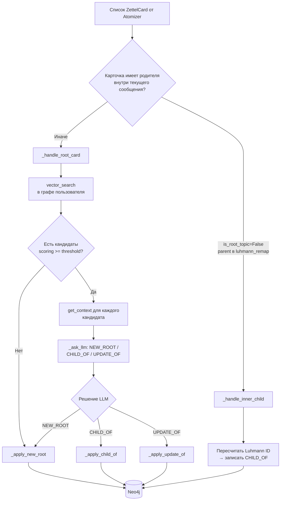
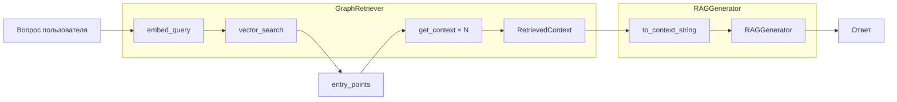
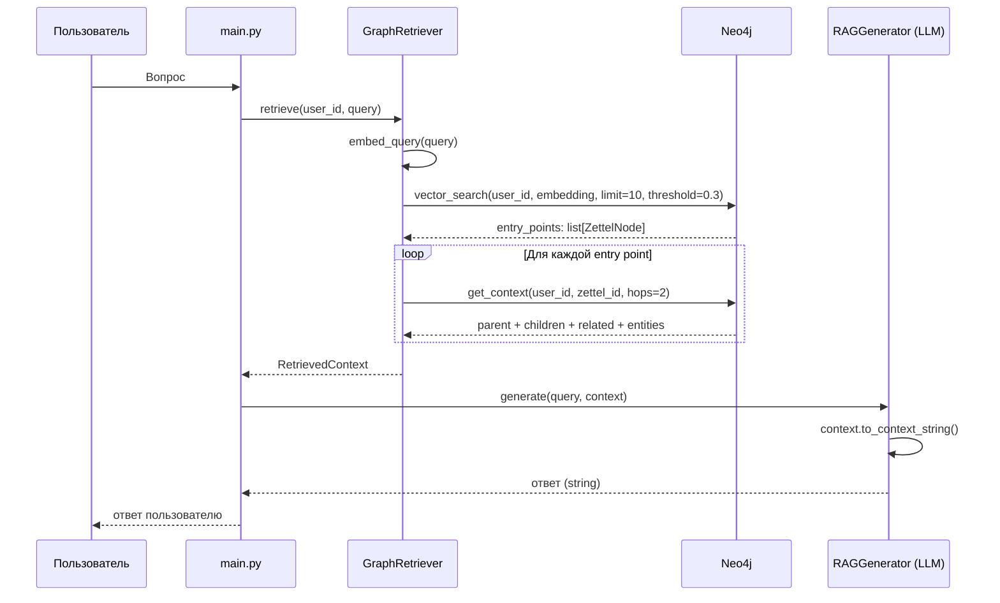
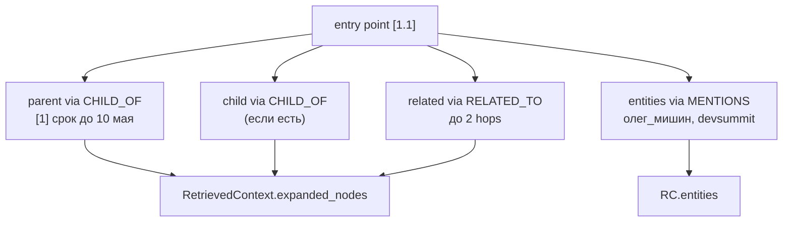
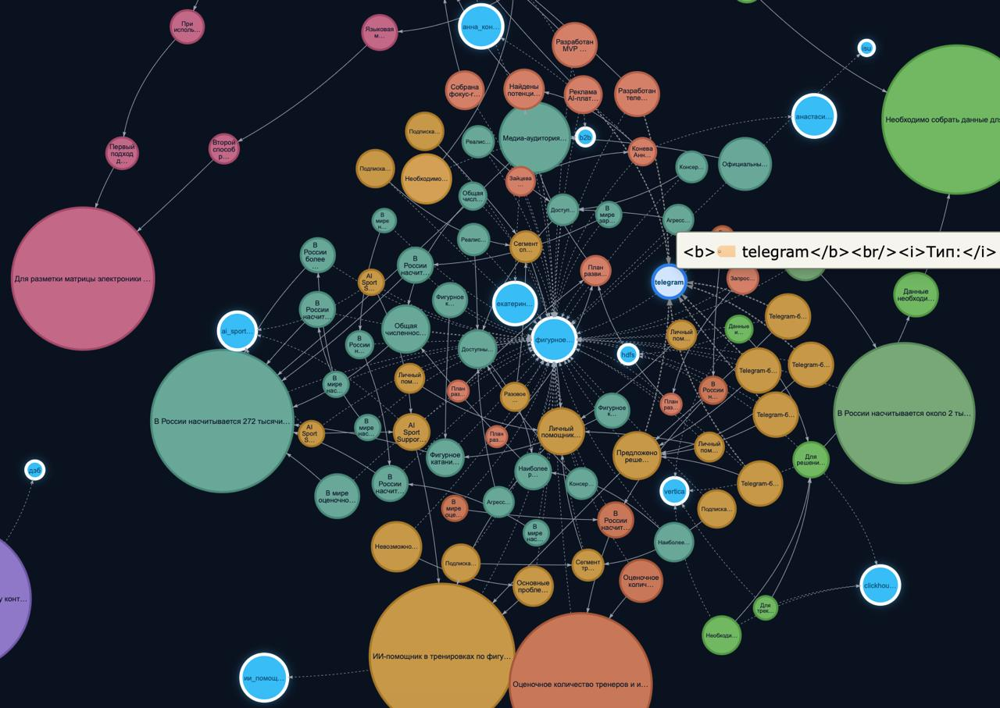

# Executive Exocortex — документация системы

---

## 1. Введение и назначение системы

**Executive Exocortex** — это система автоматизированного управления знаниями, реализованная как Telegram-бот с AI-бэкендом. Система предназначена для топ-менеджеров и специалистов, которые ежедневно генерируют большой объём неструктурированной информации: решения, риски, задачи, идеи, контекст переговоров.

### Проблема

Руководитель работает в условиях постоянного информационного потока. Информация поступает из множества источников одновременно: голосовые заметки «на ходу», пересланные сообщения, документы, контекст встреч. Традиционные инструменты заметок (Notion, Obsidian, Apple Notes) требуют ручного структурирования, тегирования и связывания. На практике это означает, что информация либо не фиксируется вовсе, либо фиксируется хаотично и теряет практическую ценность.

### Решение

Система принимает данные в свободной форме и самостоятельно:

- декомпозирует текст на атомарные смысловые единицы;
- классифицирует каждую мысль по типу;
- встраивает каждую мысль в правильное место персонального графа знаний;
- обеспечивает семантический поиск с учётом причинно-следственных связей;
- визуализирует накопленные знания в интерактивном виде;
- позволяет корректировать базу знаний (удаление отдельных веток).

---

## 2. Верхнеуровневая архитектура

Система состоит из пяти крупных подсистем:

```
┌─────────────────────────────────────────────────────────┐
│                     Telegram Bot                        │
│                      (main.py)                          │
│   Ввод: текст / голос / PDF / TXT                       │
└────────────┬────────────────────────────────────────────┘
             │
             ▼
┌─────────────────────────────────────────────────────────┐
│              Zettelkasten Pipeline                      │
│                                                         │
│  1. Atomizer      → атомарные мысли (LLM)               │
│  2. Embedding     → векторы (локальная модель)          │
│  3. Linker        → встраивание в граф (LLM + Neo4j)    │
└────────────┬────────────────────────────────────────────┘
             │
             ▼
┌─────────────────────────────────────────────────────────┐
│                 Neo4j Graph Database                    │
│  Узлы: Zettel (мысли), Entity (сущности)                │
│  Связи: CHILD_OF, MENTIONS, RELATED_TO                  │
└────────────┬────────────────────────────────────────────┘
             │
             ▼
┌─────────────────────────────────────────────────────────┐
│               GraphRAG Pipeline                         │
│  1. Retriever → векторный поиск + граф-обход             │
│  2. Generator → ответ LLM по контексту графа             │
└─────────────────────────────────────────────────────────┘
```

Дополнительно: PostgreSQL для логирования истории взаимодействий бота.

---

## 3. Функциональность Telegram-бота

### 3.1 Интерфейс

Бот реализован на библиотеке `aiogram` (async Python). Навигация построена на FSM (Finite State Machine):

```
BotStates:
  waiting_for_artifact     → режим добавления заметки
  waiting_for_search       → режим поиска
  clarifying_text          → уточнение действия (добавить или искать)
  waiting_for_delete_query → режим удаления
```

Главное меню содержит 4 кнопки:

```
[➕ Добавить новую заметку]
[🔍 Поиск мыслей по запросу]
[💡 Посмотреть базу знаний]
[🗑 Удалить заметку]
```

Каждый пользователь идентифицируется через `telegram_user_id`, из которого формируется `user_id = "tg_user_{telegram_user_id}"`. Это обеспечивает изоляцию данных между пользователями на уровне базы.

### 3.2 Режим добавления заметки

Пользователь нажимает «Добавить новую заметку» → устанавливается состояние `waiting_for_artifact`. Система принимает:

| Тип входа | Обработка |
|-----------|-----------|
| Текстовое сообщение | Напрямую передаётся в pipeline |
| Голосовое сообщение | Скачивается `.ogg` → конвертация `ffmpeg` в `.wav` → Google ASR (`speech_recognition`, `ru-RU`) → текст |
| Файл `.pdf` | Скачивается → `pdfplumber` (текст) + `pytesseract` OCR (изображения) + извлечение таблиц → объединённый текст |
| Файл `.txt` | Скачивается → plain text |

Документы обрабатываются независимо от текущего состояния FSM (всегда добавляются в базу).

После получения текста запускается `save_user_note(user_id, text)`:

```python
# main.py — упрощённо
raw_cards = atomizer.atomize(text, current_db_max_root_id)
results   = linker.link_and_insert(user_id, raw_cards)
stats     = linker.get_user_stats(user_id)
# → возвращается сообщение "Записано. База: N карточек"
```

### 3.3 Режим поиска (GraphRAG)

Пользователь вводит вопрос → система вызывает `graphrag.query(user_id, query)` → возвращает ответ в виде обычного текста. Ответ опирается только на мысли данного пользователя.

### 3.4 Просмотр базы знаний

Генерируется HTML-файл с интерактивным графом через `generate_graph_html_from_repo(repo, user_id)`. Файл отправляется как документ. Пользователь открывает его в браузере.

### 3.5 Удаление заметки

Пользователь описывает, что хочет удалить. Система делает семантический поиск, показывает до 5 кандидатов с релевантностью. Пользователь выбирает номер — удаляется мысль и весь её дочерний граф (поддерево).

---

## 4. Zettelkasten: методология и адаптация

### 4.1 Что такое Zettelkasten

Zettelkasten — метод ведения знаний социолога Никласа Лумана. Каждая мысль записывается на отдельную карточку (Zettel). Карточки связываются между собой ссылками. Нет жёстких папок — вместо этого разветвлённые «нити мышления», где каждая карточка имеет уникальный иерархический идентификатор.

В системе этот метод автоматизирован на трёх уровнях:

1. **Атомизация** — AI сам разбивает входной текст на Zettel-карточки.
2. **Luhmann ID** — система автоматически назначает иерархические ID.
3. **Линковка** — AI сам определяет, куда встроить новую карточку в существующий граф.

### 4.2 Идентификаторы Лумана (Luhmann ID)

Система иерархической нумерации:

```
1         ← корневая тема 1
1.1       ← уточнение/развитие темы 1
1.1a      ← ответвление от 1.1
1.1a1     ← ответвление от 1.1a
1.2       ← вторая ветка темы 1
2         ← корневая тема 2
2.1       ← уточнение темы 2
```

Алгоритм генерации ID (`ZettelIdGenerator.get_next_id`):

```
Правила:
├── Если parent == None (корневая):
│   └── новый ID = max(существующие корневые числовые ID) + 1
│       → 1, 2, 3, 4, ...
│
├── Если parent заканчивается цифрой (напр. "1" или "1.2"):
│   └── добавляем ".N" где N = следующий по порядку
│       → 1 → 1.1, 1.2, 1.3, ...
│
├── Если parent заканчивается цифрой после точки (напр. "1.1"):
│   └── добавляем букву: a, b, c, ...
│       → 1.1 → 1.1a, 1.1b, 1.1c, ...
│
└── Если parent заканчивается буквой (напр. "1.1a"):
    └── добавляем цифру: 1, 2, 3, ...
        → 1.1a → 1.1a1, 1.1a2, ...
```

Это позволяет бесконечно ветвить мысли без конфликтов ID и потери иерархии.

---

## 5. Atomizer — декомпозиция текста на мысли

**Файл:** `zettelkasten/atomizer.py`

### 5.1 Назначение

`NoteAtomizer` принимает произвольный текст (от 1 предложения до нескольких страниц) и возвращает список `ZettelCard` — атомарных мыслей, готовых к встраиванию в граф.

### 5.2 Структуры данных

```python
class AtomicThought(BaseModel):
    content: str          # текст мысли (1-2 предложения, самодостаточно)
    thought_type: ThoughtType  # тип мысли
    tags: list[str]       # 1-5 тегов-сущностей (snake_case)
    parent_hint: str|None # дословная цитата родительской мысли из этого же списка
    is_root_topic: bool   # True = новая тема, False = развивает другую

class ZettelCard(BaseModel):
    zettel_id: str         # UUID карточки
    luhmann_id: str        # иерархический ID
    parent_id: str|None    # UUID родительской карточки
    parent_luhmann_id: str|None
    content: str
    thought_type: ThoughtType
    tags: list[str]
    is_root_topic: bool
    embedding: list[float]|None
```

### 5.3 Типы мыслей

```
fact       → данные, метрики, констатация фактов
decision   → фиксация выбора, точка невозврата
action     → задача, поручение, to-do
risk       → угроза, узкое горлышко
idea       → гипотеза, предложение, стратегия
question   → открытый вопрос, то что требует ответа
context    → фоновая информация, условия
other      → всё что не подходит под предыдущие
```

### 5.4 Алгоритм атомизации

```
Входной текст
     │
     ▼
1. _invoke_llm(text)
   └── LLM(GPT-4o) + structured_output(AtomicThoughtList)
       Промпт содержит:
       - критерии атомарности (1-2 предложения)
       - правило самодостаточности
       - правило разрешения местоимений (заменять "он"/"она"/"это" на явные имена)
       - полное сохранение деталей (цифры, дедлайны, имена)
       - правила классификации типов
       - правила тегирования (только named entities)
       - правила parent_hint (дословная цитата для дочерних)
       ↓
       AtomicThoughtList: список AtomicThought
     │
     ▼
2. _build_cards(thoughts, current_db_max_root_id)
   └── для каждой AtomicThought:
       ├── генерирует UUID
       ├── разрешает parent_hint → parent_uuid + parent_luhmann_id
       │   (ищет совпадение по дословному тексту среди уже обработанных)
       ├── генерирует Luhmann ID (ZettelIdGenerator.get_next_id)
       ├── очищает content (_clean_content)
       └── нормализует теги (_normalize_tags → snake_case, max 5)
     │
     ▼
3. _validate_and_fix(cards)
   ├── удаляет пустые карточки
   ├── обнуляет parent_hint если не совпадает ни с одним content
   └── если нет ни одной корневой — первая становится корневой
     │
     ▼
   [list[ZettelCard]]
```

### 5.5 Правило разрешения местоимений

LLM-промпт содержит жёсткое требование: запрещено использовать местоимения «он», «она», «они», «это». Если в исходном тексте сказано «она перенесла релиз на октябрь», а из контекста ясно, что «она» — Елена Волкова, LLM обязана написать «Елена Волкова перенесла релиз продукта Helios на октябрь». Это критично для базы знаний: карточка должна быть понятна спустя год без исходного текста.

### 5.6 Пример

Входной текст:
```
По проекту Смарт-Ритейл мы отстаем от графика интеграции платежного шлюза
на 2 недели из-за багов на стороне Т-Банк. Николай Петров должен завтра
созвониться с их техподдержкой. Иначе рискуем сорвать релиз в августе.
Забронируйте мне билеты в Сочи на следующую неделю для встречи с инвесторами.
```

Результат Atomizer (AtomicThought):
```yaml
1. content: "Интеграция платёжного шлюза по проекту Смарт-Ритейл отстаёт на 2 недели из-за ошибок Т-Банка."
   type: fact
   tags: [смарт_ритейл, т_банк]
   is_root_topic: true
   parent_hint: null

2. content: "Николай Петров обязан завтра позвонить в техподдержку Т-Банк для фиксации SLA."
   type: action
   tags: [николай_петров, т_банк]
   is_root_topic: false
   parent_hint: "Интеграция платёжного шлюза..."   ← дословная цитата

3. content: "Срыв SLA с Т-Банк несёт риск задержки релиза Смарт-Ритейл в августе."
   type: risk
   tags: [смарт_ритейл, т_банк]
   is_root_topic: false
   parent_hint: "Интеграция платёжного шлюза..."

4. content: "Забронировать авиабилеты в Сочи на следующую неделю для встречи с инвесторами."
   type: action
   tags: [сочи, инвесторы]
   is_root_topic: true   ← новая независимая тема
   parent_hint: null
```

После `_build_cards` с `current_db_max_root_id = 2` (в базе уже 2 корня):
```
Карточка 1 → luhmann_id = "3"        (новый корень)
Карточка 2 → luhmann_id = "3.1"      (дочерняя от "3")
Карточка 3 → luhmann_id = "3.1a"     (тоже дочерняя от "3")
Карточка 4 → luhmann_id = "4"        (новый корень, другая тема)
```

---

## 6. Эмбеддинги — векторное представление мыслей

**Файл:** `zettelkasten/linker.py` — класс `LocalEmbeddingModel`

### 6.1 Модель

Используется локальная HuggingFace-модель `intfloat/multilingual-e5-base`:

```
Параметры: 278M
Размерность векторов: 768
Язык: мультиязычная (русский поддерживается хорошо)
Аппаратное ускорение: CUDA → MPS (Apple Silicon) → CPU
```

Модель обучена с обязательными префиксами:

```python
# Для документов, которые хранятся в базе:
embed_passage("passage: Николай Петров обязан позвонить...")

# Для поисковых запросов (новая мысль или вопрос пользователя):
embed_query("query: Кто отвечает за звонок в Т-Банк?")
```

Отсутствие правильного префикса резко снижает качество поиска.

### 6.2 Нормализация векторов

Все векторы нормализуются (`normalize_embeddings=True`). Это означает, что их длина всегда равна 1. При таком условии **косинусное сходство** эквивалентно **скалярному произведению** — поиск становится быстрее без потери качества.

### 6.3 Где используются эмбеддинги

```
Atomizer       → НЕ использует эмбеддинги
Linker         → embed_passage для каждой новой карточки
                 embed_query для поиска кандидатов
GraphRAG       → embed_query для вопроса пользователя
Удаление       → embed_query для поиска кандидатов на удаление
```

---

## 7. Linker — алгоритм встраивания мысли в граф

**Файл:** `zettelkasten/linker.py` — класс `GraphLinker`

### 7.1 Общая схема



### 7.2 Внутритекстовые дочерние карточки

Когда Atomizer возвращает несколько карточек из одного сообщения и некоторые уже связаны между собой (`parent_hint`), Linker отслеживает это через `luhmann_remap` — словарь `{временный_id: реальный_id_в_базе}`.

Пример: если карточка 3 (`luhmann_id="3"`) уже вставлена в граф, а карточка 3.1 является её дочерней, Linker сразу выполняет `_handle_inner_child` — пересчитывает реальный luhmann_id и вставляет как `CHILD_OF`, не запрашивая LLM.

Это сокращает количество LLM-запросов и ускоряет обработку связных текстов.

### 7.3 Векторный поиск кандидатов

Для «корневых» карточек (тех, у которых нет заранее известного родителя):

```python
candidates = repository.vector_search(
    user_id=user_id,
    query_embedding=embed_query(card.content),
    limit=5,                    # не более 5 кандидатов
    similarity_threshold=0.35,  # порог косинусного сходства
)
```

Поиск выполняется на Python: из Neo4j извлекаются все Zettel данного пользователя с эмбеддингами, затем вычисляется косинусное сходство с новой карточкой.

Если ни одного кандидата с similarity ≥ 0.35 нет → сразу `NEW_ROOT` без вызова LLM.

### 7.4 Сбор графового контекста

Для каждого найденного кандидата система поднимает его окрестность из Neo4j:

```python
GraphContext(
    candidate:  ZettelNode,        # сам кандидат
    similarity: float,             # косинусное сходство
    parent:     ZettelNode|None,   # родительская мысль в графе
    children:   list[ZettelNode],  # дочерние мысли
    related:    list[ZettelNode],  # связанные (RELATED_TO)
    entities:   list[EntityNode],  # сущности кандидата (MENTIONS)
)
```

Это контекст для LLM: вместо «вот похожая мысль» система говорит «вот похожая мысль, из чего она выросла, что из неё выросло, о каких проектах/людях она».

### 7.5 LLM-решение (LinkDecision)

LLM получает:

```
НОВАЯ МЫСЛЬ:
  Тип: action
  Теги: [николай_петров, т_банк]
  Текст: "Николай Петров обязан завтра позвонить в техподдержку Т-Банк."

КАНДИДАТЫ ИЗ ГРАФА (с контекстом):
  • UUID: abc123
    Luhmann-ID: [2.1]
    Сходство: 0.81
    Текст: "Миграция CRM на Salesforce запланирована на второй квартал."
    Родитель: [2] "Цифровая трансформация отдела продаж стартует в апреле."
    Сущности: salesforce, crm
```

LLM возвращает структурированный `LinkDecision`:

```python
class LinkDecision(BaseModel):
    action: Literal["new_root", "child_of", "update_of"]
    target_zettel_id: str|None  # UUID карточки-цели (для child_of и update_of)
    reasoning: str              # объяснение решения
```

Правила принятия решения (из промпта):

```
child_of  → новая мысль развивает / уточняет / является следствием старой
update_of → новая мысль прямо заменяет информацию в старой
            (другой ответственный, изменились сроки, отменено решение)
new_root  → совпадение только поверхностное, разные контексты/проекты/люди
            При любых сомнениях → new_root (безопаснее)
```

### 7.6 Применение решений

**`_apply_new_root`:**
```
1. Получить список всех корневых Luhmann ID пользователя
2. new_luhmann = max(корневые числовые) + 1
3. Записать в luhmann_remap
4. repository.create_zettel(...)  → узел Zettel
5. repository._create_entity_links(...)  → узлы Entity + связи MENTIONS
```

**`_apply_child_of`:**
```
1. Найти родительский узел по target_zettel_id
2. Получить siblings(parent.luhmann_id) — братьев в этой ветке
3. new_luhmann = ZettelIdGenerator.get_next_id(parent.luhmann_id, siblings)
4. Записать в luhmann_remap
5. repository.create_child_of(...)  → узел Zettel + связь CHILD_OF
6. repository._create_entity_links(...)  → Entity + MENTIONS
```

**`_apply_update_of`:**
```
1. repository.update_zettel_content(target_zettel_id, new_content)
   → SET z.content = new_content
   → SET z.embedding = new_embedding
   → SET z.updated_at = now()
2. Новый узел НЕ создаётся — старый перезаписывается
   (Luhmann ID сохраняется, место в графе остаётся прежним)
```

---

## 8. Граф знаний в Neo4j

**Файлы:** `storage/neo4j/client.py`, `storage/neo4j/schema.py`, `storage/neo4j/repository.py`

### 8.1 Почему Neo4j

Классические реляционные БД плохо подходят для задач, где связи между объектами так же важны, как сами объекты. В знаниевой базе критично понимать: «эта мысль выросла из той», «эти два узла связаны через общую сущность». Neo4j хранит граф нативно — обходы по рёбрам не требуют `JOIN`.

### 8.2 Схема данных

```
┌──────────────────────────────────────────────────────────────────┐
│  Узел :Zettel                                                    │
│                                                                  │
│  zettel_id     : string (UUID, unique)                           │
│  user_id       : string ("tg_user_123456")                       │
│  luhmann_id    : string ("1", "1.1", "1.1a", ...)                │
│  content       : string (текст мысли)                            │
│  thought_type  : string (fact/decision/action/risk/...)          │
│  tags          : list[string]                                    │
│  embedding     : list[float] (768 чисел)                         │
│  is_root_topic : bool                                            │
│  created_at    : datetime                                        │
│  updated_at    : datetime                                        │
└──────────────────────────────────────────────────────────────────┘

┌──────────────────────────────────────────────────────────────────┐
│  Узел :Entity                                                    │
│                                                                  │
│  name          : string ("николай_петров")                       │
│  display_name  : string ("николай_петров")                       │
│  entity_type   : string ("tag")                                  │
│  user_id       : string                                          │
│  mention_count : int (сколько раз упоминается)                   │
└──────────────────────────────────────────────────────────────────┘

Связи:
  (Zettel) -[:CHILD_OF]→  (Zettel)   — иерархия мыслей
  (Zettel) -[:MENTIONS]→  (Entity)   — упоминание сущности
  (Zettel) -[:RELATED_TO]- (Zettel)  — смысловая связь (резерв)
```

### 8.3 Как создаются сущности

При каждом добавлении узла Zettel теги карточки преобразуются в `Entity` и связи `MENTIONS`:

```cypher
UNWIND $tags as tag
MERGE (e:Entity {name: tag, user_id: $user_id})
ON CREATE SET e.display_name = tag, e.entity_type = 'tag', e.mention_count = 1
ON MATCH  SET e.mention_count = e.mention_count + 1
MERGE (z)-[:MENTIONS {created_at: datetime($created_at)}]->(e)
```

`MERGE` гарантирует, что одна сущность (например, `николай_петров` у конкретного пользователя) существует в единственном экземпляре, а `mention_count` инкрементируется при каждом новом упоминании.

### 8.4 Индексы и constraints

```cypher
-- Уникальность zettel_id глобально
CREATE CONSTRAINT zettel_id_unique FOR (z:Zettel) REQUIRE z.zettel_id IS UNIQUE

-- Поиск по пользователю
CREATE INDEX zettel_user          FOR (z:Zettel) ON (z.user_id)
CREATE INDEX zettel_user_luhmann  FOR (z:Zettel) ON (z.user_id, z.luhmann_id)

-- Entity
CREATE INDEX entity_name_user     FOR (e:Entity) ON (e.name, e.user_id)
CREATE INDEX entity_user          FOR (e:Entity) ON (e.user_id)

-- Векторный индекс для семантического поиска
CREATE VECTOR INDEX zettel_embedding
FOR (z:Zettel) ON (z.embedding)
OPTIONS { indexConfig: {
  `vector.dimensions`: 768,
  `vector.similarity_function`: 'cosine'
}}
```

Индекс `(user_id, luhmann_id)` — основной для большинства операций: поиск узла по Luhmann ID всегда выполняется в контексте конкретного пользователя.

### 8.5 Multi-user изоляция

Каждый запрос к Neo4j содержит фильтр `{user_id: $user_id}`. Мысли разных пользователей никогда не пересекаются в связях. При инициализации `GraphLinker` дополнительно вызывается `remove_cross_user_links()` — Cypher-запрос, который ищет и удаляет любые случайные рёбра между Zettel разных пользователей (защита от ошибок).

### 8.6 Клиент Neo4j

`Neo4jClient` (`storage/neo4j/client.py`) предоставляет два метода:

```python
client.execute_read(query, params)   # read-транзакция
client.execute_write(query, params)  # write-транзакция
```

Использует Bolt-протокол (порт 7687). Singleton-паттерн через `get_neo4j_client()`. При старте проверяет подключение (`driver.verify_connectivity()`).

---

## 9. GraphRAG — поиск и генерация ответов

**Файл:** `zettelkasten/graph_rag.py`

GraphRAG — это второй ключевой пайплайн системы (после ingestion). Если при добавлении заметки система **строит** граф, то при поиске она **читает** граф: находит релевантные мысли, подтягивает связанный контекст и передаёт его LLM для ответа.

### 9.1 Архитектура GraphRAG



Три класса и одна структура данных:

| Компонент | Роль |
|-----------|------|
| `GraphRAG` | Фасад: `query()` → retrieve + generate |
| `GraphRetriever` | Векторный поиск + обход графа → `RetrievedContext` |
| `RAGGenerator` | LLM синтезирует ответ по контексту |
| `RetrievedContext` | entry_points, expanded_nodes, entities, paths |

Параметры из `config/settings.py`:

```python
graphrag_search_limit = 10      # сколько entry points искать
graphrag_context_hops = 2       # глубина обхода RELATED_TO
similarity_threshold = 0.3        # порог косинусного сходства (мягче, чем у линкера)
```

У линкера порог жёстче (`0.35`), потому что там решение о встраивании должно быть точным. У GraphRAG порог мягче — лучше найти больше кандидатов и дать LLM широкий контекст.

### 9.2 RAG vs GraphRAG

```
Обычный RAG:
  Вопрос → embed → top-K похожих текстов → LLM
  (каждый chunk изолирован, связи между мыслями теряются)

GraphRAG:
  Вопрос → embed → top-K entry points
         → обход графа (родители, дети, related, entity)
         → структурированный контекст → LLM
  (LLM видит не только «похожие фразы», но и иерархию и сущности)
```

**Пример.** Пользователь спрашивает: «Кто курирует DevSummit?»

- Обычный RAG мог бы найти только карточку `[1.1] Куратором назначен Олег Мишин` — без сроков и бюджета.
- GraphRAG находит `[1.1]`, затем подтягивает родителя `[1]` (срок до 10 мая) и соседа `[1.1a]` (бюджет 2,4 млн) через `CHILD_OF`. LLM получает полную картину ветки.

### 9.3 Полная последовательность (sequence)



### 9.4 Этап 1: векторный поиск (entry points)

Entry point — мысль, семантически близкая к вопросу. Это «точка входа» в граф, от которой начинается обход.

**Шаг 1.1 — эмбеддинг вопроса**

```python
query_embedding = embedding_model.embed_query("Кто курирует DevSummit?")
# фактически: "query: Кто курирует DevSummit?"
```

Используется та же модель `intfloat/multilingual-e5-base`, что и при записи заметок, но с префиксом `query:` (а не `passage:`). Это требование модели E5: запрос и документ эмбеддятся по-разному.

**Шаг 1.2 — cosine similarity по всем Zettel пользователя**

```python
candidates = repository.vector_search(
    user_id=user_id,
    query_embedding=query_embedding,
    limit=10,                    # graphrag_search_limit
    similarity_threshold=0.3,
)
```

Алгоритм (`ZettelRepository._vector_search_python_fallback`):

```
1. Cypher: MATCH (z:Zettel {user_id}) WHERE z.embedding IS NOT NULL RETURN z
2. Для каждого узла: score = cosine(query_vec, z.embedding)
3. Отфильтровать: score >= threshold (0.3)
4. Отсортировать по score убыванию
5. Вернуть top-10
```

Почему Python, а не vector index Neo4j напрямую: vector index не умеет фильтровать по `user_id`. Поэтому сначала загружаются все мысли конкретного пользователя, затем similarity считается в numpy. Для персональной базы топ-менеджера (сотни–тысячи карточек) это быстро.

**Шаг 1.3 — результат**

```python
context.entry_points = [node for node, score in candidates]
# например: [1.1] sim=0.91, [1] sim=0.84, [1.1a] sim=0.79
```

Если `entry_points` пуст — GraphRAG сразу возвращает «информации не найдено», без вызова LLM.

### 9.5 Этап 2: обход графа (расширение контекста)

Для каждой entry point вызывается `repository.get_context(user_id, zettel_id, hops=2)`. Это один Cypher-запрос на каждый тип связи:



**Родитель (CHILD_OF)**

```cypher
MATCH (z:Zettel {zettel_id: $id, user_id: $user_id})-[:CHILD_OF]->(parent:Zettel)
RETURN parent
```

Дочерняя мысль `[1.1]` указывает на родителя `[1]`. Это даёт LLM «откуда выросла» найденная мысль — контекст ветки.

**Дети (CHILD_OF в обратную сторону)**

```cypher
MATCH (child:Zettel)-[:CHILD_OF]->(z:Zettel {zettel_id: $id, user_id: $user_id})
RETURN child
```

Все уточнения и следствия entry point попадают в контекст.

**Связанные мысли (RELATED_TO)**

```cypher
MATCH (z)-[:RELATED_TO*1..2]-(related:Zettel {user_id: $user_id})
RETURN DISTINCT related
```

`hops=2` означает до двух шагов по `RELATED_TO`. Связь используется реже, чем `CHILD_OF`, но позволяет подтянуть смыслово близкие, но не иерархические мысли.

**Сущности (MENTIONS)**

```cypher
MATCH (z:Zettel)-[:MENTIONS]->(e:Entity {user_id: $user_id})
RETURN e
```

Теги (`devsummit`, `олег_мишин`) попадают в блок «СВЯЗАННЫЕ СУЩНОСТИ» — LLM понимает, о каких проектах и людях идёт речь.

**Дедупликация**

```python
expanded_ids = set(node.zettel_id for node in context.entry_points)

for entry in context.entry_points:
    node_context = repository.get_context(...)
    if node_context.parent.zettel_id not in expanded_ids:
        context.expanded_nodes.append(parent)
        expanded_ids.add(parent.zettel_id)
        context.paths.append("[1.1] → CHILD_OF → [1]")
    # аналогично для children, related
```

Один и тот же узел не добавляется дважды, даже если он связан с несколькими entry points. `paths` — текстовое описание связей для LLM (до 5 штук в промпте).

### 9.6 Этап 3: сборка контекста для LLM

`RetrievedContext.to_context_string()` превращает граф в текст:

```
1. all_nodes = entry_points + expanded_nodes (уникальные по zettel_id)
2. Группировка по thought_type: FACT, ACTION, RISK, DECISION, ...
3. Блок СВЯЗАННЫЕ СУЩНОСТИ (до 10 entity)
4. Блок СВЯЗИ МЕЖДУ МЫСЛЯМИ (до 5 paths)
```

Пример итогового контекста:

```
## FACT
• [1.1] Куратором конференции DevSummit назначен Олег Мишин.
• [1.1a] Бюджет конференции DevSummit составляет 2,4 млн рублей.

## ACTION
• [1] Конференцию DevSummit необходимо провести до 10 мая.

## RISK
• [2] Существует риск не успеть забронировать площадку Expocentre.

## СВЯЗАННЫЕ СУЩНОСТИ
• devsummit (tag, упоминаний: 4)
• олег_мишин (tag, упоминаний: 1)

## СВЯЗИ МЕЖДУ МЫСЛЯМИ
• [1.1] → CHILD_OF → [1]
• [1.1a] → CHILD_OF → [1]
```

### 9.7 Этап 4: генерация ответа (RAGGenerator)

```python
if not context.all_nodes:
    return NO_CONTEXT_RESPONSE  # без LLM

response = llm.invoke([
    SystemMessage(SYSTEM_PROMPT),   # правила: только факты из контекста
    HumanMessage(f"КОНТЕКСТ: {context_str}\n\nВОПРОС: {query}"),
])
```

Промпт запрещает LLM:
- выдумывать факты вне контекста;
- делать формальные разделы «Факты / Решения / Действия» (если пользователь не просил);
- дублировать вопрос в ответе.

Temperature = `0.3` — чуть выше, чем у atomizer/linker (`0.0`), чтобы ответ звучал естественнее, но оставался привязанным к фактам.

### 9.8 Специализированные режимы поиска

Помимо основного `query(user_id, text)`:

| Метод | Как ищет | Когда полезен |
|-------|----------|---------------|
| `query(user_id, text)` | vector search + graph expand | Любой вопрос пользователя |
| `query_entity(user_id, name)` | Cypher по Entity ← MENTIONS ← Zettel | «Расскажи всё про devsummit» |
| `query_actions(user_id)` | все Zettel с `thought_type=action` | Список задач и поручений |
| `query_risks(user_id)` | все Zettel с `thought_type=risk` | Обзор зафиксированных рисков |

`query_entity` не использует vector search — идёт напрямую по графу сущностей:

```cypher
MATCH (e:Entity {name: $entity_name, user_id: $user_id})<-[:MENTIONS]-(z:Zettel)
RETURN z, e ORDER BY z.created_at DESC LIMIT 20
```

`query_actions` / `query_risks` фильтруют по типу мысли — удобно для обзорных запросов без формулировки вопроса.

### 9.9 Сравнение GraphRAG и линкера

Оба используют `vector_search` и `get_context`, но с разными целями:

| | Linker (запись) | GraphRAG (поиск) |
|--|-----------------|------------------|
| Цель | Куда встроить новую мысль | Ответить на вопрос |
| limit | 5 | 10 |
| threshold | 0.35 | 0.3 |
| После search | LLM решает new_root/child_of/update_of | Graph expand + LLM генерирует ответ |
| Префикс embed | `passage:` для карточки, `query:` для search | `query:` для вопроса |

---

## 10. Интерактивный дашборд

**Файл:** `zettelkasten/graph_visualizer.py`

### 10.1 Логика генерации

```
export_graph_data(user_id) из Neo4j
         │
         ├── Все Zettel пользователя + parent_luhmann
         ├── Все Entity пользователя
         └── Все рёбра (CHILD_OF, MENTIONS, RELATED_TO)
         │
         ▼
_build_html(graph_data)
  ├── Для каждой мысли:
  │   ├── calc_depth(luhmann_id)  ← рекурсивный обход parent_by_luhmann
  │   ├── size = thought_size_by_depth(depth)
  │   │     depth=0 → 62, depth=1 → 48, depth=2 → 34, depth=3 → 28, deeper → 24
  │   ├── label = make_thought_label(content, depth)
  │   │     depth=0 → до 34 символов без переноса
  │   │     depth=1 → до 16 символов, перенос по 6
  │   │     depth=2 → до 11 символов, перенос по 5
  │   │     глубже  → до 7 символов, перенос по 4
  │   └── shape = "circle", цвет = оранжевый
  │
  ├── Для каждой сущности:
  │   ├── size = 18 (фиксировано)
  │   ├── label = до 9 символов
  │   └── shape = "circle", цвет = голубой
  │
  └── Для каждого ребра:
      ├── CHILD_OF  → сплошная серая линия, без подписи
      ├── RELATED_TO → пунктирная линия, подпись "связана с"
      └── MENTIONS  → пунктирная линия, без подписи
         │
         ▼
  HTML + vis.js (embedded)
```

### 10.2 Интерактивность дашборда

- Клик на узел → правая панель деталей (полный текст, тип, теги, список связей).
- Клик на связь в панели → перемещение к связанному узлу.
- Логика стрелок в панели: `→` = дочерняя (вглубь графа), `←` = родитель (уровень выше).
- Теги/Entity показываются в панели без стрелок.
- Поиск по тексту (поле в левом верхнем углу) — фильтрует граф в реальном времени.
- Переключатель темы `Светлая / Тёмная` — сохраняется в `localStorage`.
- После стабилизации физика отключается: граф «замирает» в финальной позиции.



---

## 11. Удаление мыслей

### 11.1 Поиск кандидатов

```python
# main.py — process_delete_search_query
query_embedding = embedding_model.embed_query(user_text)
candidates = repository.vector_search(
    user_id, query_embedding,
    limit=5,
    similarity_threshold=max(0.35, settings.linker_similarity_threshold)
)
# → показывает до 5 мыслей с preview и score
# → сохраняет список в FSM state (delete_candidates)
```

### 11.2 Каскадное удаление

```python
# storage/neo4j/repository.py — delete_zettel
MATCH (target:Zettel {zettel_id: $id, user_id: $user_id})
OPTIONAL MATCH (desc:Zettel {user_id: $user_id})-[:CHILD_OF*1..]->(target)
WITH target, collect(DISTINCT desc) + target AS to_delete
UNWIND to_delete AS node
DETACH DELETE node
```

`CHILD_OF*1..` — рекурсивный обход произвольной глубины. Удаляется и сама мысль, и все её потомки, и все рёбра.

### 11.3 Очистка сущностей

После удаления мыслей:

```cypher
MATCH (e:Entity {user_id: $user_id})
WHERE NOT EXISTS { MATCH (:Zettel {user_id: $user_id})-[:MENTIONS]->(e) }
DETACH DELETE e
```

Сущности без связей («осиротевшие теги») автоматически удаляются.

---

## 12. Логирование в PostgreSQL

**Файл:** `storage/postgres/db_connect.py`

Каждое взаимодействие с ботом записывается в таблицу `history_messages`:

```sql
CREATE TABLE history_messages (
    id           SERIAL PRIMARY KEY,
    user_id      BIGINT NOT NULL,
    message_id   BIGINT NOT NULL,
    message_text TEXT   NOT NULL,
    message_date TIMESTAMP NOT NULL,
    message_type TEXT   NOT NULL,  -- text_artifact / voice / search_query / delete_query / action
    bot_answer   TEXT
)
```

Это журнал событий для анализа использования системы.

---

## 13. Карта модулей проекта

```
Executive_Exocortex/
│
├── main.py                        ← точка входа бота (FSM, routing)
│
├── config/
│   ├── settings.py                ← централизованная конфигурация
│   └── prompts.py                 ← системные промпты (atomizer, linker)
│
├── zettelkasten/
│   ├── atomizer.py                ← LLM-декомпозиция текста на мысли
│   ├── linker.py                  ← встраивание в граф (embedding + LLM)
│   ├── graph_rag.py               ← GraphRAG (retrieval + generation)
│   ├── graph_visualizer.py        ← генератор HTML-дашборда
│   └── exocortex.py               ← CLI-скрипт для демо и тестов
│
├── storage/
│   ├── neo4j/
│   │   ├── client.py              ← Bolt-клиент Neo4j
│   │   ├── schema.py              ← инициализация схемы/индексов
│   │   └── repository.py         ← весь CRUD-слой (Neo4j)
│   └── postgres/
│       ├── db_connect.py          ← подключение + таблица истории
│       └── cleaner.py             ← утилита очистки логов
│
├── telegram_bot/
│   ├── texts.py                   ← тексты интерфейса
│   └── handlers/
│       ├── asr.py                 ← распознавание голоса (Google ASR)
│       ├── pdf_reader.py          ← чтение PDF (pdfplumber + OCR)
│       └── txt_reader.py          ← чтение TXT
│
└── docker-compose.yml             ← Neo4j (Community 5.26)
```

---

## 14. Инфраструктура и запуск

### 14.1 Зависимости

```
LLM и AI:
  langchain-openai         ← ChatOpenAI с structured output
  sentence-transformers    ← локальная модель эмбеддингов
  torch                    ← GPU/CPU для модели
  pydantic                 ← схемы для structured output

База данных:
  neo4j>=5.0               ← граф знаний
  psycopg2                 ← PostgreSQL-клиент

Telegram:
  aiogram                  ← async-бот

Обработка файлов:
  pdfplumber               ← извлечение текста из PDF
  pytesseract              ← OCR для сканов
  speech_recognition       ← распознавание голоса
  pandas + tabulate        ← обработка таблиц из PDF
```

### 14.2 Переменные окружения

```bash
# LLM
LLM_API_KEY=...            # ключ OpenAI-совместимого API
LLM_BASE_URL=...           # base URL (например https://openrouter.ai/api/v1)

# Neo4j
NEO4J_URI=bolt://localhost:7687
NEO4J_USER=neo4j
NEO4J_PASSWORD=...         # задаётся при первом старте контейнера

# Telegram
TELEGRAM_BOT_TOKEN=...

# PostgreSQL
POSTGRES_PASSWORD=...
```

Важно: пароль Neo4j задаётся ОДИН РАЗ при первом старте контейнера. При смене пароля в `.env` нужно очистить volume: `rm -rf storage/neo4j/data/*`.

### 14.3 Запуск

```bash
# 1. Скопировать и заполнить конфигурацию
cp .env.example .env

# 2. Поднять Neo4j
docker compose up -d

# 3. Установить зависимости
python3 -m venv .venv
source .venv/bin/activate
pip install -r requirements.txt

# 4. Запустить бота
python main.py

# Запуск CLI-демо (без бота, только pipeline)
python zettelkasten/exocortex.py --user-id demo_user
python zettelkasten/exocortex.py --multi-user
```

---

## 15. Сквозной пример работы системы

Пользователь отправляет голосовое сообщение:

```
"Коллеги, конференцию DevSummit нужно провести до 10 мая. Куратор — Олег Мишин.
Бюджет мероприятия — 2,4 млн рублей. Главный риск — не успеть забронировать
площадку в Expocentre до конца месяца."
```

```
1. asr.recognize_audio(wav_path)
   → "Коллеги, конференцию DevSummit нужно провести до 10 мая. Куратор — Олег Мишин.
      Бюджет мероприятия — 2,4 млн рублей. Главный риск — не успеть забронировать
      площадку в Expocentre до конца месяца."

2. atomizer.atomize(text, current_max_root=0)
   → [
       ZettelCard(luhmann="1", is_root=True,
         content="Конференцию DevSummit необходимо провести до 10 мая.",
         type="action", tags=["devsummit"]),

       ZettelCard(luhmann="1.1", is_root=False, parent="1",
         content="Куратором конференции DevSummit назначен Олег Мишин.",
         type="fact", tags=["олег_мишин", "devsummit"]),

       ZettelCard(luhmann="1.1a", is_root=False, parent="1",
         content="Бюджет конференции DevSummit составляет 2,4 млн рублей.",
         type="fact", tags=["devsummit"]),

       ZettelCard(luhmann="2", is_root=True,
         content="Существует риск не успеть забронировать площадку Expocentre до конца месяца.",
         type="risk", tags=["expocentre", "devsummit"]),
     ]

3. linker.link_and_insert(user_id, cards):
   ├── Карточка "1": vector_search → пусто → NEW_ROOT → create_zettel(luhmann="1")
   ├── Карточка "1.1": parent в luhmann_remap → _handle_inner_child
   │     → create_child_of(parent="1", luhmann="1.1")
   ├── Карточка "1.1a": parent в luhmann_remap → _handle_inner_child
   │     → create_child_of(parent="1", luhmann="1.1a")
   └── Карточка "2": vector_search → sim≈0.72 с [1] → LLM → NEW_ROOT (другая тема: риск)

4. Состояние графа в Neo4j:
   [1] "Конференцию DevSummit необходимо провести до 10 мая."
     ├─ [1.1] ← [1]: "Куратором конференции DevSummit назначен Олег Мишин."
     └─ [1.1a] ← [1]: "Бюджет конференции DevSummit составляет 2,4 млн рублей."

   [2] "Существует риск не успеть забронировать площадку Expocentre до конца месяца."

   Entity: devsummit (4 упоминания), олег_мишин (1), expocentre (1)

5. Бот отвечает: "✅ Записано в граф знаний. 📚 Размер базы знаний: 4 карточки"
```

Пользователь спрашивает:

```
"Кто курирует конференцию DevSummit?"
```

```
6. graphrag.query(user_id, "Кто курирует конференцию DevSummit?")

7. GraphRetriever.retrieve():
   ├── embed_query("Кто курирует конференцию DevSummit?")
   ├── vector_search → [1.1] sim=0.91, [1] sim=0.84, [1.1a] sim=0.79
   ├── get_context([1.1]) → parent=[1], children=[1.1a], entities=[олег_мишин, devsummit]
   └── context_string:
       ## FACT
       • [1.1] Куратором конференции DevSummit назначен Олег Мишин.
       • [1.1a] Бюджет конференции DevSummit составляет 2,4 млн рублей.
       ## ACTION
       • [1] Конференцию DevSummit необходимо провести до 10 мая.

8. RAGGenerator.generate():
   → "Конференцией DevSummit курирует Олег Мишин. Мероприятие нужно провести
      до 10 мая, бюджет — 2,4 млн рублей."

9. Бот отвечает этим текстом.
```
