# Executive Exocortex

**Executive Exocortex** — персональный цифровой экзокортекс: система хранения, структурирования и управления знаниями. Пользователь отправляет текст, голос или документ в Telegram — система автоматически разбивает информацию на атомарные заметки по методу Zettelkasten, связывает их в граф знаний Neo4j и позволяет находить ответы по накопленному контексту через GraphRAG.

Систему можно рассматривать как замену Notion или Obsidian для рабочих мыслей: вместо того чтобы вручную тегировать и связывать заметки, пользователь просто «складывает» информацию в бота — а он сам превращает её в структурированную базу знаний с семантическим поиском и интерактивной визуализацией графа.

---

## Содержание

1. [Введение и назначение системы](#1-введение-и-назначение-системы)
2. [Верхнеуровневая архитектура](#2-верхнеуровневая-архитектура)
3. [Структура проекта](#3-структура-проекта)
4. [Функциональность Telegram-бота](#4-функциональность-telegram-бота)
5. [Zettelkasten: методология и адаптация](#5-zettelkasten-методология-и-адаптация)
6. [Atomizer — декомпозиция текста на мысли](#6-atomizer--декомпозиция-текста-на-мысли)
7. [Эмбеддинги — векторное представление мыслей](#7-эмбеддинги--векторное-представление-мыслей)
8. [Linker — встраивание мысли в граф](#8-linker--встраивание-мысли-в-граф)
9. [Граф знаний в Neo4j](#9-граф-знаний-в-neo4j)
10. [GraphRAG — поиск и генерация ответов](#10-graphrag--поиск-и-генерация-ответов)
11. [Интерактивный дашборд визуализации графа](#11-интерактивный-дашборд-визуализации-графа)
12. [Удаление мыслей](#12-удаление-мыслей)
13. [Логирование в PostgreSQL](#13-логирование-в-postgresql)
14. [Оценка качества — Atomizer](#14-оценка-качества--atomizer)
15. [Оценка качества — Linker](#15-оценка-качества--linker)
16. [Оценка качества — GraphRAG Retrieval](#16-оценка-качества--graphrag-retrieval)
17. [Оценка качества — GraphRAG Generation](#17-оценка-качества--graphrag-generation)
18. [Инфраструктура и запуск](#18-инфраструктура-и-запуск)
19. [Сквозной пример работы системы](#19-сквозной-пример-работы-системы)

---

## 1. Введение и назначение системы

**Executive Exocortex** — система автоматизированного управления знаниями, реализованная как Telegram-бот с AI-бэкендом. Система предназначена для специалистов, которые ежедневно генерируют большой объём неструктурированной информации: решения, риски, задачи, идеи, контекст переговоров.

### Проблема

Руководитель работает в условиях постоянного информационного потока. Информация поступает из множества источников одновременно: голосовые заметки «на ходу», пересланные сообщения, документы, контекст встреч. Традиционные инструменты заметок (Notion, Obsidian, Apple Notes) требуют ручного структурирования, тегирования и связывания. На практике это означает, что информация либо не фиксируется вовсе, либо фиксируется хаотично и теряет практическую ценность.

### Решение

Система принимает данные в свободной форме и самостоятельно:

- декомпозирует текст на атомарные смысловые единицы (Zettel-карточки);
- классифицирует каждую мысль по типу (факт, решение, задача, риск, идея, вопрос, контекст);
- встраивает каждую мысль в правильное место персонального графа знаний;
- обеспечивает семантический поиск с учётом причинно-следственных связей (GraphRAG);
- визуализирует накопленные знания в интерактивном графе (vis.js);
- позволяет удалять мысли вместе с дочерними ветками.

### Текущие модели

| Компонент | Модель | Temperature | Назначение |
|-----------|--------|-------------|------------|
| Atomizer | `google/gemini-2.5-flash` | 0.0 | Разбиение текста на атомарные мысли |
| Linker | `google/gemini-2.5-flash` | 0.0 | Решение о встраивании мысли в граф |
| GraphRAG | `google/gemini-2.5-flash` | 0.3 | Генерация ответов по графу |
| Embedding | `intfloat/multilingual-e5-base` | — | Локальная модель, 768 dim, mps/cuda/cpu |

Все три LLM-компонента используют **`google/gemini-2.5-flash`** — модель, лидирующую в eval по Atomizer (Final 0.853), Linker (Overall 0.923) и GraphRAG Generation (Overall 0.909). Подробнее — [§14–17](#14-оценка-качества--atomizer) и [eval/README_eval.md](./eval/README_eval.md).

Параметры линкера: `similarity_threshold=0.5`, `max_candidates=5`.
Параметры GraphRAG: `search_limit=5`, `context_hops=1`, `similarity_threshold=0.3`.

---

## 2. Верхнеуровневая архитектура

Система состоит из пяти подсистем, взаимодействующих последовательно:

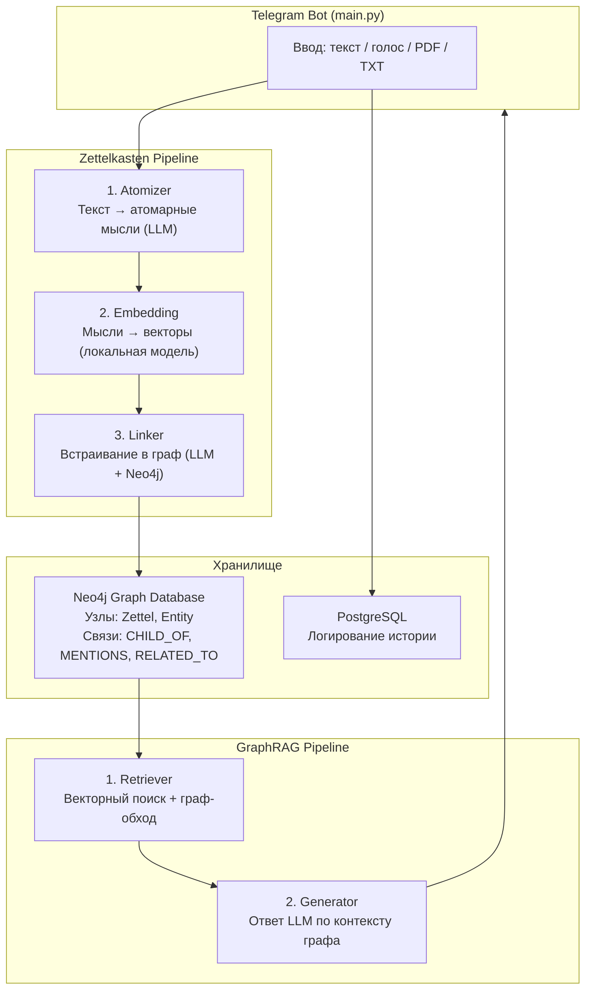
```mermaid
flowchart TB
    subgraph TG["Telegram Bot (main.py)"]
        INPUT["Ввод: текст / голос / PDF / TXT"]
    end

    subgraph ZP["Zettelkasten Pipeline"]
        A["1. Atomizer\nТекст → атомарные мысли (LLM)"]
        B["2. Embedding\nМысли → векторы (локальная модель)"]
        C["3. Linker\nВстраивание в граф (LLM + Neo4j)"]
    end

    subgraph DB["Хранилище"]
        NEO["Neo4j Graph Database\nУзлы: Zettel, Entity\nСвязи: CHILD_OF, MENTIONS, RELATED_TO"]
        PG["PostgreSQL\nЛогирование истории"]
    end

    subgraph RAG["GraphRAG Pipeline"]
        R["1. Retriever\nВекторный поиск + граф-обход"]
        G["2. Generator\nОтвет LLM по контексту графа"]
    end

    INPUT --> A
    A --> B
    B --> C
    C --> NEO
    INPUT --> PG
    NEO --> R
    R --> G
    G --> TG
```

Дополнительно: PostgreSQL для логирования всех взаимодействий пользователя с ботом.

---

## 3. Структура проекта

```
Executive_Exocortex/
├── main.py                        # Telegram-бот: точка входа (aiogram FSM)
├── config/
│   ├── settings.py                # Централизованная конфигурация (Pydantic BaseSettings)
│   └── prompts.py                 # Все LLM-системные промпты
├── zettelkasten/
│   ├── atomizer.py                # NoteAtomizer — LLM-декомпозиция на ZettelCard
│   ├── linker.py                  # GraphLinker — embedding + LLM-встраивание в граф
│   ├── graph_rag.py               # GraphRAG — retrieval + generation
│   ├── graph_visualizer.py        # Интерактивный HTML-дашборд графа (vis.js)
│   └── exocortex.py               # CLI-демо скрипт
├── storage/
│   ├── neo4j/
│   │   ├── client.py              # Bolt-клиент Neo4j (singleton)
│   │   ├── schema.py              # Инициализация схемы (constraints, indexes)
│   │   └── repository.py          # Полный CRUD-слой
│   └── postgres/
│       ├── db_connect.py          # Логирование истории
│       └── cleaner.py             # Утилита очистки логов
├── telegram_bot/
│   ├── texts.py                   # UI-тексты
│   └── handlers/
│       ├── asr.py                 # Google ASR для голоса
│       ├── pdf_reader.py          # PDF-извлечение (pdfplumber + OCR)
│       └── txt_reader.py          # Чтение plain text
├── eval/                          # Пайплайн оценки качества
│   ├── generate_data.ipynb        # Генерация синтетических данных + прогоны моделей
│   ├── calculate_metrics.ipynb    # Расчёт метрик Atomizer
│   ├── compare_results.ipynb      # Нормализация, скоринг, рейтинг
│   ├── calc_costs.ipynb           # Анализ стоимости и задержек
│   ├── rag_01_generate_dataset.ipynb  # Генерация RAG Q&A-датасета
│   ├── rag_02_retrieval_metrics.ipynb # Метрики retrieval (top_k=3,5,7)
│   ├── rag_03_generation_metrics.ipynb # Метрики генерации (LLM-as-judge)
│   ├── synthetic_datasets/        # Сгенерированные данные (atomizer, linker, graphrag)
│   ├── metric_results/            # Результаты eval
│   │   ├── atomizer/              # Метрики Atomizer
│   │   ├── linker/                # Метрики Linker
│   │   ├── graphrag/              # Актуальные метрики GraphRAG (v2)
│   │   └── rag/                   # Legacy GraphRAG eval (deprecated)
│   └── README_eval.md             # Методология оценки
├── docker-compose.yml             # Neo4j + Langfuse + ChromaDB (legacy)
├── requirements.txt
└── images/
    └── graph-dashboard.png
```

---

## 4. Функциональность Telegram-бота

### 4.1 Интерфейс

Бот реализован на `aiogram` (async Python). Навигация построена на конечном автомате (FSM):

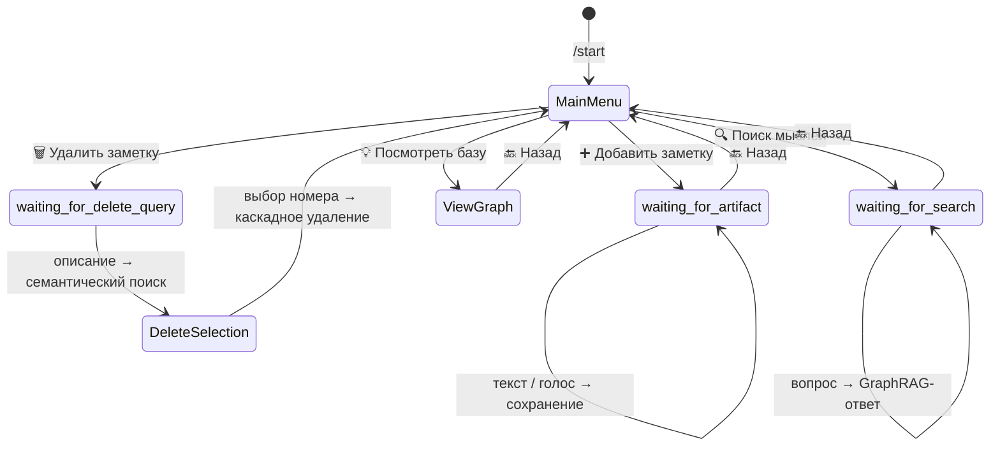
```mermaid
stateDiagram-v2
    [*] --> MainMenu: /start
    MainMenu --> waiting_for_artifact: ➕ Добавить заметку
    MainMenu --> waiting_for_search: 🔍 Поиск мыслей
    MainMenu --> ViewGraph: 💡 Посмотреть базу
    MainMenu --> waiting_for_delete_query: 🗑 Удалить заметку

    waiting_for_artifact --> waiting_for_artifact: текст / голос → сохранение
    waiting_for_search --> waiting_for_search: вопрос → GraphRAG-ответ
    waiting_for_delete_query --> DeleteSelection: описание → семантический поиск
    DeleteSelection --> MainMenu: выбор номера → каскадное удаление

    waiting_for_artifact --> MainMenu: 🔙 Назад
    waiting_for_search --> MainMenu: 🔙 Назад
    ViewGraph --> MainMenu: 🔙 Назад
```

Главное меню содержит 4 кнопки:

```
[➕ Добавить новую заметку]
[🔍 Поиск мыслей по запросу]
[💡 Посмотреть базу знаний]
[🗑 Удалить заметку]
```

Каждый пользователь идентифицируется через `telegram_user_id`, из которого формируется `user_id = "tg_user_{telegram_user_id}"`. Это обеспечивает полную изоляцию данных между пользователями на уровне базы.

### 4.2 Режим добавления заметки

Пользователь нажимает «Добавить новую заметку» → устанавливается состояние `waiting_for_artifact`. Система принимает:

| Тип входа | Обработка |
|-----------|-----------|
| Текстовое сообщение | Напрямую передаётся в pipeline |
| Голосовое сообщение | `.ogg` → `ffmpeg` → `.wav` → Google ASR (`speech_recognition`, `ru-RU`) → текст |
| Файл `.pdf` | `pdfplumber` (текст) + `pytesseract` (OCR изображений) + извлечение таблиц → текст |
| Файл `.txt` | Чтение plain text |

Документы обрабатываются независимо от текущего состояния FSM (всегда добавляются в базу).

После получения текста запускается `save_user_note(user_id, text)`:

```python
raw_cards = atomizer.atomize(text, current_db_max_root_id)
results   = linker.link_and_insert(user_id, raw_cards)
stats     = linker.get_user_stats(user_id)
# → "✅ Записано в граф знаний. 📚 Размер базы знаний: N карточек"
```

### 4.3 Режим поиска (GraphRAG)

Пользователь вводит вопрос → система вызывает `graphrag.query(user_id, query)` → возвращает ответ в формате HTML. Ответ опирается только на мысли данного пользователя.

### 4.4 Просмотр базы знаний

Генерируется HTML-файл с интерактивным графом через `generate_graph_html_from_repo(repo, user_id)`. Файл отправляется как документ. Пользователь открывает его в браузере.

### 4.5 Удаление заметки

Пользователь описывает, что хочет удалить. Система делает семантический поиск, показывает до 5 кандидатов с релевантностью. Пользователь выбирает номер — удаляется мысль и всё её дочернее поддерево.

### 4.6 Уточняющее меню

Если пользователь отправляет текст без активного режима (не нажал ни одну кнопку), бот спрашивает: «Что вы хотите с ним сделать?» и предлагает две кнопки: «📥 Добавить заметку» / «🔍 Найти мысли по контексту». Текст сохраняется в FSM до принятия решения.

---

## 5. Zettelkasten: методология и адаптация

### 5.1 Что такое Zettelkasten

Zettelkasten — метод ведения знаний социолога Никласа Лумана. Каждая мысль записывается на отдельную карточку (Zettel). Карточки связываются между собой ссылками. Нет жёстких папок — вместо этого разветвлённые «нити мышления», где каждая карточка имеет уникальный иерархический идентификатор.

В системе этот метод автоматизирован на трёх уровнях:

1. **Атомизация** — AI разбивает входной текст на Zettel-карточки.
2. **Luhmann ID** — система автоматически назначает иерархические идентификаторы.
3. **Линковка** — AI определяет, куда встроить каждую новую карточку в существующий граф.

### 5.2 Идентификаторы Лумана (Luhmann ID)

Система иерархической нумерации, обеспечивающая бесконечное ветвление мыслей без конфликтов:

```
1         ← корневая тема 1
1.1       ← уточнение/развитие темы 1
1.1a      ← ответвление от 1.1
1.1a1     ← ответвление от 1.1a
1.2       ← вторая ветка темы 1
2         ← корневая тема 2
2.1       ← уточнение темы 2
```

### 5.3 Алгоритм генерации Luhmann ID

Генерация выполняется классом `ZettelIdGenerator.get_next_id(parent_luhmann_id, existing_sibling_ids, current_max_root)`:

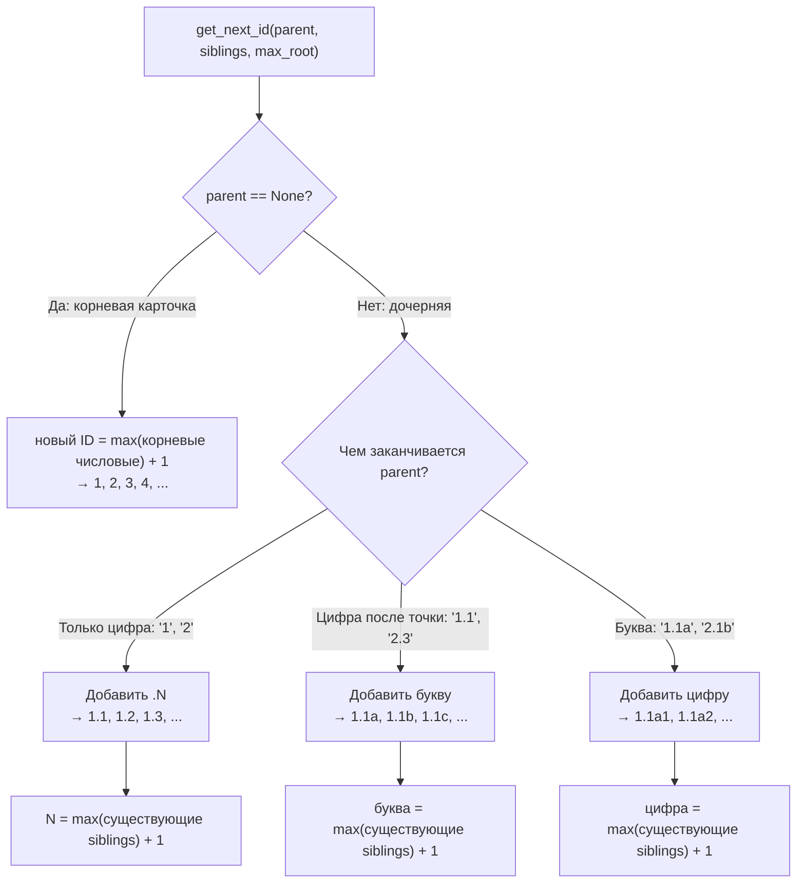
```mermaid
flowchart TD
    START["get_next_id(parent, siblings, max_root)"] --> CHECK{parent == None?}

    CHECK -->|Да: корневая карточка| ROOT["новый ID = max(корневые числовые) + 1\n→ 1, 2, 3, 4, ..."]

    CHECK -->|Нет: дочерняя| TYPE{Чем заканчивается parent?}

    TYPE -->|Только цифра: '1', '2'| DOT["Добавить .N\n→ 1.1, 1.2, 1.3, ..."]
    TYPE -->|Цифра после точки: '1.1', '2.3'| LETTER["Добавить букву\n→ 1.1a, 1.1b, 1.1c, ..."]
    TYPE -->|Буква: '1.1a', '2.1b'| NUM["Добавить цифру\n→ 1.1a1, 1.1a2, ..."]

    DOT --> SIBLING1["N = max(существующие siblings) + 1"]
    LETTER --> SIBLING2["буква = max(существующие siblings) + 1"]
    NUM --> SIBLING3["цифра = max(существующие siblings) + 1"]
```

Алгоритм определяет тип следующего суффикса по последнему символу родительского ID и учитывает уже существующих siblings (братьев) для вычисления следующего порядкового номера или буквы.

**Пример:** если `parent_luhmann_id = "1.1"` и среди siblings уже есть `["1.1a", "1.1b"]`, следующий ID будет `"1.1c"`.

---

## 6. Atomizer — декомпозиция текста на мысли

**Файл:** `zettelkasten/atomizer.py`

### 6.1 Назначение

`NoteAtomizer` принимает произвольный текст (от 1 предложения до нескольких страниц) и возвращает список `ZettelCard` — атомарных мыслей, готовых к встраиванию в граф.

### 6.2 Структуры данных

```python
class AtomicThought(BaseModel):
    content: str          # текст мысли (1-2 предложения, самодостаточно)
    thought_type: ThoughtType  # тип мысли
    tags: list[str]       # 1-5 тегов-сущностей (snake_case)
    parent_hint: str|None # дословная цитата родительской мысли из этого же списка
    is_root_topic: bool   # True = новая тема, False = развивает другую

class ZettelCard(BaseModel):
    zettel_id: str         # UUID карточки
    luhmann_id: str        # иерархический ID
    parent_id: str|None    # UUID родительской карточки
    parent_luhmann_id: str|None
    content: str
    thought_type: ThoughtType
    tags: list[str]
    is_root_topic: bool
    embedding: list[float]|None
```

### 6.3 Типы мыслей

| Тип | Описание | Пример |
|-----|----------|--------|
| `fact` | Данные, метрики, констатация фактов | «Выручка упала на 5%» |
| `decision` | Фиксация выбора, точка невозврата | «Закрываем направление СНГ» |
| `action` | Задача, поручение, to-do | «Петрову подготовить отчёт к пятнице» |
| `risk` | Угроза, узкое горлышко | «Подрядчик может сорвать сроки» |
| `idea` | Гипотеза, предложение, стратегия | «А что если внедрить ИИ в колл-центр?» |
| `question` | Открытый вопрос, требующий ответа | «Почему выросла стоимость лида?» |
| `context` | Фоновая информация, условия | «Клиент пришёл в негативном настроении» |
| `other` | Всё, что не подходит под предыдущие | — |

### 6.4 Алгоритм атомизации

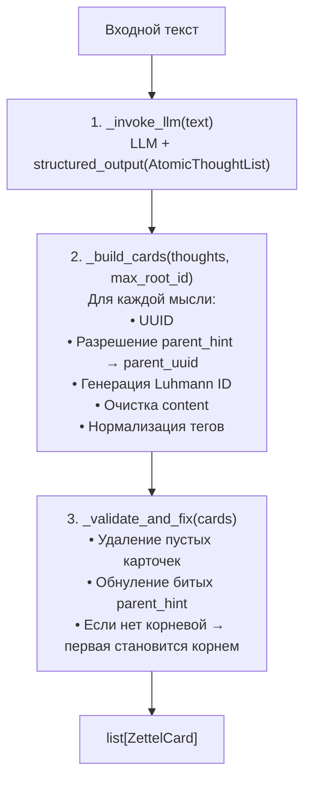
```mermaid
flowchart TD
    IN["Входной текст"] --> LLM["1. _invoke_llm(text)\nLLM + structured_output(AtomicThoughtList)"]
    LLM --> BUILD["2. _build_cards(thoughts, max_root_id)\nДля каждой мысли:\n• UUID\n• Разрешение parent_hint → parent_uuid\n• Генерация Luhmann ID\n• Очистка content\n• Нормализация тегов"]
    BUILD --> VALIDATE["3. _validate_and_fix(cards)\n• Удаление пустых карточек\n• Обнуление битых parent_hint\n• Если нет корневой → первая становится корнем"]
    VALIDATE --> OUT["list[ZettelCard]"]
```

**Промпт Atomizer** содержит жёсткие правила:

- **Критерий атомарности:** одна мысль = 1-2 предложения, одно concrete утверждение.
- **Самодостаточность:** карточка должна быть понятна без исходного текста спустя год.
- **Разрешение местоимений (Coreference Resolution):** запрещено использовать «он», «она», «это», «они» — заменять на явные имена, названия проектов, организаций.
- **Сохранение деталей:** цифры, метрики, дедлайны, конкретные формулировки.
- **Тегирование:** только именованные сущности (люди, проекты, организации, технологии), формат `snake_case`, от 1 до 5 тегов.
- **Внутритекстовое связывание:** `parent_hint` — дословная цитата родительской мысли из того же списка.

### 6.5 Правило разрешения местоимений

LLM-промпт содержит жёсткое требование: если в исходном тексте сказано «она перенесла релиз на октябрь», а из контекста ясно, что «она» — Елена Волкова, LLM обязана написать «Елена Волкова перенесла релиз продукта Helios на октябрь». Это критично для базы знаний: карточка должна быть понятна спустя год без исходного текста.

### 6.6 Пример

**Входной текст:**

```
По проекту Смарт-Ритейл мы отстаем от графика интеграции платежного шлюза
на 2 недели из-за багов на стороне Т-Банк. Николай Петров должен завтра
созвониться с их техподдержкой. Иначе рискуем сорвать релиз в августе.
Забронируйте мне билеты в Сочи на следующую неделю для встречи с инвесторами.
```

**Результат Atomizer (AtomicThought):**

```yaml
1. content: "Интеграция платёжного шлюза по проекту Смарт-Ритейл отстаёт на 2 недели из-за ошибок Т-Банка."
   type: fact
   tags: [смарт_ритейл, т_банк]
   is_root_topic: true
   parent_hint: null

2. content: "Николай Петров обязан завтра позвонить в техподдержку Т-Банк для фиксации SLA."
   type: action
   tags: [николай_петров, т_банк]
   is_root_topic: false
   parent_hint: "Интеграция платёжного шлюза..."   ← дословная цитата

3. content: "Срыв SLA с Т-Банк несёт риск задержки релиза Смарт-Ритейл в августе."
   type: risk
   tags: [смарт_ритейл, т_банк]
   is_root_topic: false
   parent_hint: "Интеграция платёжного шлюза..."

4. content: "Забронировать авиабилеты в Сочи на следующую неделю для встречи с инвесторами."
   type: action
   tags: [сочи, инвесторы]
   is_root_topic: true   ← новая независимая тема
   parent_hint: null
```

**После `_build_cards`** с `current_db_max_root_id = 2` (в базе уже 2 корня):

| Карточка | luhmann_id | Пояснение |
|----------|-----------|-----------|
| 1 | `"3"` | Новый корень (root #3) |
| 2 | `"3.1"` | Дочерняя от «3» |
| 3 | `"3.1a"` | Тоже дочерняя от «3» (ответвление от 3.1) |
| 4 | `"4"` | Новый корень (другая тема) |

---

## 7. Эмбеддинги — векторное представление мыслей

**Файл:** `zettelkasten/linker.py` — класс `LocalEmbeddingModel`

### 7.1 Модель

Используется локальная HuggingFace-модель `intfloat/multilingual-e5-base`:

| Параметр | Значение |
|----------|----------|
| Параметры | 278M |
| Размерность | 768 |
| Язык | Мультиязычная (русский поддерживается) |
| Ускорение | CUDA → MPS (Apple Silicon) → CPU |

### 7.2 Префиксы E5

Модель E5 обучена с обязательными префиксами:

```python
# Для документов (карточки в базе):
embed_passage("passage: Николай Петров обязан позвонить...")

# Для поисковых запросов (вопрос или новая мысль):
embed_query("query: Кто отвечает за звонок в Т-Банк?")
```

Отсутствие правильного префикса резко снижает качество поиска.

### 7.3 Нормализация

Все векторы нормализуются (`normalize_embeddings=True`). При нормализованных векторах (длина = 1) **косинусное сходство** эквивалентно **скалярному произведению** — поиск становится быстрее.

### 7.4 Где используются эмбеддинги

| Компонент | Метод | Назначение |
|-----------|-------|------------|
| Atomizer | — | НЕ использует эмбеддинги |
| Linker | `embed_passage` | Эмбеддинг каждой новой карточки для хранения |
| Linker | `embed_query` | Поиск кандидатов при встраивании |
| GraphRAG | `embed_query` | Поиск по вопросу пользователя |
| Удаление | `embed_query` | Поиск кандидатов на удаление |

---

## 8. Linker — встраивание мысли в граф

**Файл:** `zettelkasten/linker.py` — класс `GraphLinker`

### 8.1 Общая схема

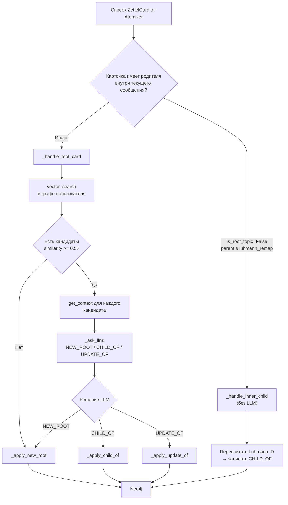
```mermaid
flowchart TD
    A["Список ZettelCard от Atomizer"] --> B{"Карточка имеет родителя\nвнутри текущего сообщения?"}
    B -->|"is_root_topic=False\nparent в luhmann_remap"| C["_handle_inner_child\n(без LLM)"]
    B -->|Иначе| D["_handle_root_card"]
    C --> E["Пересчитать Luhmann ID\n→ записать CHILD_OF"]
    D --> F["vector_search\nв графе пользователя"]
    F --> G{"Есть кандидаты\nsimilarity >= 0.5?"}
    G -->|Нет| H["_apply_new_root"]
    G -->|Да| I["get_context для каждого\nкандидата"]
    I --> J["_ask_llm:\nNEW_ROOT / CHILD_OF / UPDATE_OF"]
    J --> K{Решение LLM}
    K -->|NEW_ROOT| H
    K -->|CHILD_OF| L["_apply_child_of"]
    K -->|UPDATE_OF| M["_apply_update_of"]
    H --> N["Neo4j"]
    L --> N
    M --> N
    E --> N
```

### 8.2 Внутритекстовые дочерние карточки

Когда Atomizer возвращает несколько карточек из одного сообщения и некоторые уже связаны (`parent_hint`), Linker отслеживает это через `_luhmann_remap` — словарь `{временный_id: реальный_id_в_базе}`.

Пример: если карточка `3` уже вставлена в граф как `[5]`, а карточка `3.1` является её дочерней, Linker сразу выполняет `_handle_inner_child` — пересчитывает реальный `luhmann_id` и вставляет как `CHILD_OF`, **не запрашивая LLM**. Это сокращает количество LLM-запросов.

### 8.3 Векторный поиск кандидатов

Для «корневых» карточек (без заранее известного родителя):

```python
candidates = repository.vector_search(
    user_id=user_id,
    query_embedding=embed_query(card.content),
    limit=5,                    # max_candidates
    similarity_threshold=0.5,   # linker_similarity_threshold
)
```

Поиск выполняется в Python: из Neo4j извлекаются все Zettel данного пользователя с эмбеддингами, затем вычисляется косинусное сходство с новой карточкой. Если ни одного кандидата с `similarity >= 0.5` — сразу `NEW_ROOT` без вызова LLM.

### 8.4 Сбор графового контекста

Для каждого кандидата система поднимает его окрестность из Neo4j:

```python
GraphContext(
    candidate:  ZettelNode,        # сам кандидат
    similarity: float,             # косинусное сходство
    parent:     ZettelNode|None,   # родительская мысль
    children:   list[ZettelNode],  # дочерние мысли
    related:    list[ZettelNode],  # связанные (RELATED_TO)
    entities:   list[EntityNode],  # сущности (MENTIONS)
)
```

Вместо «вот похожая мысль» LLM видит «вот похожая мысль, из чего она выросла, что из неё выросло, о каких проектах/людях она».

### 8.5 LLM-решение (LinkDecision)

LLM получает новую мысль и кандидатов с контекстом, возвращает:

```python
class LinkDecision(BaseModel):
    action: Literal["new_root", "child_of", "update_of"]
    target_zettel_id: str|None  # UUID карточки-цели
    reasoning: str              # объяснение решения
```

**Правила принятия решения (из промпта):**

| Действие | Когда выбирается |
|----------|-----------------|
| `child_of` | Новая мысль развивает / уточняет / является следствием старой |
| `update_of` | Новая мысль прямо заменяет информацию в старой (другие сроки, отменено решение) |
| `new_root` | Совпадение поверхностное, разные контексты/проекты/люди. **При любых сомнениях → `new_root`** |

### 8.6 Применение решений

**`_apply_new_root`:** получает список корневых Luhmann ID пользователя → генерирует `max + 1` → создаёт узел Zettel + Entity-узлы с MENTIONS.

**`_apply_child_of`:** находит родительский узел → получает siblings → генерирует следующий Luhmann ID → создаёт узел + связь CHILD_OF + Entity + MENTIONS.

**`_apply_update_of`:** обновляет `content` и `embedding` существующего узла → SET `updated_at = now()`. Новый узел **не** создаётся, Luhmann ID сохраняется.

---

## 9. Граф знаний в Neo4j

**Файлы:** `storage/neo4j/client.py`, `storage/neo4j/schema.py`, `storage/neo4j/repository.py`

### 9.1 Почему Neo4j

В знаниевой базе критично понимать: «эта мысль выросла из той», «эти два узла связаны через общую сущность». Neo4j хранит граф нативно — обходы по рёбрам не требуют `JOIN`. Контейнер: `neo4j:5.26-community` с поддержкой vector index.

### 9.2 Схема данных

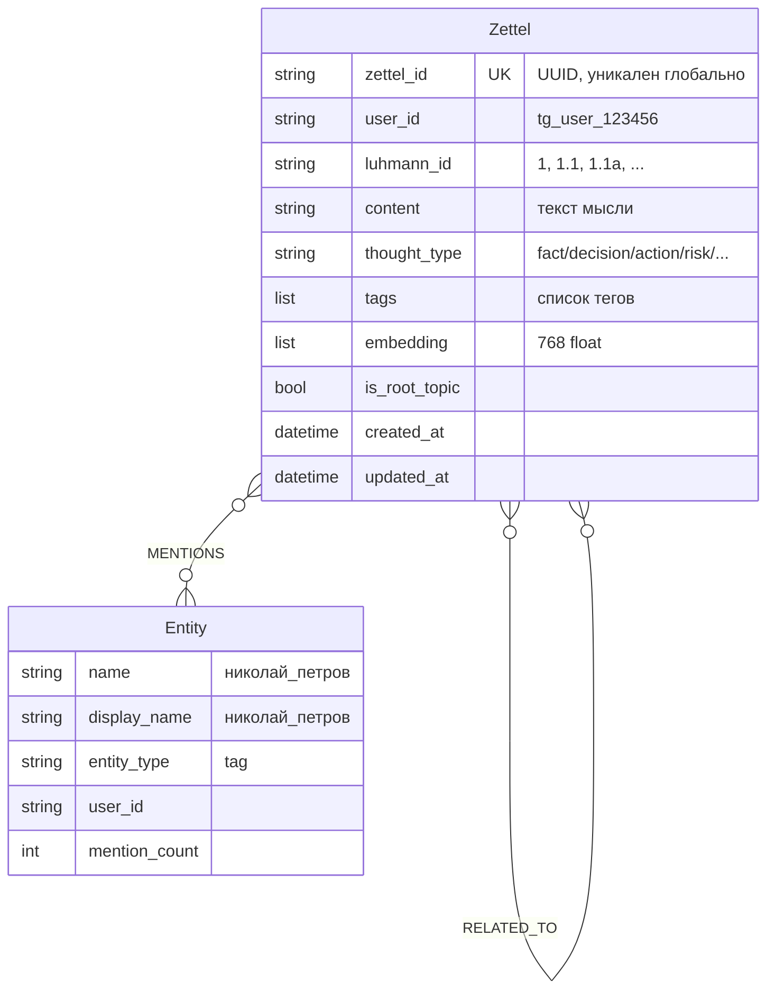
```mermaid
erDiagram
    Zettel {
        string zettel_id UK "UUID, уникален глобально"
        string user_id "tg_user_123456"
        string luhmann_id "1, 1.1, 1.1a, ..."
        string content "текст мысли"
        string thought_type "fact/decision/action/risk/..."
        list tags "список тегов"
        list embedding "768 float"
        bool is_root_topic
        datetime created_at
        datetime updated_at
    }

    Entity {
        string name "николай_петров"
        string display_name "николай_петров"
        string entity_type "tag"
        string user_id
        int mention_count
    }

    Zettel ||--o{ Zettel : "CHILD_OF"
    Zettel }o--o{ Zettel : "RELATED_TO"
    Zettel }o--o{ Entity : "MENTIONS"
```

**Связи:**

| Связь | Направление | Описание |
|-------|-------------|----------|
| `CHILD_OF` | `(child) → (parent)` | Иерархия мыслей |
| `MENTIONS` | `(zettel) → (entity)` | Упоминание сущности |
| `RELATED_TO` | `(zettel) ↔ (zettel)` | Смысловая связь |

### 9.3 Как создаются сущности (Entity)

При каждом добавлении узла Zettel теги карточки преобразуются в Entity и связи MENTIONS:

```cypher
UNWIND $tags as tag
MERGE (e:Entity {name: tag, user_id: $user_id})
ON CREATE SET e.display_name = tag, e.entity_type = 'tag', e.mention_count = 1
ON MATCH  SET e.mention_count = e.mention_count + 1
MERGE (z)-[:MENTIONS {created_at: datetime($created_at)}]->(e)
```

`MERGE` гарантирует, что сущность (например, `николай_петров`) существует в единственном экземпляре для пользователя, а `mention_count` инкрементируется.

### 9.4 Индексы и constraints

```cypher
-- Уникальность zettel_id
CREATE CONSTRAINT zettel_id_unique FOR (z:Zettel) REQUIRE z.zettel_id IS UNIQUE

-- Поиск по пользователю
CREATE INDEX zettel_user          FOR (z:Zettel) ON (z.user_id)
CREATE INDEX zettel_user_luhmann  FOR (z:Zettel) ON (z.user_id, z.luhmann_id)

-- Entity
CREATE INDEX entity_name_user     FOR (e:Entity) ON (e.name, e.user_id)
CREATE INDEX entity_user          FOR (e:Entity) ON (e.user_id)

-- Векторный индекс (768-dim, cosine)
CREATE VECTOR INDEX zettel_embedding
FOR (z:Zettel) ON (z.embedding)
OPTIONS { indexConfig: {
  `vector.dimensions`: 768,
  `vector.similarity_function`: 'cosine'
}}
```

Индекс `(user_id, luhmann_id)` — основной для поиска узла по Luhmann ID в контексте пользователя.

### 9.5 Multi-user изоляция

Каждый запрос к Neo4j содержит фильтр `{user_id: $user_id}`. При инициализации `GraphLinker` дополнительно вызывается `remove_cross_user_links()` — Cypher-запрос, который ищет и удаляет любые случайные рёбра между Zettel разных пользователей.

### 9.6 Клиент Neo4j

`Neo4jClient` (`storage/neo4j/client.py`) — singleton через `get_neo4j_client()`:

- `execute_read(query, params)` — read-транзакция
- `execute_write(query, params)` — write-транзакция
- Bolt-протокол (порт 7687), проверка подключения при старте (`verify_connectivity`)

---

## 10. GraphRAG — поиск и генерация ответов

**Файл:** `zettelkasten/graph_rag.py`

GraphRAG — второй ключевой пайплайн системы. Если при добавлении заметки система **строит** граф, то при поиске она **читает** граф: находит релевантные мысли, подтягивает связанный контекст и передаёт его LLM для генерации ответа.

### 10.1 Архитектура GraphRAG

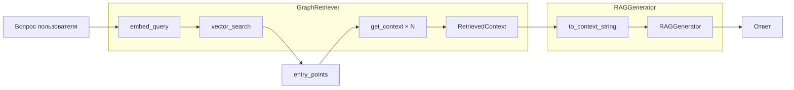
```mermaid
flowchart LR
    Q["Вопрос пользователя"] --> E["embed_query"]
    E --> VS["vector_search"]
    VS --> EP["entry_points"]
    EP --> GC["get_context × N"]
    GC --> RC["RetrievedContext"]
    RC --> FMT["to_context_string"]
    FMT --> LLM["RAGGenerator"]
    LLM --> A["Ответ"]

    subgraph retriever ["GraphRetriever"]
        E
        VS
        GC
        RC
    end

    subgraph generator ["RAGGenerator"]
        FMT
        LLM
    end
```

Три класса:

| Компонент | Роль |
|-----------|------|
| `GraphRAG` | Фасад: `query()` → retrieve + generate |
| `GraphRetriever` | Векторный поиск + обход графа → `RetrievedContext` |
| `RAGGenerator` | LLM синтезирует ответ по контексту |

Структура данных `RetrievedContext` содержит: `entry_points`, `expanded_nodes`, `entities`, `paths`.

### 10.2 RAG vs GraphRAG

```
Обычный RAG:
  Вопрос → embed → top-K похожих текстов → LLM
  (каждый chunk изолирован, связи между мыслями теряются)

GraphRAG:
  Вопрос → embed → top-K entry points
         → обход графа (родители, дети, related, entity)
         → структурированный контекст → LLM
  (LLM видит не только «похожие фразы», но и иерархию и сущности)
```

**Пример.** Пользователь спрашивает: «Кто курирует DevSummit?»

- Обычный RAG мог бы найти только карточку `[1.1] Куратором назначен Олег Мишин`.
- GraphRAG находит `[1.1]`, затем подтягивает родителя `[1]` (срок до 10 мая) и соседа `[1.1a]` (бюджет 2,4 млн) через `CHILD_OF`. LLM получает полную картину ветки.

### 10.3 Полная последовательность

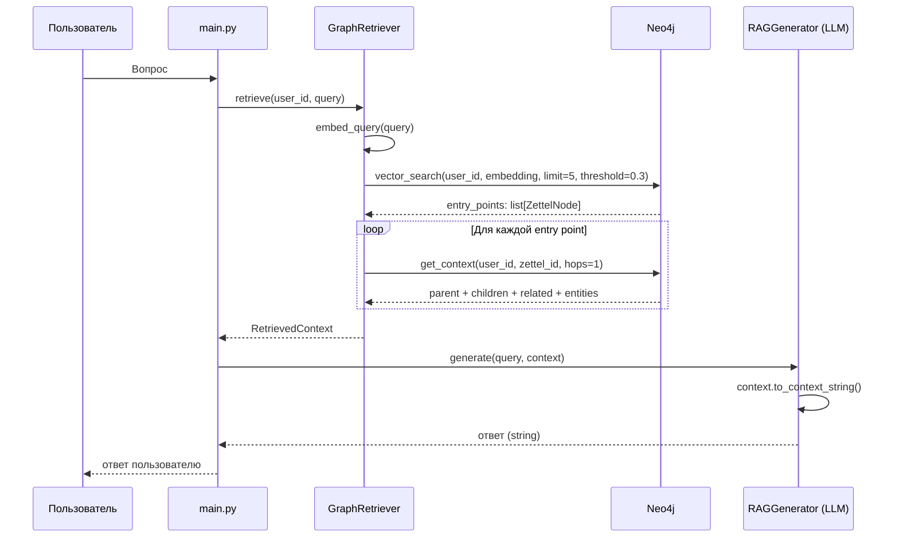
```mermaid
sequenceDiagram
    participant U as Пользователь
    participant B as main.py
    participant R as GraphRetriever
    participant N as Neo4j
    participant G as RAGGenerator (LLM)

    U->>B: Вопрос
    B->>R: retrieve(user_id, query)

    R->>R: embed_query(query)
    R->>N: vector_search(user_id, embedding, limit=5, threshold=0.3)
    N-->>R: entry_points: list[ZettelNode]

    loop Для каждой entry point
        R->>N: get_context(user_id, zettel_id, hops=1)
        N-->>R: parent + children + related + entities
    end

    R-->>B: RetrievedContext

    B->>G: generate(query, context)
    G->>G: context.to_context_string()
    G-->>B: ответ (string)

    B-->>U: ответ пользователю
```

### 10.4 Этап 1: векторный поиск (entry points)

Entry point — мысль, семантически близкая к вопросу. Это «точка входа» в граф.

**Шаг 1.1** — эмбеддинг вопроса с префиксом `query:`:

```python
query_embedding = embedding_model.embed_query("Кто курирует DevSummit?")
```

**Шаг 1.2** — cosine similarity по всем Zettel пользователя:

```python
candidates = repository.vector_search(
    user_id=user_id,
    query_embedding=query_embedding,
    limit=5,
    similarity_threshold=0.3,
)
```

Алгоритм: Cypher загружает все мысли пользователя с эмбеддингами → numpy вычисляет cosine → фильтрация по порогу → top-5 по убыванию.

Почему Python, а не vector index Neo4j: vector index не фильтрует по `user_id`. Для персональной базы (сотни–тысячи карточек) вычисление в Python быстрое.

Если `entry_points` пуст — GraphRAG сразу возвращает «информации не найдено» без вызова LLM.

### 10.5 Этап 2: обход графа (расширение контекста)

Для каждой entry point вызывается `get_context(user_id, zettel_id, hops=1)`:

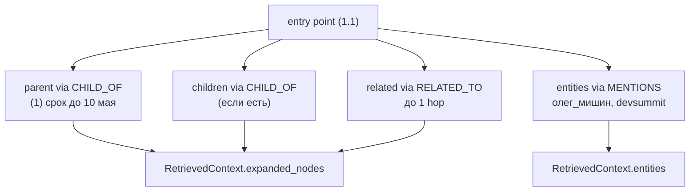
```mermaid
flowchart TD
    EP["entry point (1.1)"]
    EP --> P["parent via CHILD_OF\n(1) срок до 10 мая"]
    EP --> C1["children via CHILD_OF\n(если есть)"]
    EP --> R["related via RELATED_TO\nдо 1 hop"]
    EP --> E["entities via MENTIONS\nолег_мишин, devsummit"]

    P --> RC["RetrievedContext.expanded_nodes"]
    C1 --> RC
    R --> RC
    E --> ENT["RetrievedContext.entities"]
```

**Дедупликация:** один и тот же узел не добавляется дважды, даже если связан с несколькими entry points. `paths` — текстовое описание связей для LLM.

### 10.6 Этап 3: сборка контекста

`RetrievedContext.to_context_string()` превращает граф в текст для промпта:

1. Объединение `entry_points + expanded_nodes` (уникальные по `zettel_id`)
2. Группировка по `thought_type`: FACT, ACTION, RISK, DECISION, ...
3. Блок «СВЯЗАННЫЕ СУЩНОСТИ» (до 10 entity)
4. Блок «СВЯЗИ МЕЖДУ МЫСЛЯМИ» (до 5 paths)

### 10.7 Этап 4: генерация ответа

```python
if not context.all_nodes:
    return NO_CONTEXT_RESPONSE  # без LLM

response = llm.invoke([
    SystemMessage(SYSTEM_PROMPT),
    HumanMessage(f"КОНТЕКСТ: {context_str}\n\nВОПРОС: {query}"),
])
```

Промпт запрещает LLM выдумывать факты вне контекста, делать формальные разделы (если пользователь не просил), дублировать вопрос. Ответ форматируется в HTML для Telegram (`<b>`, `<i>`, `<code>`).

Temperature = `0.3` — выше, чем у atomizer/linker (`0.0`), чтобы ответ звучал естественнее.

### 10.8 Специализированные режимы поиска

| Метод | Как ищет | Когда полезен |
|-------|----------|---------------|
| `query(user_id, text)` | vector search + graph expand | Любой вопрос пользователя |
| `query_entity(user_id, name)` | Cypher по Entity ← MENTIONS ← Zettel | «Расскажи всё про devsummit» |
| `query_actions(user_id)` | Все Zettel с `thought_type=action` | Список задач и поручений |
| `query_risks(user_id)` | Все Zettel с `thought_type=risk` | Обзор зафиксированных рисков |

### 10.9 Сравнение параметров Linker и GraphRAG

| Параметр | Linker (запись) | GraphRAG (поиск) |
|----------|----------------|------------------|
| Цель | Куда встроить мысль | Ответить на вопрос |
| `limit` | 5 | 5 |
| `threshold` | 0.5 | 0.3 (мягче — шире контекст) |
| После search | LLM: new_root / child_of / update_of | Graph expand + LLM генерирует ответ |
| Префикс embed | `passage:` для карточки, `query:` для search | `query:` для вопроса |

---

## 11. Интерактивный дашборд визуализации графа

**Файл:** `zettelkasten/graph_visualizer.py`

### 11.1 Логика генерации

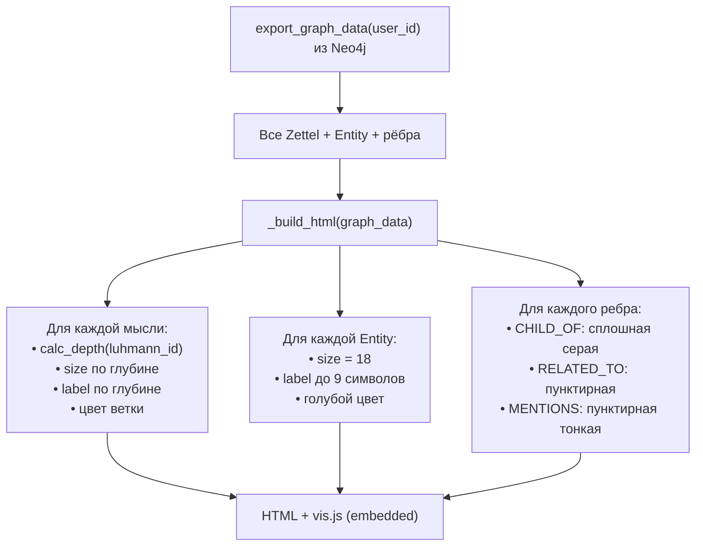
```mermaid
flowchart TD
    EX["export_graph_data(user_id) из Neo4j"] --> DATA["Все Zettel + Entity + рёбра"]
    DATA --> BUILD["_build_html(graph_data)"]
    BUILD --> Z["Для каждой мысли:\n• calc_depth(luhmann_id)\n• size по глубине\n• label по глубине\n• цвет ветки"]
    BUILD --> E["Для каждой Entity:\n• size = 18\n• label до 9 символов\n• голубой цвет"]
    BUILD --> EDGE["Для каждого ребра:\n• CHILD_OF: сплошная серая\n• RELATED_TO: пунктирная\n• MENTIONS: пунктирная тонкая"]
    Z --> HTML["HTML + vis.js (embedded)"]
    E --> HTML
    EDGE --> HTML
```

**Размеры узлов-мыслей по глубине:**

| Глубина | Размер | Символов в label | Перенос строки |
|---------|--------|-----------------|----------------|
| 0 (корень) | 62 | до 34 | нет |
| 1 | 48 | до 16 | по 6 символов |
| 2 | 34 | до 11 | по 5 символов |
| 3 | 28 | до 9 | по 4 символа |
| 4+ | 24 | до 7 | по 4 символа |

**Цвета веток:** каждая корневая ветка получает свой цвет из палитры (оранжевый, зелёный, розовый, фиолетовый, ...) — дочерние узлы наследуют цвет корня.

### 11.2 Интерактивность

- **Клик** на узел → правая панель деталей (полный текст, тип, теги, список связей).
- **Клик** на связь в панели → перемещение к связанному узлу.
- **Стрелки** в панели: `→` = дочерняя (вглубь), `←` = родитель (уровень выше). Теги — без стрелок.
- **Поиск** по тексту (поле в левом верхнем углу) — фильтрация графа в реальном времени.
- **Переключатель темы** «Светлая / Тёмная» — сохраняется в `localStorage`.
- **Физика:** после стабилизации отключается — граф «замирает» в финальной позиции.

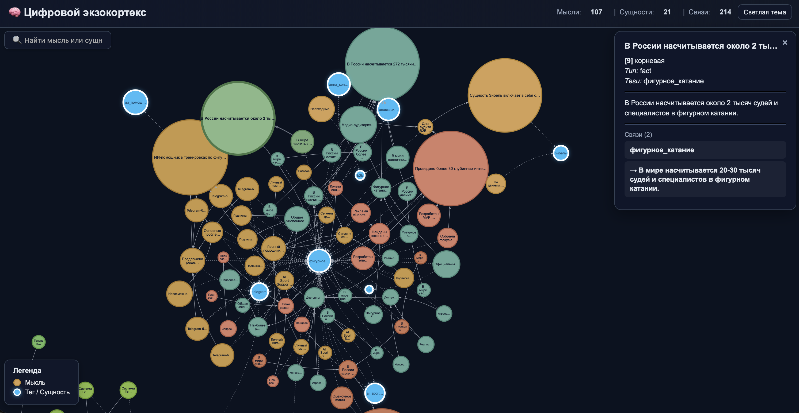

---

## 12. Удаление мыслей

### 12.1 Поиск кандидатов

```python
query_embedding = embedding_model.embed_query(user_text)
candidates = repository.vector_search(
    user_id, query_embedding,
    limit=5,
    similarity_threshold=max(0.35, settings.linker_similarity_threshold)
)
# → показывает до 5 мыслей с preview и score
```

### 12.2 Каскадное удаление

```cypher
MATCH (target:Zettel {zettel_id: $id, user_id: $user_id})
OPTIONAL MATCH (desc:Zettel {user_id: $user_id})-[:CHILD_OF*1..]->(target)
WITH target, collect(DISTINCT desc) + target AS to_delete
UNWIND to_delete AS node
DETACH DELETE node
```

`CHILD_OF*1..` — рекурсивный обход произвольной глубины. Удаляется мысль, все её потомки и все рёбра.

### 12.3 Очистка сущностей

После удаления мыслей «осиротевшие» Entity (без связей MENTIONS) автоматически удаляются:

```cypher
MATCH (e:Entity {user_id: $user_id})
WHERE NOT EXISTS { MATCH (:Zettel {user_id: $user_id})-[:MENTIONS]->(e) }
DETACH DELETE e
```

---

## 13. Логирование в PostgreSQL

**Файл:** `storage/postgres/db_connect.py`

Каждое взаимодействие с ботом записывается в таблицу `history_messages`:

```sql
CREATE TABLE history_messages (
    id           SERIAL PRIMARY KEY,
    user_id      BIGINT NOT NULL,
    message_id   BIGINT NOT NULL,
    message_text TEXT   NOT NULL,
    message_date TIMESTAMP NOT NULL,
    message_type TEXT   NOT NULL,  -- text_artifact / voice / search_query / delete_query / action
    bot_answer   TEXT
)
```

Это журнал событий для анализа использования системы.

---

## 14. Оценка качества — Atomizer

### 14.1 Методология

Вместо ручной разметки применяется подход **smart model as oracle**:

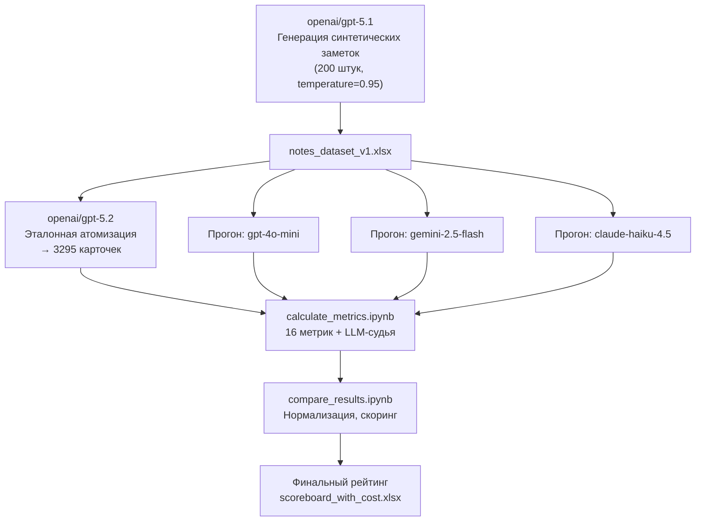
```mermaid
flowchart TD
    GEN["openai/gpt-5.1\nГенерация синтетических заметок\n(200 штук, temperature=0.95)"]
    GEN --> NOTES["notes_dataset_v1.xlsx"]

    NOTES --> REF["openai/gpt-5.2\nЭталонная атомизация\n→ 3295 карточек"]
    NOTES --> M1["Прогон: gpt-4o-mini"]
    NOTES --> M2["Прогон: gemini-2.5-flash"]
    NOTES --> M3["Прогон: claude-haiku-4.5"]

    REF --> CALC["calculate_metrics.ipynb\n16 метрик + LLM-судья"]
    M1 --> CALC
    M2 --> CALC
    M3 --> CALC

    CALC --> COMP["compare_results.ipynb\nНормализация, скоринг"]
    COMP --> FINAL["Финальный рейтинг\nscoreboard_with_cost.xlsx"]
```

**Роли моделей:**

| Роль | Модель | Назначение |
|------|--------|------------|
| Генератор данных | `openai/gpt-5.1` | 200 реалистичных управленческих заметок |
| Эталон (oracle) | `openai/gpt-5.2` | Эталонная атомизация через реальный NoteAtomizer |
| LLM-судья (G-Eval) | `openai/gpt-5.1` | Оценка faithfulness и hallucination |
| Тест-модели | `gpt-4o-mini`, `gemini-2.5-flash`, `claude-haiku-4.5` | Сравниваемые бюджетные модели |

### 14.2 Метрики

| Группа | Метрика | Описание | Идеальное значение |
|--------|---------|----------|--------------------|
| Декомпозиция | `count_ratio` | N_pred / N_ref | 1.0 |
| Декомпозиция | `count_mae` | \|N_pred − N_ref\| | 0 |
| Иерархия | `hierarchy_valid_ratio` | Доля карточек с валидным Luhmann ID | 1.0 |
| Иерархия | `parent_consistency` | Доля дочерних с существующим родителем | 1.0 |
| Иерархия | `root_count_delta` | Ошибка в числе корневых тем | 0 |
| Иерархия | `depth_mae` | Разница в макс. глубине дерева | 0 |
| Теги | `tag_precision` | Доля корректных среди предсказанных тегов | 1.0 |
| Теги | `tag_recall` | Доля найденных эталонных тегов | 1.0 |
| Теги | `tag_f1` | Гармоническое среднее P и R | 1.0 |
| Семантика | `semantic_similarity_mean` | Среднее cosine sim эталонных мыслей к ближайшим предсказанным | 1.0 |
| Семантика | `coverage_ratio` | Доля эталонных мыслей с sim ≥ 0.75 | 1.0 |
| Семантика | `hallucination_ratio` | Доля предсказанных без подтверждения в эталоне | 0.0 |
| Типы | `type_overlap` | Пересечение распределений типов мыслей | 1.0 |
| Судья | `faithfulness_score` | Верность исходному тексту (LLM-judge) | 1.0 |
| Судья | `hallucination_score` | Степень галлюцинаций (LLM-judge) | 0.0 |

### 14.3 Финальный скор

Quality Score — среднее по всем нормализованным метрикам. Cost Score — обратная нормализация цены. Итоговый Final Score:

```
final_score = quality_score × 0.85 + cost_score × 0.15
```

### 14.4 Результаты: итоговый рейтинг

| Место | Модель | Цена (₽/M вх.) | Quality Score | Final Score |
|-------|--------|----------------|---------------|-------------|
| 🥇 1 | `google/gemini-2.5-flash` | 32.40 | 0.859 | **0.8533** |
| 🥈 2 | `openai/gpt-4o-mini` | 16.20 | 0.809 | **0.8379** |
| 🥉 3 | `anthropic/claude-haiku-4.5` | 108.00 | 0.783 | **0.6660** |

### 14.5 Детализация по категориям

| Модель | Произв. | Декомп. | Иерархия | Теги | Семантика | Качество | Типы | Quality | Final |
|--------|---------|---------|----------|------|-----------|----------|------|---------|-------|
| `gemini-2.5-flash` | 0.785 | 0.866 | 0.845 | 0.711 | 0.984 | 0.955 | 0.832 | 0.859 | **0.853** |
| `gpt-4o-mini` | 0.686 | 0.641 | 0.719 | 0.773 | 0.980 | 0.977 | 0.801 | 0.809 | **0.838** |
| `claude-haiku-4.5` | 0.772 | 0.610 | 0.723 | 0.654 | 0.980 | 0.946 | 0.798 | 0.783 | **0.666** |

### 14.6 Сырые значения ключевых метрик

| Модель | count_ratio | count_mae | depth_mae | tag_f1 | sem_sim | coverage | halluc. | faithful. |
|--------|------------|-----------|-----------|--------|---------|----------|---------|-----------|
| `gemini-2.5-flash` | **1.034** | **2.35** | **1.27** | 0.674 | **0.952** | **1.000** | **0.000** | 0.958 |
| `gpt-4o-mini` | 0.748 | 4.67 | 3.35 | **0.766** | 0.941 | **1.000** | **0.000** | **0.978** |
| `claude-haiku-4.5` | 0.726 | 5.06 | 2.16 | 0.645 | 0.941 | **1.000** | **0.000** | 0.950 |

### 14.7 Анализ

**gemini-2.5-flash** — первое место. Ключевые преимущества: лучший `count_ratio = 1.034` (почти идеальное дробление), лучший `count_mae = 2.35`, лучший `depth_mae = 1.27`. Две другие модели недодробляют (~0.73–0.75), пропуская каждую четвёртую мысль.

**gpt-4o-mini** — второе место. Поднялся с третьего по качеству за счёт низкой стоимости. Выигрывает по тегам (`tag_f1 = 0.766`) и faithfulness (`0.978`).

**claude-haiku-4.5** — последнее место из-за высокой цены (108 ₽/М vs 16 ₽/М) при слабой декомпозиции.

Все модели демонстрируют нулевой `hallucination_ratio` и 100% coverage — не «придумывают» мысли.

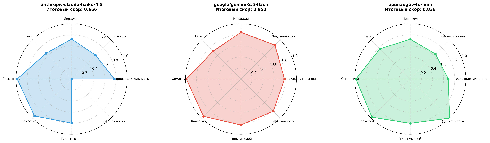

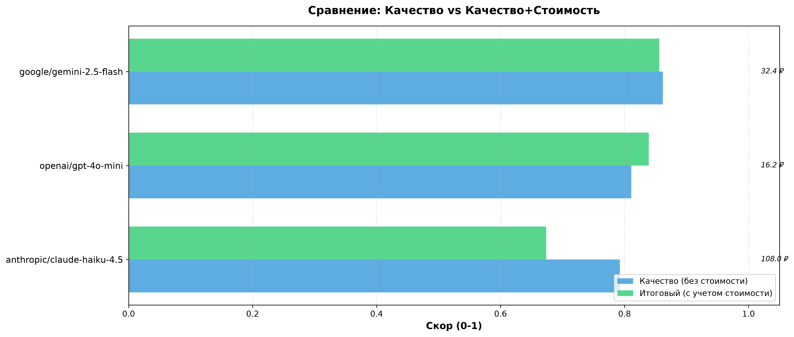

---

## 15. Оценка качества — Linker

### 15.1 Задача

Linker получает карточку и граф Neo4j, принимает решение: `new_root`, `child_of` (+ целевой узел) или `update_of` (+ целевой узел). Это задача многоклассовой классификации + retrieval.

### 15.2 Методология

Эталон формируется прогоном smart model (`openai/gpt-5.2`) через реальный `GraphLinker`. Тест-модели (`gpt-4o-mini`, `gemini-2.5-flash`, `claude-haiku-4.5`) прогоняются на тех же карточках. Сравниваются действия и целевые узлы.

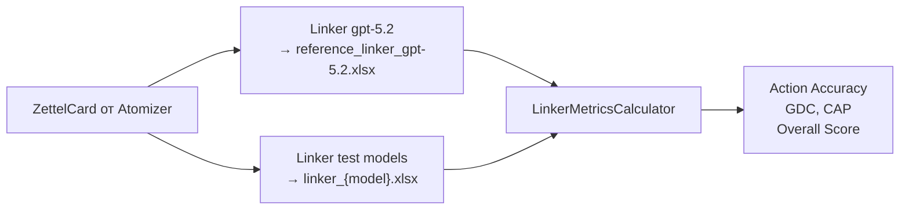
```mermaid
flowchart LR
    A["ZettelCard от Atomizer"] --> B["Linker gpt-5.2\n→ reference_linker_gpt-5.2.xlsx"]
    A --> C["Linker test models\n→ linker_{model}.xlsx"]
    B --> D["LinkerMetricsCalculator"]
    C --> D
    D --> E["Action Accuracy\nGDC, CAP\nOverall Score"]
```

### 15.3 Метрики

| Метрика | Описание |
|---------|----------|
| Action Accuracy | Доля правильных действий (new_root / child_of / update_of) |
| Graph Depth Consistency (GDC) | Согласованность глубины решений с эталоном |
| Child Attachment Precision (CAP) | Точность присоединения к правильному родителю |
| Graph Structure Similarity | Совпадение рёбер итогового графа |
| Action KL-Divergence | KL-расхождение распределений действий (→ 0 лучше) |
| Root Rate Delta | Ошибка в доле корневых узлов |
| Overall Score | Агрегированный скор качества |

### 15.4 Результаты (484 карточки)

| Метрика | gemini-2.5-flash | claude-haiku-4.5 | gpt-4o-mini |
|---------|------------------|------------------|-------------|
| **Overall Score** | **0.923** | 0.907 | 0.846 |
| Action Accuracy | **0.946** | 0.936 | 0.901 |
| Graph Depth Consistency | **0.967** | 0.961 | 0.952 |
| Child Attachment Precision | **0.766** | 0.714 | 0.610 |
| Graph Structure Similarity | 0.986 | **0.991** | 0.987 |
| Latency (с/карточка) | **0.51** | 1.05 | 0.56 |

| Место | Модель | Overall | Action Acc. | Latency |
|-------|--------|---------|-------------|---------|
| 🥇 1 | `google/gemini-2.5-flash` | **0.923** | **0.946** | **0.51s** |
| 🥈 2 | `anthropic/claude-haiku-4.5` | 0.907 | 0.936 | 1.05s |
| 🥉 3 | `openai/gpt-4o-mini` | 0.846 | 0.901 | 0.56s |

`gemini-2.5-flash` лидирует с наивысшей точностью классификации действий (94.6%) и минимальной задержкой. `gpt-4o-mini` проигрывает по CAP (0.610 vs 0.766) — чаще присоединяет дочерние карточки к неверным родителям.

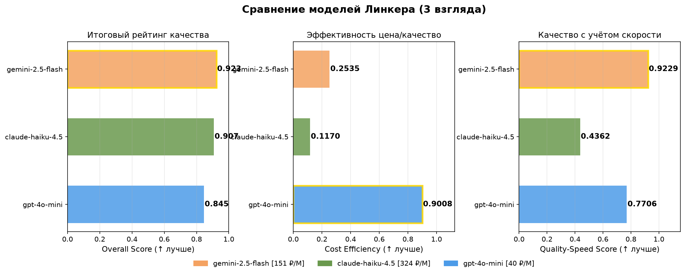

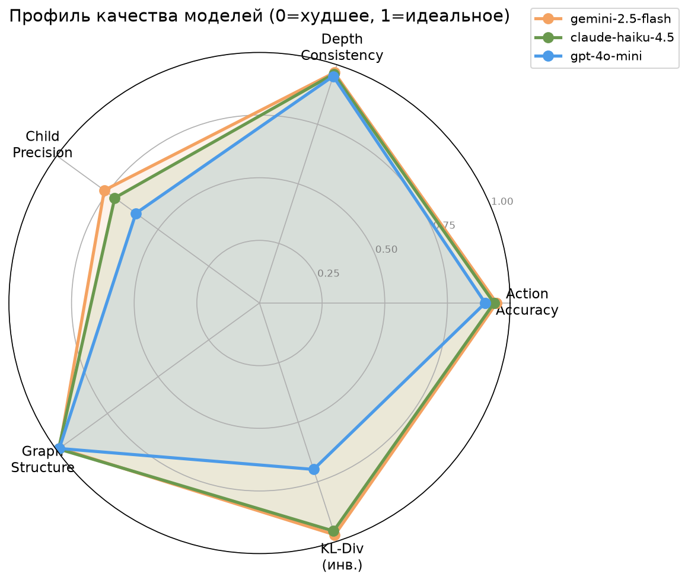

---

## 16. Оценка качества — GraphRAG Retrieval

### 16.1 Задача

Retrieval-компонент GraphRAG должен по вопросу пользователя найти релевантные узлы графа. Оценивается качество поиска при разных значениях `top_k`.

Актуальный пайплайн (**v2**, `metric_results/graphrag/`): ground truth формируется на этапе GPT-аннотации (`relevant_zettel_ids`), а не post-hoc через cosine similarity. Legacy-пайплайн (`metric_results/rag/`) больше не используется.

### 16.2 Методология (v2)

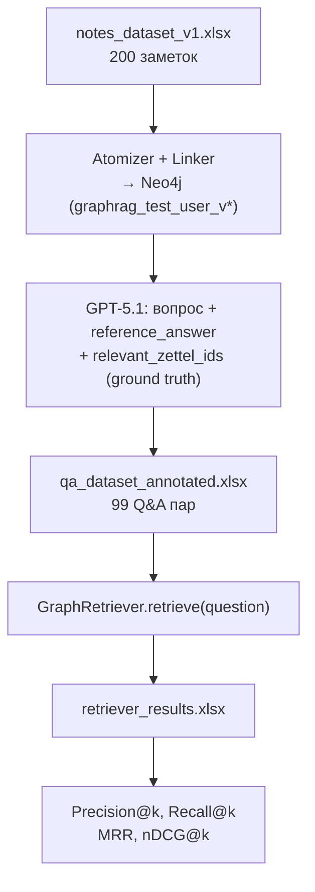
```mermaid
flowchart TD
    NOTES["notes_dataset_v1.xlsx\n200 заметок"] --> AL["Atomizer + Linker\n→ Neo4j (graphrag_test_user_v*)"]
    AL --> QA_GEN["GPT-5.1: вопрос + reference_answer\n+ relevant_zettel_ids (ground truth)"]
    QA_GEN --> QA["qa_dataset_annotated.xlsx\n99 Q&A пар"]
    QA --> RET["GraphRetriever.retrieve(question)"]
    RET --> RES["retriever_results.xlsx"]
    RES --> MET["Precision@k, Recall@k\nMRR, nDCG@k"]
```

| Параметр | Значение |
|----------|----------|
| User ID | `graphrag_test_user_v1` |
| Заметок в графе | 100 |
| Q&A пар | 99 (оценено 98) |
| Similarity threshold (eval) | 0.5 |
| context_hops | 1 |

### 16.3 Метрики

| Метрика | Описание |
|---------|----------|
| Precision@k | Доля релевантных среди top-k найденных |
| Recall@k | Доля найденных среди всех релевантных |
| F1@k | Гармоническое среднее P и R |
| HitRate | Доля запросов, где хотя бы один релевантный попал в top-k |
| MRR | Средний обратный ранг первого релевантного результата |
| nDCG@k | Нормализованный DCG с учётом порядка результатов |

### 16.4 Результаты (по top_k)

| top_k | Precision | Recall | F1 | HitRate | MRR | nDCG |
|-------|-----------|--------|-----|---------|-----|------|
| **3** | **0.517** | 0.549 | **0.503** | 0.867 | **0.832** | 0.652 |
| 5 | 0.371 | 0.649 | 0.447 | 0.939 | 0.832 | 0.668 |
| 7 | 0.324 | **0.758** | 0.431 | **0.959** | 0.832 | **0.715** |

**Best top_k = 3** (максимальный F1 = 0.503). При top_k=7 растёт Recall (0.758) и HitRate (0.959), но падает Precision. Для generation eval использовался `top_k=5`.

Retrieval по типам вопросов (F1@3):

| question_type | F1@3 | HitRate@3 |
|---------------|------|-----------|
| factual | 0.612 | 0.914 |
| risk | 0.543 | 0.857 |
| summary | 0.498 | 1.000 |
| decision | 0.430 | 0.806 |
| action_items | 0.313 | 0.667 |

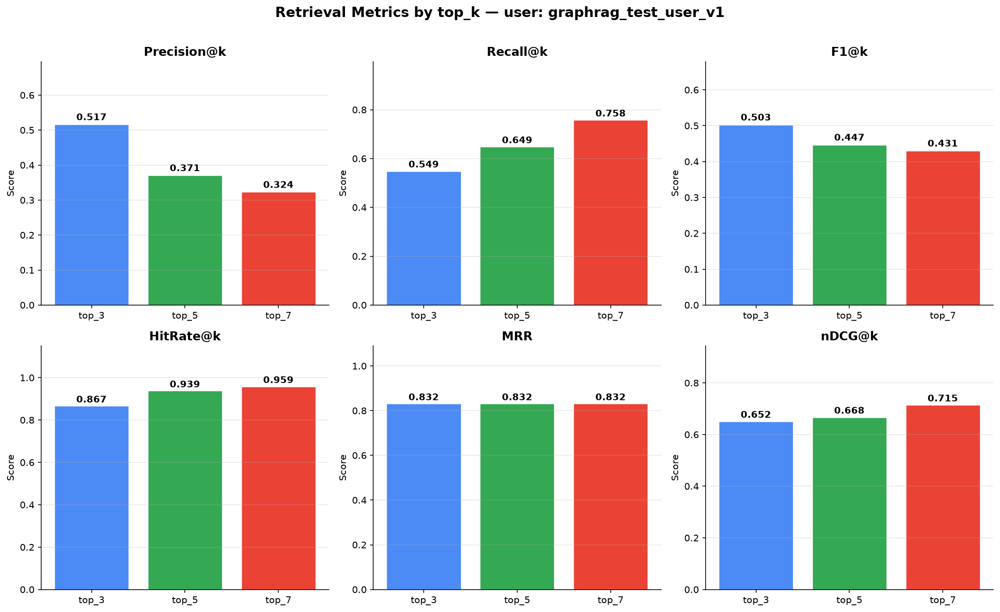

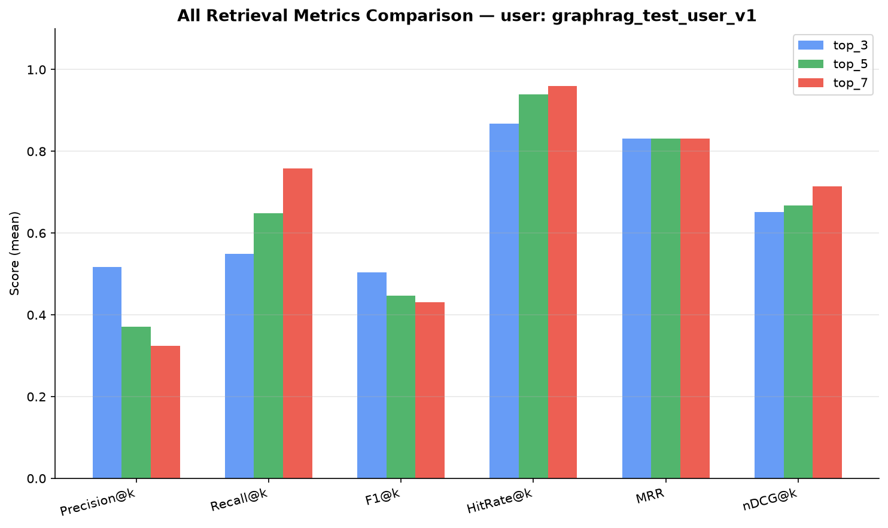

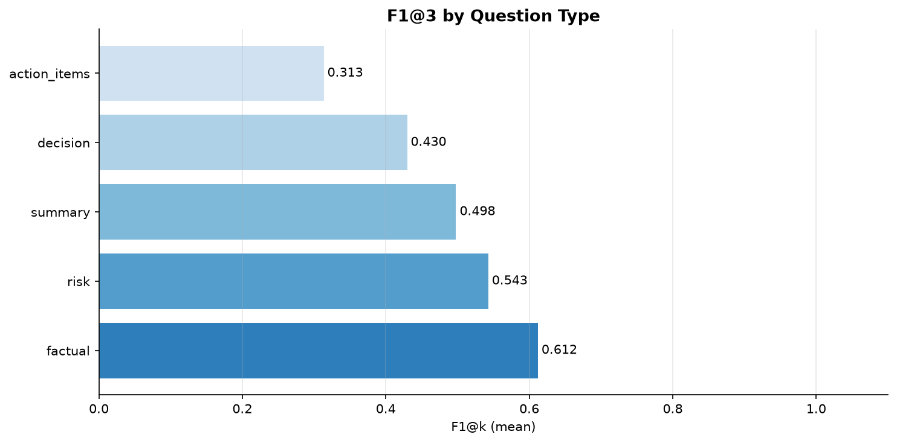

---

## 17. Оценка качества — GraphRAG Generation

### 17.1 Задача

Generation-компонент получает извлечённый контекст и генерирует текстовый ответ на вопрос. Оценивается LLM-судьёй (`openai/gpt-5.1`) по методологии G-Eval.

Eval: 98 вопросов × 3 модели, `top_k=5`, user ID `graphrag_test_user_v10`.

### 17.2 Метрики

| Метрика | Описание |
|---------|----------|
| Faithfulness | Все факты ответа подтверждены контекстом из графа |
| Relevance | Ответ действительно отвечает на заданный вопрос |
| Completeness | Ответ покрывает все аспекты вопроса |
| Coherence | Связность и читаемость ответа |
| Accuracy | Фактическая точность утверждений |
| Hallucinations ↓ | Доля галлюцинаций (меньше — лучше) |
| Overall | Агрегированный скор |

### 17.3 Результаты

| Модель | Faithfulness | Relevance | Completeness | Coherence | Accuracy | Halluc. ↓ | Overall | Latency (мс) |
|--------|-------------|-----------|--------------|-----------|----------|-----------|---------|--------------|
| 🥇 `gemini-2.5-flash` | **0.950** | 0.941 | 0.787 | 0.981 | **0.851** | **0.050** | **0.909** | **3163** |
| 🥈 `claude-haiku-4.5` | 0.925 | **0.961** | **0.799** | **0.982** | 0.848 | 0.076 | 0.906 | 5052 |
| 🥉 `gpt-4o-mini` | 0.897 | 0.928 | 0.752 | 0.977 | 0.815 | 0.103 | 0.877 | 3721 |

**`gemini-2.5-flash`** лидирует по generation: лучший faithfulness, accuracy, overall score и минимальная latency. Именно поэтому эта модель выбрана для GraphRAG в продакшне (`config/settings.py`).

Completeness (0.75–0.80) существенно выше, чем в legacy-eval (~0.25), благодаря улучшенному retrieval (F1@3 = 0.503 vs 0.073 в legacy).

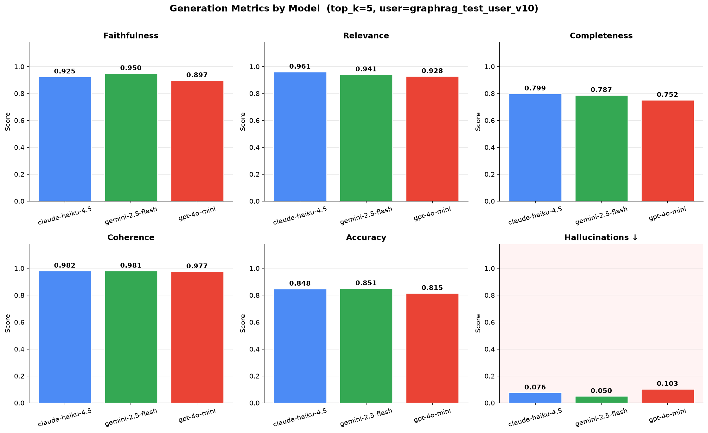

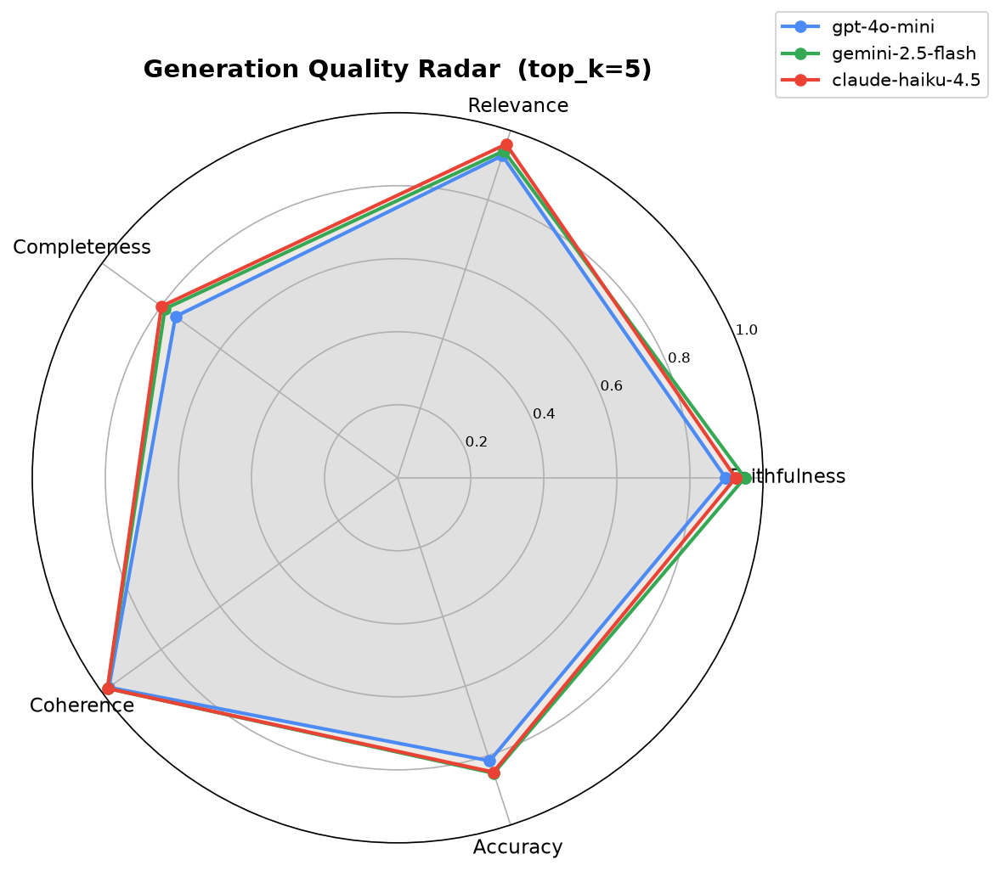

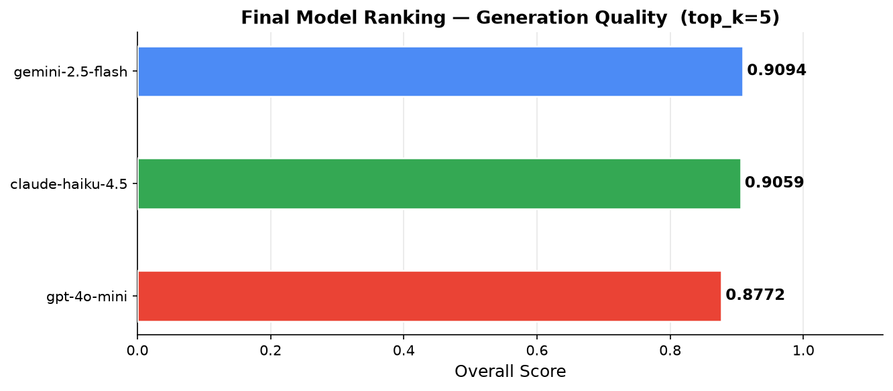

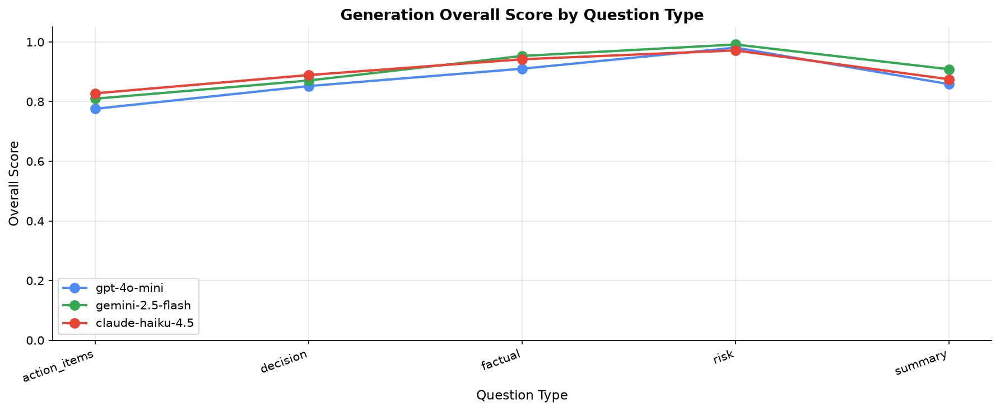

---

## 18. Инфраструктура и запуск

### 18.1 Docker Compose

```yaml
services:
  neo4j:
    image: neo4j:5.26-community
    ports: ["7687:7687", "7474:7474"]
    volumes: [./storage/neo4j/data:/data]
    environment:
      NEO4J_AUTH: neo4j/${NEO4J_PASSWORD}

  langfuse-db:
    image: postgres:15
    ports: ["5432:5432"]

  langfuse:
    image: langfuse/langfuse:2
    ports: ["3000:3000"]
    depends_on: [langfuse-db]
```

ChromaDB доступен как legacy-профиль: `docker compose --profile legacy up`.

### 18.2 Зависимости

| Категория | Пакеты |
|-----------|--------|
| LLM и AI | `langchain-openai`, `sentence-transformers`, `torch`, `pydantic` |
| База данных | `neo4j>=5.0`, `psycopg2` |
| Telegram | `aiogram` |
| Обработка файлов | `pdfplumber`, `pytesseract`, `speech_recognition` |
| Утилиты | `pandas`, `tabulate`, `python-dotenv` |

### 18.3 Переменные окружения

```bash
# LLM
LLM_API_KEY=...            # ключ OpenAI-совместимого API
LLM_BASE_URL=...           # base URL (например https://openrouter.ai/api/v1)

# Neo4j
NEO4J_URI=bolt://localhost:7687
NEO4J_USER=neo4j
NEO4J_PASSWORD=...         # задаётся при первом старте контейнера

# Telegram
TELEGRAM_BOT_TOKEN=...

# PostgreSQL
POSTGRES_PASSWORD=...
```

> **Важно:** пароль Neo4j задаётся ОДИН РАЗ при первом старте контейнера. При смене пароля в `.env` нужно очистить volume: `rm -rf storage/neo4j/data/*` и перезапустить контейнер.

### 18.4 Запуск

```bash
# 1. Скопировать и заполнить конфигурацию
cp .env.example .env

# 2. Поднять Neo4j и Langfuse
docker compose up -d

# 3. Установить зависимости
python3 -m venv .venv
source .venv/bin/activate
pip install -r requirements.txt

# 4. Запустить бота
python main.py

# CLI-демо (без бота, только pipeline)
python zettelkasten/exocortex.py --user-id demo_user
python zettelkasten/exocortex.py --multi-user
```

### 18.5 Воспроизведение оценки (eval pipeline)

```bash
# Шаг 1: Генерация данных + эталон + прогоны тест-моделей
jupyter notebook eval/generate_data.ipynb

# Шаг 2: Расчёт метрик Atomizer
jupyter notebook eval/calculate_metrics.ipynb

# Шаг 3: Нормализация и рейтинг
jupyter notebook eval/compare_results.ipynb

# Шаг 4: Анализ стоимости
jupyter notebook eval/calc_costs.ipynb

# RAG-оценка (GraphRAG v2 → metric_results/graphrag/)
jupyter notebook eval/rag_01_generate_dataset.ipynb
jupyter notebook eval/rag_02_retrieval_metrics.ipynb
jupyter notebook eval/rag_03_generation_metrics.ipynb
```

Подробная методология описана в [eval/README_eval.md](./eval/README_eval.md).

---

## 19. Сквозной пример работы системы

Пользователь отправляет голосовое сообщение:

> «Коллеги, конференцию DevSummit нужно провести до 10 мая. Куратор — Олег Мишин.
> Бюджет мероприятия — 2,4 млн рублей. Главный риск — не успеть забронировать
> площадку в Expocentre до конца месяца.»

### Шаг 1: Распознавание голоса

```
asr.recognize_audio(wav_path) → текст
```

### Шаг 2: Атомизация

```
atomizer.atomize(text, current_max_root=0) →
  [1]   action: "Конференцию DevSummit необходимо провести до 10 мая."
  [1.1]  fact:   "Куратором конференции DevSummit назначен Олег Мишин."
  [1.1a] fact:   "Бюджет конференции DevSummit составляет 2,4 млн рублей."
  [2]    risk:   "Существует риск не успеть забронировать площадку Expocentre."
```

### Шаг 3: Встраивание в граф (Linker)

```
linker.link_and_insert(user_id, cards):
  [1]    → vector_search → пусто → NEW_ROOT → create_zettel(luhmann="1")
  [1.1]  → parent в luhmann_remap → _handle_inner_child → create_child_of(luhmann="1.1")
  [1.1a] → parent в luhmann_remap → _handle_inner_child → create_child_of(luhmann="1.1a")
  [2]    → vector_search → sim≈0.72 с [1] → LLM → NEW_ROOT (другая тема: риск)
```

### Шаг 4: Состояние графа в Neo4j

```
📌 [1] "Конференцию DevSummit необходимо провести до 10 мая."
  └─ [1.1] ← [1]: "Куратором конференции DevSummit назначен Олег Мишин."
  └─ [1.1a] ← [1]: "Бюджет конференции DevSummit составляет 2,4 млн рублей."

📌 [2] "Существует риск не успеть забронировать площадку Expocentre."

Entity: devsummit (4), олег_мишин (1), expocentre (1)
```

### Шаг 5: Бот отвечает

```
✅ Записано в граф знаний. 📚 Размер базы знаний: 4 карточки
```

---

Пользователь спрашивает: **«Кто курирует конференцию DevSummit?»**

### Шаг 6: GraphRAG Retrieval

```
embed_query("Кто курирует конференцию DevSummit?")
vector_search → [1.1] sim=0.91, [1] sim=0.84, [1.1a] sim=0.79
get_context([1.1]) → parent=[1], entities=[олег_мишин, devsummit]
```

### Шаг 7: Контекст для LLM

```
## FACT
• [1.1] Куратором конференции DevSummit назначен Олег Мишин.
• [1.1a] Бюджет конференции DevSummit составляет 2,4 млн рублей.

## ACTION
• [1] Конференцию DevSummit необходимо провести до 10 мая.

## СВЯЗАННЫЕ СУЩНОСТИ
• devsummit (tag, упоминаний: 4)
• олег_мишин (tag, упоминаний: 1)
```

### Шаг 8: Ответ

> «Конференцией DevSummit курирует Олег Мишин. Мероприятие нужно провести до 10 мая, бюджет — 2,4 млн рублей.»
