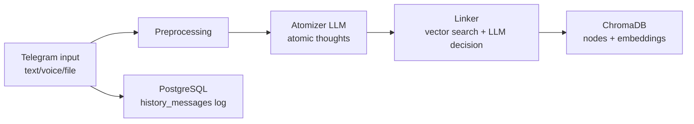
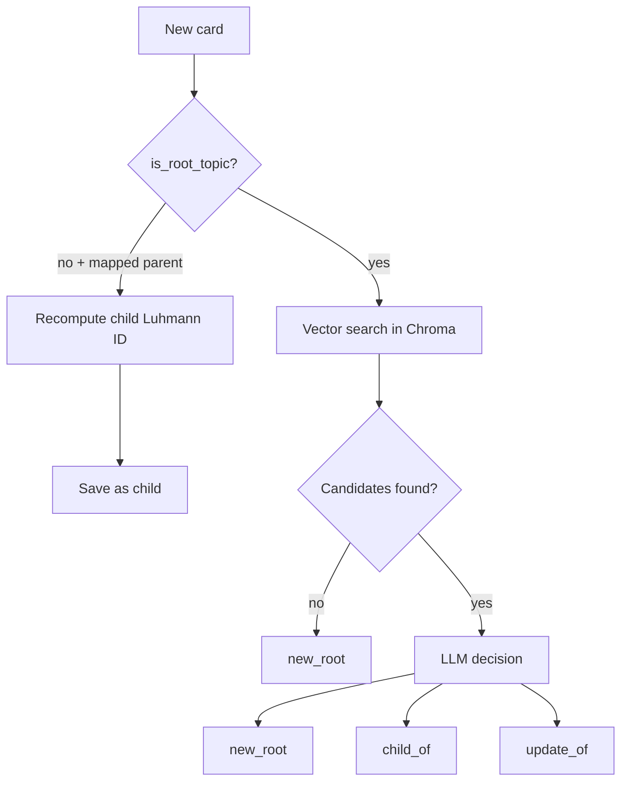

# Executive Exocortex

AI-based Executive Exocortex: voice/text knowledge capture, Zettelkasten atomization, semantic linking, and personal knowledge graph assembly.

Проект строит цифровой экзокортекс руководителя: принимает неструктурированный вход (голос, текст, файлы), извлекает атомарные мысли, связывает их по логике Zettelkasten и сохраняет в векторное хранилище для дальнейшего поиска и развития графа знаний.

---

## 1) Что реализовано сейчас

### В проде/рабочем прототипе
- Telegram-бот (`main.py`) с UI-кнопками и FSM-сценариями.
- Прием артефактов: текст, голосовые сообщения, PDF/TXT-документы.
- Распознавание речи (`speech_recognition`, Google Speech API).
- OCR + извлечение таблиц из PDF (`pytesseract`, `pdfplumber`, `pandas`).
- Логирование пользовательских событий в PostgreSQL (`history_messages`).
- Zettelkasten-атомизация через LLM (`zettelkasten/atomizer.py`).
- Luhmann-нумерация карточек (например `1`, `1.1`, `1.1a`).
- Линкер (`zettelkasten/linker.py`):
  - локальные эмбеддинги через HuggingFace `intfloat/multilingual-e5-base`,
  - поиск кандидатов в ChromaDB,
  - LLM-решение `new_root` / `child_of` / `update_of`,
  - обновление графа и перезапись фактов.

### Пока заглушки/в развитии
- RAG-ответы в боте (поиск и просмотр базы пока имитационные ответы).
- Полноценное удаление заметок из графа/Chroma (в UI уже есть сценарий, логика удаления еще не подключена).
- Финальный GraphRAG слой (в теории описан, в коде пока база для него).

---

## 2) Архитектура директорий

```text
Executive_Exocortex/
├─ main.py                         # Telegram-бот (входная точка)
├─ docker-compose.yml              # ChromaDB в Docker (HTTP mode)
├─ requirements.txt
├─ config/
│  ├─ settings.py                  # Центральные настройки (Pydantic BaseSettings)
│  ├─ prompts.py                   # Системные промпты атомайзера и линкера
│  └─ __init__.py
├─ telegram_bot/
│  ├─ texts.py                     # Тексты UI бота
│  └─ handlers/
│     ├─ asr.py                    # Speech-to-text для голосовых
│     ├─ txt_reader.py             # Чтение txt
│     └─ pdf_reader.py             # OCR + извлечение таблиц из PDF
├─ zettelkasten/
│  ├─ atomizer.py                  # Декомпозиция заметки в атомарные мысли (LLM)
│  ├─ linker.py                    # Встраивание карточек в граф (vector + LLM decision)
│  ├─ exocortex.py                 # Демонстрационный pipeline-скрипт
│  └─ __init__.py
├─ storage/
│  ├─ chromadb/
│  │  └─ factory.py                # Фабрика клиента ChromaDB (http/persistent/memory)
│  ├─ chromaDB/
│  │  └─ factory.py                # Дублирующий модуль (legacy/case variant)
│  └─ postgres/
│     ├─ db_connect.py             # Подключение и лог-таблица history_messages
│     └─ cleaner.py                # Очистка history_messages
└─ theory/
   ├─ zettelkasten.md
   └─ graphRAG.md
```

---

## 3) Высокоуровневый поток данных



---

## 4) Как работает метод Zettelkasten в текущем коде

### Шаг 1. Атомизация заметки
Модуль `zettelkasten/atomizer.py`:
- отправляет исходный текст в LLM со строгой JSON-схемой;
- извлекает список `AtomicThought`:
  - `content` (1-2 предложения),
  - `thought_type` (`fact`, `decision`, `action`, `risk`, `idea`, `question`, `context`, `other`),
  - `tags` (1..5, snake_case),
  - `parent_hint` (точная цитата родительской мысли в пределах той же заметки),
  - `is_root_topic`.

### Шаг 2. Преобразование в карточки Zettel
Каждая мысль превращается в `ZettelCard`:
- `zettel_id` (UUID),
- `luhmann_id` (человеко-читабельный иерархический ID),
- `parent_id`, `parent_luhmann_id`,
- `content`, `thought_type`, `tags`,
- `is_root_topic`, `embedding`, timestamps.

### Шаг 3. Генерация Luhmann ID
`ZettelIdGenerator.get_next_id(...)` поддерживает базовые ветвления:
- корни: `1`, `2`, `3`, ...
- дочерние numeric: `1.1`, `1.2`, ...
- alpha ветка: `1.1a`, `1.1b`, ...
- numeric после alpha: `1.1a1`, `1.1a2`, ...

### Шаг 4. Линковка в существующий граф
`GraphLinker`:
1. Для уже дочерних мыслей (определены атомайзером) пересчитывает ID относительно реального родителя в базе.
2. Для корневых мыслей:
   - делает semantic search по ChromaDB,
   - передает кандидатов в LLM,
   - получает решение:
     - `new_root` — новая независимая ветка;
     - `child_of` — встраивание как дочерней;
     - `update_of` — перезапись существующего факта.

### Шаг 5. Персистентность
- Узлы и эмбеддинги сохраняются в ChromaDB.
- Логи событий Telegram сохраняются в PostgreSQL.

---

## 5) Подробно про Linker (ядро графовой логики)

### 5.1 Эмбеддинги
`LocalEmbeddingModel` использует `SentenceTransformer`:
- `passage: ...` для индексируемых карточек;
- `query: ...` для поисковых запросов.

Поддерживаются устройства:
- `cuda` (если доступна),
- `mps` (Apple Silicon),
- иначе `cpu`.

### 5.2 Векторный поиск кандидатов
`ZettelVectorDB.search_candidates(...)`:
- вычисляет query embedding;
- запрашивает top-N в Chroma;
- преобразует distance в similarity;
- отфильтровывает по `similarity_threshold`.

### 5.3 LLM-решение по кандидату
`LinkDecision` (structured output):
- `action: LinkAction`,
- `target_zettel_id` (если `child_of`/`update_of`),
- `reasoning`.

### 5.4 Применение действия
- `new_root`: новая корневая карточка, новый `luhmann_id`.
- `child_of`: карточка получает `parent_id`, `parent_luhmann_id`, новый дочерний `luhmann_id`.
- `update_of`: существующая карточка перезаписывается (`[ОБНОВЛЕНО ...]` + новый embedding), новая карточка не добавляется как отдельный узел.



---

## 6) Telegram-бот: текущее поведение

### Меню
- `Добавить новую заметку`
- `Поиск мыслей по запросу` (пока заглушка ответа)
- `Посмотреть базу знаний` (пока заглушка)
- `Удалить заметку` (поиск/выбор пока заглушка)

### FSM-состояния
- `waiting_for_artifact`
- `waiting_for_search`
- `clarifying_text`
- `waiting_for_delete_query`

### Обработка контента
- Голос: скачивание `.ogg` → `ffmpeg` в `.wav` → `recognize_google`.
- PDF: OCR каждой страницы + таблицы в markdown.
- TXT: прямое чтение файла.
- Все действия логируются в PostgreSQL таблицу `history_messages`.

---

## 7) Конфигурация

`config/settings.py` (через `.env` + defaults):
- LLM:
  - `zettel_atomizer_model_name`
  - `zettel_atomizer_temperature`
  - `linker_model_name`
- Embeddings:
  - `embedding_model_name` (по умолчанию `intfloat/multilingual-e5-base`)
- Chroma:
  - `chroma_mode`: `http` / `persistent` / `memory`
  - `chroma_host`, `chroma_port`
  - `chroma_persist_dir`
  - `chroma_collection_name`

Рекомендуемые переменные `.env`:
- `TELEGRAM_BOT_TOKEN`
- `POSTGRES_PASSWORD`
- `LLM_API_KEY`
- `LLM_BASE_URL`

---

## 8) Запуск проекта

### 8.1 Установка зависимостей
```bash
python -m venv .venv
source .venv/bin/activate
pip install -r requirements.txt
```

### 8.2 ChromaDB (если `chroma_mode=http`)
```bash
docker compose up -d
```

### 8.3 PostgreSQL
Нужен локальный Postgres; таблица создается автоматически в `main.py` через `create_database()` и `create_tables()`.

### 8.4 Запуск Telegram-бота
```bash
python main.py
```

### 8.5 Запуск демо-пайплайна Zettelkasten
```bash
python zettelkasten/exocortex.py
```

---

## 9) Что важно для метода в текущей реализации

- Одна мысль → одна карточка (`AtomicThought`).
- У каждой карточки есть:
  - атомарный текст,
  - тип мысли,
  - теги,
  - положение в иерархии Лумана.
- Новые мысли не просто добавляются, а встраиваются в сеть:
  - как новая ветка,
  - как дочерняя мысль,
  - как обновление существующего факта.

Именно это превращает поток заметок в управляемый evolving-граф знаний.

---

## 10) Ограничения текущей версии

- В `telegram_bot` RAG-ответы пока не подключены к реальному графу (UI-заглушки).
- `storage/chromaDB` и `storage/chromadb` содержат дублирующий `factory.py` (разные регистры пути).
- В `storage/postgres/cleaner.py` импорт `from db_connect import ...` зависит от cwd и требует аккуратного запуска.
- Для ASR и OCR нужны внешние системные зависимости (`ffmpeg`, `tesseract`).
- Качество линковки сильно зависит от:
  - качества исходного текста,
  - промптов,
  - порога similarity и качества LLM.

---

## 11) Ближайшие шаги развития

- Подключить `main.py` к `atomizer + linker + chroma` в production-цикле.
- Реализовать реальный Retrieval/RAG поверх текущего графа.
- Добавить удаление/версионирование карточек в Chroma с сохранением ссылочной целостности.
- Ввести eval-набор и метрики качества атомизации/линковки.
- Добавить observability (latency, token cost, linking decisions).

---

## 12) Справочные материалы

- Метод Zettelkasten: `theory/zettelkasten.md`
- Концепт GraphRAG: `theory/graphRAG.md`

---

## 13) Ссылка на доску проекта

[MTS Link Board](https://my.mts-link.ru/boards/board/51eb4ee0-7bdb-42be-8ab5-7cd5e68e6ec7)