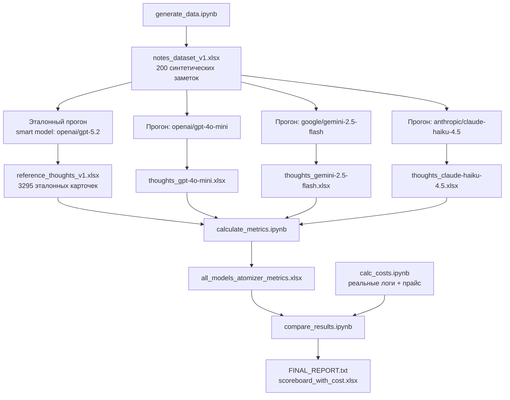
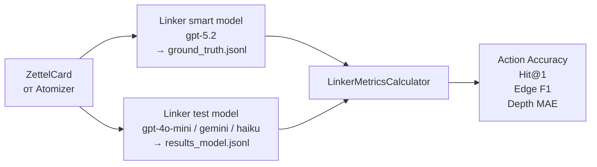
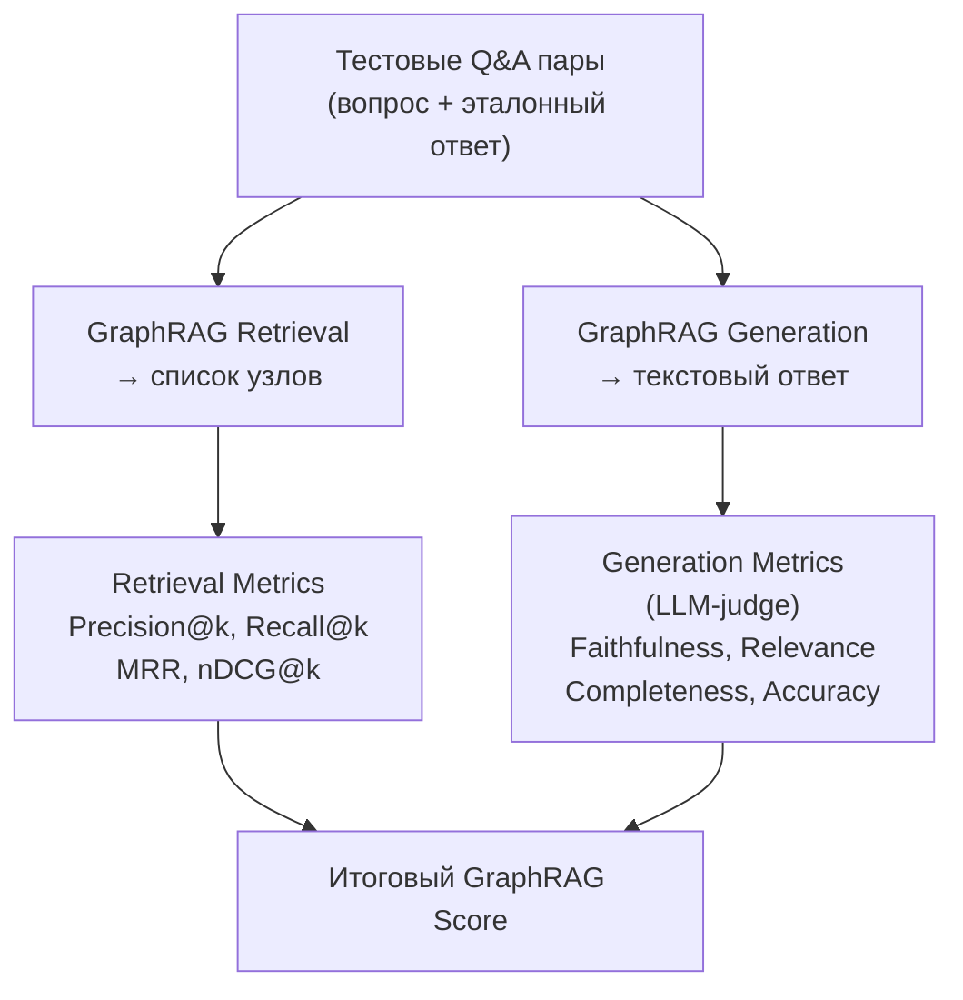

# Оценка качества системы Executive Exocortex

> **Формат документа:** методологическое описание эксперимента в стиле исследовательской работы.  
> Охватывает все этапы: постановку задачи, генерацию данных, формирование эталона, расчёт метрик, результаты и выводы.

---

## Аннотация

Данная работа описывает систему оценки качества компонентов **Executive Exocortex** — персонального экзокортекса на основе графа знаний. Система состоит из трёх семантически связанных этапов: **Atomizer** (разбиение текста на атомарные мысли), **Linker** (встраивание мыслей в граф знаний) и **GraphRAG** (поиск и генерация ответов по графу). Ошибка на каждом шаге каскадно влияет на последующие, поэтому оценка каждого этапа в отдельности критична.

Ключевая задача — построить **воспроизводимую, количественную** систему выбора моделей и конфигураций промптов по комплексному критерию **качество + стоимость + задержка**.

Вместо ручной разметки применяется подход **smart model as oracle**: сильная закрытая модель генерирует синтетический датасет и формирует эталон, по которому затем оцениваются тест-модели. Подход масштабируется, не требует ручного труда и воспроизводим при обновлении корпуса.

---

## Содержание

1. [Введение: что и почему оценивается](#1-введение-что-и-почему-оценивается)
2. [Архитектура eval-контура](#2-архитектура-eval-контура)
3. [Экспериментальный дизайн](#3-экспериментальный-дизайн)
4. [Генерация синтетического датасета](#4-генерация-синтетического-датасета)
5. [Формирование эталона через smart model](#5-формирование-эталона-через-smart-model)
6. [Выбор моделей для тестирования](#6-выбор-моделей-для-тестирования)
7. [Оценка Atomizer: метрики и формулы](#7-оценка-atomizer-метрики-и-формулы)
8. [Нормализация, категориальные скоры, финальный рейтинг](#8-нормализация-категориальные-скоры-финальный-рейтинг)
9. [Результаты Atomizer](#9-результаты-atomizer)
10. [Оценка Linker](#10-оценка-linker)
11. [Оценка GraphRAG](#11-оценка-graphrag)
12. [Стоимость и latency: экономический слой](#12-стоимость-и-latency-экономический-слой)
13. [Ограничения и риски валидности](#13-ограничения-и-риски-валидности)
14. [Воспроизведение эксперимента](#14-воспроизведение-эксперимента)
15. [Заключение](#15-заключение)

---

## 1. Введение: что и почему оценивается

### 1.1 Пайплайн системы

Executive Exocortex превращает неструктурированные управленческие заметки в граф знаний и отвечает на вопросы по нему. Пайплайн состоит из трёх последовательных компонентов:

```
[Текст заметки]
      │
      ▼
┌───────────────────────────────────────┐
│  Atomizer                             │
│  Разбивает текст на атомарные мысли   │
│  (ZettelCard): content, thought_type, │
│  tags, luhmann_id, parent_id          │
└───────────────────────────────────────┘
      │  список ZettelCard
      ▼
┌───────────────────────────────────────┐
│  Linker                               │
│  Решает как встроить каждую карточку  │
│  в граф: new_root / child_of /        │
│  update_of + выбор целевого узла      │
└───────────────────────────────────────┘
      │  граф знаний в Neo4j
      ▼
┌───────────────────────────────────────┐
│  GraphRAG                             │
│  Retrieval по графу + генерация       │
│  ответа на вопрос пользователя        │
└───────────────────────────────────────┘
      │
      ▼
[Ответ пользователю в Telegram]
```

### 1.2 Почему важно оценивать каждый этап

Ошибки в пайплайне **каскадируются**:

- Если Atomizer плохо дробит текст (пропускает мысли, объединяет несвязанные), Linker получает «грязные» карточки и встраивает их неверно.
- Если Linker неправильно выбирает действие (`new_root` вместо `child_of`), граф растёт хаотично, семантические связи рвутся.
- Если граф искажён, GraphRAG получает неверный контекст при retrieval и генерирует ответ, не соответствующий реальной базе знаний пользователя.

Из этого следует принцип оценки: **отдельная метрика для каждого этапа + понимание сквозного влияния**.

### 1.3 Исследовательские вопросы

1. Какая из бюджетных моделей лучше всего выполняет атомизацию по совокупности метрик качества?
2. Как меняется рейтинг при учёте стоимости вызова?
3. Какие метрики наиболее чувствительны к смене модели и промпта?
4. Что достигнуто в оценке Linker и GraphRAG, что ещё в разработке?

---

## 2. Архитектура eval-контура

### 2.1 Состав файлов


| Файл                       | Назначение                                                                       |
| -------------------------- | -------------------------------------------------------------------------------- |
| `generate_data.ipynb`      | Генерация синтетических заметок, эталона через smart model, прогоны тест-моделей |
| `calculate_metrics.ipynb`  | Формальные метрики Atomizer + LLM-as-a-judge                                     |
| `compare_results.ipynb`    | Нормализация, категориальные скоры, итоговый рейтинг, визуализации               |
| `calc_costs.ipynb`         | Анализ стоимости и скорости по прайс-листу и реальным логам                      |
| `metric_results/atomizer/` | Итоговые таблицы и отчёты по Atomizer                                            |
| `synthetic_datasets/`      | Сгенерированные заметки и предсказания моделей                                   |


### 2.2 Полная схема пайплайна оценки




---

## 3. Экспериментальный дизайн

### 3.1 Принцип «smart model как эталон»

Традиционный подход к оценке NLP-систем предполагает ручную разметку экспертами. Для корпуса из 200 заметок × ~16 карточек = ~3200 карточек это нереалистично по времени и стоимости.

Вместо этого применяется **smart model as oracle**:

1. **Smart model A** (`openai/gpt-5.1`) генерирует реалистичные синтетические заметки с заданными параметрами (домен, стиль, длина).
2. **Smart model B** (`openai/gpt-5.2`) прогоняется через реальный `NoteAtomizer` и формирует эталонный набор карточек.
3. **Тест-модели** (бюджетные LLM) прогоняются на тех же входных заметках.
4. Их выход сравнивается с эталоном по набору формальных и семантических метрик.
5. **LLM-judge** (`openai/gpt-5.1`) дополнительно оценивает выход тест-моделей по критериям faithfulness и hallucination.

**Почему это работает:** Разница между тест-моделью и smart model отражает реальный разрыв в качестве, а не случайный bias разметчика. Эталон стабилен и воспроизводим.

**Ограничение:** Эталон наследует характерный для smart model способ структурирования. Если промпт изменится, эталон нужно перегенерировать.

### 3.2 Уровни оценки


| Уровень          | Что оценивается                     | Метод                                    |
| ---------------- | ----------------------------------- | ---------------------------------------- |
| Декомпозиция     | Правильное число атомарных мыслей   | Формальные метрики (count_ratio, MAE)    |
| Иерархия         | Корректность Luhmann-ID структуры   | Валидация формата + сравнение с эталоном |
| Теги             | Точность и полнота extracted тегов  | Precision / Recall / F1                  |
| Семантика        | Смысловая близость мыслей к эталону | Cosine similarity через эмбеддинги       |
| Качество (судья) | Верность тексту, галлюцинации       | LLM-as-a-judge (G-Eval)                  |
| Экономика        | Стоимость и скорость                | Прайс-лист + реальные логи               |


---

## 4. Генерация синтетического датасета

### 4.1 Зачем синтетика

Реальные заметки пользователя содержат приватные данные и не масштабируются автоматически. Синтетический датасет решает обе проблемы: он не содержит личных данных и генерируется в нужном объёме и с нужными свойствами.

Ключевое требование к датасету: **имитировать реальную «грязную» среду**, а не идеально структурированные тексты. Заметки должны быть:

- Реалистичны как управленческие записи топ-менеджера (встречи, звонки, анализ ситуации).
- Смешаны по типам содержания: факты, решения, задачи, риски, идеи, вопросы, контекст.
- Насыщены именами, проектами, метриками, датами.
- Содержать местоимения и контекстные ссылки — чтобы атомизация была нетривиальной задачей.

### 4.2 Параметры генерации

```python
count_syntetic_data = 200
generate_llm_model  = 'openai/gpt-5.1'
temperature         = 0.95        # высокая для разнообразия
num_sentences       = random.randint(3, 10)
domain              = random.choice(BUSINESS_DOMAINS)
style               = random.choice(NOTE_STYLES)
```

**Домены (`BUSINESS_DOMAINS`):** продуктовая разработка, продажи и маркетинг, HR, финансы, операционка, стратегия, аналитика и метрики, реструктуризация, ИИ-зация процессов и др. (17 доменов).

**Стили (`NOTE_STYLES`):** расшифровка встречи, голосовая заметка, рабочие мысли, записи после звонка, планёрка/совещание, анализ ситуации, список задач и решений.

### 4.3 Промпт генерации

Системный промпт `SYNTHETIC_NOTE_GENERATION_SYSTEM_PROMPT` содержит детальные требования к реалистичности, структуре, сущностям и стилю. Важный момент: промпт явно требует **использовать местоимения и контекстные ссылки** — это искусственно усложняет задачу атомизации, приближая её к реальным условиям.

Пример сгенерированной заметки:

> *«Встреча с Ивановым по проекту Альфа. Он сказал что запуск переносится на конец квартала из-за проблем с API. Нужно обсудить с командой план Б. Также он предложил использовать готовое решение от Amazon вместо разработки своего.»*

### 4.4 Техническая реализация

Генерация выполнена через `SyntheticNoteGenerator`:

```python
class SyntheticNoteGenerator:
    def __init__(self, model_name, temperature=0.95):
        self.llm = ChatOpenAI(model=model_name, temperature=temperature)
        self.excel_lock = Lock()   # для потокобезопасного автосейва

    def generate_note(self, num_sentences, domain, style) -> SyntheticNote: ...
```

Все 200 заметок генерировались **параллельно** через `ThreadPoolExecutor` с промежуточным автосейвом в Excel (защита от потери прогресса при сбое). Итоговый файл: `synthetic_datasets/notes_dataset_v1.xlsx`.

---

## 5. Формирование эталона через smart model

### 5.1 Логика эталонной атомизации

Все 200 заметок из `notes_dataset_v1.xlsx` прогоняются через **реальный** `NoteAtomizer`, но с самой сильной доступной моделью:

```python
atomizer = NoteAtomizer(
    model_name = 'openai/gpt-5.2',
    system_prompt          = settings.zettel_atomizer_system_prompt,
    user_prompt_template   = settings.zettel_atomizer_user_prompt_template,
)
```

Важно: используется **тот же код и промпт**, что и в продакшне — это гарантирует, что эталон отражает реальную задачу, а не идеальную человеческую аннотацию.

### 5.2 Структура ZettelCard

Каждая карточка в эталоне содержит:


| Поле            | Тип    | Описание                                                      |
| --------------- | ------ | ------------------------------------------------------------- |
| `zettel_id`     | UUID   | Уникальный идентификатор                                      |
| `luhmann_id`    | string | Позиция в дереве: `1`, `1.1`, `1.1a`, `1.1a1`                 |
| `parent_id`     | UUID   | Ссылка на родительскую карточку                               |
| `content`       | string | Текст атомарной мысли                                         |
| `thought_type`  | enum   | `fact / decision / action / risk / idea / question / context` |
| `tags`          | string | Через запятую                                                 |
| `is_root_topic` | bool   | Является ли корневым узлом ветки                              |


### 5.3 Полученные размеры эталонного набора


| Параметр                    | Значение |
| --------------------------- | -------- |
| Количество заметок          | 200      |
| Всего карточек              | 3 295    |
| Среднее карточек на заметку | ~16.5    |
| Минимум                     | 5        |
| Максимум                    | ~45      |


Итоговый артефакт: `synthetic_datasets/atomizer/reference_thoughts_v1.xlsx`.

### 5.4 Интеграция с Langfuse

Эталон загружается в Langfuse как датасет `atomizer-benchmark-v1`:

- **input:** `note_text` (исходная заметка)
- **expected_output:** список карточек (`content`, `thought_type`, `tags`, иерархия)

Это даёт воспроизводимую базу: любой новый прогон можно сопоставить с той же версией эталона, а все итерации сохраняются в истории.

---

## 6. Выбор моделей для тестирования

### 6.1 Smart model (генерация / эталон / судья)


| Роль                            | Модель           | Причина выбора                                                     |
| ------------------------------- | ---------------- | ------------------------------------------------------------------ |
| Генерация синтетических заметок | `openai/gpt-5.1` | Высокая языковая вариативность, устойчивость к длинным инструкциям |
| Эталонная атомизация            | `openai/gpt-5.2` | Сильнее структурирует информацию, даёт «чистый» эталон             |
| LLM-судья (G-Eval)              | `openai/gpt-5.1` | Стабильный structured output, качественная экспертная оценка       |


### 6.2 Тест-модели Atomizer

```python
llm_models = [
    "openai/gpt-4o-mini",
    "google/gemini-2.5-flash",
    "anthropic/claude-haiku-4.5",
]
```


| Модель                       | Прайс (вход, ₽/М токенов) | Причина включения в тест                                |
| ---------------------------- | ------------------------- | ------------------------------------------------------- |
| `openai/gpt-4o-mini`         | 16.20                     | Бюджетный baseline OpenAI, нижняя граница цены          |
| `google/gemini-2.5-flash`    | 32.40                     | Кандидат на лучший баланс скорость/качество             |
| `anthropic/claude-haiku-4.5` | 108.00                    | Альтернативный вендор для проверки robustness сравнения |


**Логика выбора:** не перебирать десятки моделей сразу, а взять короткий осмысленный список с принципиально разным ценовым и поведенческим профилем. Это позволяет сформировать чёткие гипотезы: «дешевле = хуже?», «другой вендор = другой паттерн ошибок?».

---

## 7. Оценка Atomizer: метрики и формулы

Все метрики считаются на уровне отдельной заметки (`note_id`), затем агрегируются по модели. Реализовано в `calculate_metrics.ipynb`.

### 7.1 Обозначения

- $R$ — эталонный набор карточек для заметки, $N_{ref} = \lvert R \rvert$
- $P$ — предсказанный набор карточек, $N_{pred} = \lvert P \rvert$
- $sim(x, y)$ — cosine similarity эмбеддингов (модель `intfloat/multilingual-e5-base`)
- $\tau = 0.75$ — порог семантического покрытия

---

### 7.2 Группа «Декомпозиция»

Эта группа метрик отвечает на вопрос: **правильное ли количество атомарных мыслей извлекла модель?**

Атомизация — это не только «разбить текст», но и правильно определить границы мыслей. Слишком мало карточек означает, что несвязанные идеи слиты в одну. Слишком много — что одна идея раздроблена на несколько бессмысленных фрагментов.

#### Count Ratio

Отношение числа предсказанных карточек к числу эталонных:

$$\text{countratio} = \frac{N_{pred}}{N_{ref}}$$

Интерпретация: $1.0$ — идеально; $> 1$ — модель передробила (избыточно); $< 1$ — модель недодробила (слила мысли).

#### Count MAE

Абсолютная ошибка числа карточек:

$$\text{countmae} = \lvert N_{pred} - N_{ref} \rvert$$

MAE даёт абсолютное отклонение, не зависящее от знака. Чем ближе к 0, тем лучше.

---

### 7.3 Группа «Иерархия»

Atomizer не просто извлекает мысли — он выстраивает их в **иерархию Люмана (Luhmann)**. Каждой карточке присваивается `luhmann_id` вида `1`, `1.1`, `1.1a`, `1.1a1`, отражающий её позицию в дереве. Это позволяет группировать смежные мысли и понимать контекст.

Корректность иерархии — критически важная характеристика: если модель присваивает неправильные ID, граф знаний будет иметь ложные связи.

#### Валидность Luhmann-ID

Доля карточек с корректным форматом ID:

$$\text{hierarchyvalidratio} = \frac{\lvert i : \text{luhmannid}*i \text{ валиден} \rvert}{N*{pred}}$$

Паттерн валидности: `^\d+([a-z]\d*|\.\d+[a-z]?)*$`

#### Родительская согласованность

Доля дочерних карточек, у которых в предсказании существует родительский ID:

$$\text{parentconsistency} = \frac{\lvert i : \text{parent}(i) \in \text{IDset} \rvert}{\lvert i : \text{depth}(i) > 1 \rvert}$$

Если `1.1a` присутствует, но `1.1` отсутствует — связь разорвана, дерево некорректно.

#### Root Count Delta

Ошибка в числе корневых тем (узлов с `is_root_topic=True`):

$$\text{rootcountdelta} = \lvert \text{root}*{pred} - \text{root}*{ref} \rvert$$

Каждый корень — это отдельная тема внутри заметки. Если модель видит больше тем, чем есть — она дробит контекст; меньше — объединяет несвязанные темы.

#### Depth MAE

Разница в максимальной глубине дерева:

$$\text{depthmae} = \lvert \text{depth}^{max}*{pred} - \text{depth}^{max}*{ref} \rvert$$

Глубина дерева отражает детализацию иерархии. Большое отклонение означает, что модель либо «уплощает» структуру, либо уходит в чрезмерную вложенность.

---

### 7.4 Группа «Теги»

Теги — это метаданные карточки. Они используются в GraphRAG для поиска по тематике. Метрики тегов построены на классической схеме Precision / Recall.

Предварительно теги нормализуются: нижний регистр, `snake_case`, удаление спецсимволов.

#### Tag Precision

Доля корректных тегов среди всех предсказанных:

$$\text{tagprecision} = \frac{\lvert tags(P) \cap tags(R) \rvert}{\lvert tags(P) \rvert}$$

Низкая Precision = модель добавляет много лишних тегов, не присутствующих в эталоне.

#### Tag Recall

Доля найденных эталонных тегов:

$$\text{tagrecall} = \frac{\lvert tags(P) \cap tags(R) \rvert}{\lvert tags(R) \rvert}$$

Низкий Recall = модель пропускает важные теги, которые должны были быть извлечены.

#### Tag F1

Гармоническое среднее Precision и Recall:

$$\text{tagf1} = 2 \cdot \frac{\text{tagprecision} \cdot \text{tagrecall}}{\text{tagprecision} + \text{tagrecall}}$$

F1 — основная агрегатная метрика тегов: балансирует между точностью и полнотой.

---

### 7.5 Группа «Семантика»

Формальные метрики не улавливают смысл. Две карточки могут быть сформулированы по-разному, но содержать одну и ту же мысль — и наоборот, быть идентично оформлены, но нести разный смысл. Для оценки смысловой близости используются **эмбеддинги**.

Модель: `intfloat/multilingual-e5-base` (dim=768, device=mps). Для каждого текста вычисляется эмбеддинг с префиксом `"passage: "`, затем считается cosine similarity.

#### Semantic Similarity Mean

Для каждой эталонной мысли $r_i$ находим наиболее похожую предсказанную $p_j$, берём среднее:

$$\text{semanticsimilaritymean} = \frac{1}{N_{ref}} \sum_{i=1}^{N_{ref}} \max_{j}  sim(r_i, p_j)$$

Показывает: насколько хорошо в среднем каждая эталонная мысль «нашла пару» среди предсказанных.

#### Semantic Coverage Ratio

Доля эталонных мыслей, покрытых предсказанием с similarity $\geq \tau$:

$$\text{coverageratio} = \frac{1}{N_{ref}} \sum_{i=1}^{N_{ref}} \mathbf{1}\left[\max_{j}  sim(r_i, p_j) \geq \tau\right]$$

Это бинарная версия предыдущей метрики: считаем не среднее сходство, а долю эталонных мыслей, которые «нашлись» в выводе модели. Порог $\tau = 0.75$ выбран эмпирически как граница «смысл совпадает».

#### Hallucination Ratio

Симметричная метрика: доля **предсказанных** мыслей, не нашедших подтверждения в эталоне:

$$\text{hallucinationratio} = \frac{1}{N_{pred}} \sum_{j=1}^{N_{pred}} \mathbf{1}\left[\max_{i}  sim(p_j, r_i) < \tau\right]$$

Высокий `hallucination_ratio` означает: модель «придумывает» мысли, которых нет в исходном тексте. Это важный сигнал о достоверности карточек.

---

### 7.6 Группа «Типы мыслей»

Каждая карточка должна иметь тип: `fact`, `decision`, `action`, `risk`, `idea`, `question`, `context`. Тип влияет на визуализацию графа и фильтрацию в GraphRAG.

Поскольку карточки не выровнены попарно (нет взаимно-однозначного соответствия между эталонными и предсказанными), сравниваем **распределения типов**.

#### Thought Type Distribution Overlap

Пересечение нормированных распределений:

$$\text{typeoverlap} = \sum_{t \in \mathcal{T}} \min\left(P_{ref}(t), P_{pred}(t)\right)$$

где $\mathcal{T}$ — множество всех типов, $P_{ref}(t)$ и $P_{pred}(t)$ — нормированные частоты. Значение $1.0$ означает полное совпадение распределений типов.

---

### 7.7 LLM-as-a-Judge (G-Eval)

Формальные и семантические метрики не ловят все проблемы. LLM-судья проверяет:

- **faithfulness** — все ли мысли реально есть в исходной заметке?
- **hallucination_score** — насколько модель добавила информацию, которой нет в тексте?

#### Промпт судьи

```
Ты — эксперт-аналитик систем обработки знаний.
Твоя задача — оценить, насколько корректно модель разбила
заметку на атомарные мысли.

Критерии оценки:
1. faithfulness [0, 1]: все мысли реально присутствуют в тексте
2. hallucination_score [0, 1]: мысли, которых нет в тексте
3. chain_of_thought: объяснение оценки
4. detected_errors: список найденных проблем
```

Ответ судьи валидируется через **Pydantic-схему** (`AtomizerEvaluationSchema`) с использованием OpenAI Structured Outputs API (`temperature=0` для детерминизма):

```python
class AtomizerEvaluationSchema(BaseModel):
    faithfulness:      float  # [0, 1]
    hallucination_score: float  # [0, 1]
    chain_of_thought:  str
    detected_errors:   list[str]
```

Судья запускается на **случайной подвыборке** из 50 заметок для контроля стоимости.

---

### 7.8 Сводная таблица метрик


| Группа       | Метрика                    | Формула / Метод                                              | Интерпретация                              |
| ------------ | -------------------------- | ------------------------------------------------------------ | ------------------------------------------ |
| Декомпозиция | `count_ratio`              | $N_{pred} / N_{ref}$                                         | 1.0 идеально; >1 передробление; <1 слияние |
| Декомпозиция | `count_mae`                | $\lvert N_{pred} - N_{ref} \rvert$                           | Абсолютная ошибка числа карточек           |
| Иерархия     | `hierarchy_valid_ratio`    | Доля карточек с валидным ID                                  | 1.0 = все ID корректны                     |
| Иерархия     | `parent_consistency`       | Доля дочерних с существующим родителем                       | 1.0 = дерево связно                        |
| Иерархия     | `root_count_delta`         | $\lvert root_{pred} - root_{ref} \rvert$                     | 0 = верное число тематических веток        |
| Иерархия     | `depth_mae`                | $\lvert depth^{max}*{pred} - depth^{max}*{ref} \rvert$       | 0 = верная глубина дерева                  |
| Теги         | `tag_precision`            | $\lvert tags(P) \cap tags(R) \rvert / \lvert tags(P) \rvert$ | Доля корректных тегов                      |
| Теги         | `tag_recall`               | $\lvert tags(P) \cap tags(R) \rvert / \lvert tags(R) \rvert$ | Полнота тегов                              |
| Теги         | `tag_f1`                   | $2 \cdot P \cdot R / (P + R)$                                | Баланс точности и полноты                  |
| Семантика    | `semantic_similarity_mean` | $\frac{1}{N_{ref}} \sum_i \max_j sim(r_i, p_j)$              | Средняя смысловая близость к эталону       |
| Семантика    | `coverage_ratio`           | Доля $r_i$ с $\max_j sim \geq 0.75$                          | Процент покрытых эталонных мыслей          |
| Семантика    | `hallucination_ratio`      | Доля $p_j$ с $\max_i sim < 0.75$                             | Доля «придуманных» мыслей                  |
| Типы         | `type_overlap`             | $\sum_t \min(P_{ref}(t), P_{pred}(t))$                       | Совпадение распределения типов             |
| Судья        | `faithfulness_score`       | LLM-as-a-judge [0, 1]                                        | Верность исходному тексту                  |
| Судья        | `hallucination_score`      | LLM-as-a-judge [0, 1]                                        | Степень галлюцинаций (меньше лучше)        |
| Скорость     | `latency_ms_total`         | Прямой замер времени (мс)                                    | Время обработки одной заметки              |


### 7.9 Агрегация по модели

По каждой метрике и каждой модели считается:


| Статистика | Зачем                                       |
| ---------- | ------------------------------------------- |
| `mean`     | Средний уровень качества                    |
| `median`   | Устойчивая оценка без влияния выбросов      |
| `std`      | Стабильность: насколько результат повторяем |
| `P5`       | Типичный «плохой» случай                    |
| `P95`      | Типичный «лучший» случай                    |


Результаты сохраняются в `atomizer_metrics_{model}.xlsx` и `all_models_atomizer_metrics.xlsx`.

---

## 8. Нормализация, категориальные скоры, финальный рейтинг

Сырые метрики имеют разные шкалы и направления (некоторые — «больше лучше», другие — «меньше лучше»). Для сравнения моделей все метрики приводятся к $[0, 1]$.

### 8.1 Нормализация

Для метрик типа «больше лучше» (similarity, F1, coverage):

$$norm(m) = \frac{m - m_{min}}{m_{max} - m_{min}}$$

Для метрик типа «меньше лучше» (MAE, hallucination):

$$norm(m) = 1 - \frac{m - m_{min}}{m_{max} - m_{min}}$$

Для `count_ratio` применяется **target-нормализация** относительно идеального значения 1.0:

$$norm(\text{countratio}) = 1 - \lvert \text{countratio} - 1.0 \rvert$$

### 8.2 Категориальные скоры

Нормализованные метрики объединяются в категориальные скоры:

$$\text{score}*{cat} = \frac{1}{\lvert M*{cat} \rvert} \sum_{m \in M_{cat}} norm(m)$$

где $M_{cat}$ — набор метрик данной группы (Декомпозиция, Иерархия, Теги, Семантика, Качество, Типы, Производительность).

### 8.3 Quality Score

Общий скор качества — среднее по всем нормализованным метрикам:

$$\text{qualityscore} = \frac{1}{\lvert M \rvert} \sum_{m \in M} norm(m)$$

### 8.4 Cost Score

Стоимость нормализуется в обратном направлении (дешевле = лучше):

$$\text{costscore} = 1 - \frac{\text{price} - \text{price}*{min}}{\text{price}*{max} - \text{price}_{min}}$$

Модель с минимальной ценой получает $\text{costscore} = 1.0$, с максимальной — $0.0$.

### 8.5 Итоговый финальный скор

$$\text{finalscore} = \text{qualityscore} \cdot (1 - w_{cost}) + \text{costscore} \cdot w_{cost}$$

В эксперименте:

$$w_{cost} = 0.15$$

Вес 15% для стоимости выбран как разумный баланс: качество важнее цены, но цена не игнорируется. При необходимости вес можно изменить и пересчитать рейтинг без перезапуска экспериментов.

---

## 9. Результаты Atomizer

### 9.1 Итоговый рейтинг

Данные из `metric_results/atomizer/FINAL_REPORT.txt`:


| Место | Модель                       | Цена вх. (₽/М) | Quality score | Final score |
| ----- | ---------------------------- | -------------- | ------------- | ----------- |
| 🥇 1  | `google/gemini-2.5-flash`    | 32.40          | 0.859         | **0.8533**  |
| 🥈 2  | `openai/gpt-4o-mini`         | 16.20          | 0.809         | **0.8379**  |
| 🥉 3  | `anthropic/claude-haiku-4.5` | 108.00         | 0.783         | **0.6660**  |


### 9.2 Детализация по категориям


| Модель             | Произв. | Декомп. | Иерархия | Теги  | Семантика | Качество | Типы  | Quality | Final     |
| ------------------ | ------- | ------- | -------- | ----- | --------- | -------- | ----- | ------- | --------- |
| `gemini-2.5-flash` | 0.785   | 0.866   | 0.845    | 0.711 | 0.984     | 0.955    | 0.832 | 0.859   | **0.853** |
| `gpt-4o-mini`      | 0.686   | 0.641   | 0.719    | 0.773 | 0.980     | 0.977    | 0.801 | 0.809   | **0.838** |
| `claude-haiku-4.5` | 0.772   | 0.610   | 0.723    | 0.654 | 0.980     | 0.946    | 0.798 | 0.783   | **0.666** |


### 9.3 Сырые значения ключевых метрик


| Модель             | count_ratio | count_mae | depth_mae | tag_f1    | sem_sim   | coverage  | halluc.   | faithful. |
| ------------------ | ----------- | --------- | --------- | --------- | --------- | --------- | --------- | --------- |
| `gemini-2.5-flash` | **1.034**   | **2.35**  | **1.27**  | 0.674     | **0.952** | **1.000** | **0.000** | 0.958     |
| `gpt-4o-mini`      | 0.748       | 4.67      | 3.35      | **0.766** | 0.941     | **1.000** | **0.000** | **0.978** |
| `claude-haiku-4.5` | 0.726       | 5.06      | 2.16      | 0.645     | 0.941     | **1.000** | **0.000** | 0.950     |


### 9.4 Анализ результатов

`**gemini-2.5-flash` занимает первое место по качеству**, несмотря на то что его цена вдвое выше `gpt-4o-mini`. Ключевые преимущества:

- Лучший `count_ratio = 1.034` — практически идеальное дробление (1.0 = норма). Две другие модели недодробляют (~0.73–0.75), то есть в среднем пропускают каждую четвёртую мысль.
- Лучший `count_mae = 2.35` — в среднем ошибается всего на 2 карточки при эталоне ~16.5.
- Лучший `depth_mae = 1.27` — точнее строит иерархию.

`**gpt-4o-mini` занимает второе место** по итоговому скору, поднявшись с третьего по качеству за счёт стоимости. Выигрывает по тегам (`tag_f1 = 0.766`) и faithfulness судьи (`0.978`). Недодробляет, но теги точнее.

`**claude-haiku-4.5` проигрывает** несмотря на высокие семантические метрики — из-за высокой цены (108 ₽/М против 16 ₽/М у gpt-4o-mini) и слабой декомпозиции.

**Вывод:** Все модели демонстрируют нулевой `hallucination_ratio` и 100% semantic_coverage — то есть не «придумывают» мысли. Главное различие — в **точности дробления** (count_ratio, depth_mae), что является ключевым критерием для качества Linker и GraphRAG.

---

## 10. Оценка Linker

### 10.1 Задача Linker

Linker получает отдельную атомарную карточку и граф знаний Neo4j, и должен принять решение:

- `new_root` — карточка образует новую корневую ветку в графе.
- `child_of` + целевой узел — карточка является дочерней по отношению к существующей.
- `update_of` + целевой узел — карточка обновляет/уточняет существующую.

Это задача **многоклассовой классификации + retrieval**: сначала нужно выбрать правильное действие, затем — правильную целевую карточку среди кандидатов.

### 10.2 Реализованная инфраструктура оценки

В `generate_data.ipynb` создан полный инженерный контур:

```python
@dataclass
class LinkerEvalRecord:
    """Запись результата оценки Linker для одной карточки"""
    card_content: str
    action_ref: str       # эталонное действие от smart model
    action_pred: str      # предсказанное действие
    target_ref_id: str    # эталонный целевой узел
    target_pred_id: str   # предсказанный целевой узел
    candidates: list      # кандидаты, которые видел Linker

class InstrumentedGraphLinker(GraphLinker):
    """Обёртка над реальным Linker с перехватом кандидатов и решений"""
    ...
```

Функции для массового запуска: `run_model_evaluation()`, `run_all_models_parallel()`.  
Результаты: `ground_truth.jsonl` (эталон smart model) и `results_{model}.jsonl`.

### 10.3 Метрики Linker

#### Action Accuracy и Macro-F1

Классификация действия (`new_root / child_of / update_of`):

$$\text{accuracy} = \frac{\lvert i : action_{pred}^{(i)} = action_{ref}^{(i)} \rvert}{N}$$

$$\text{Macro-F1} = \frac{1}{3} \sum_{c \in \mathcal{C}} F1_c$$

Macro-F1 важен: если датасет несбалансирован (мало `new_root`, много `child_of`), accuracy будет обманчива.

#### Hit@1 (Target Retrieval)

Попадание в правильный целевой узел:

$$\text{Hit@1} = \frac{\lvert i : target_{pred}^{(i)} = target_{ref}^{(i)} \rvert}{N}$$

Для оценки частичного совпадения — Jaccard-similarity контента целевых узлов:

$$\text{targetsim} = \frac{\lvert tokens(target_{pred}) \cap tokens(target_{ref}) \rvert}{\lvert tokens(target_{pred}) \cup tokens(target_{ref}) \rvert}$$

#### Graph Structure Metrics


| Метрика         | Формула                                                        | Смысл                        |
| --------------- | -------------------------------------------------------------- | ---------------------------- |
| Edge Precision  | $\lvert E_{pred} \cap E_{ref} \rvert / \lvert E_{pred} \rvert$ | Доля корректных рёбер графа  |
| Edge Recall     | $\lvert E_{pred} \cap E_{ref} \rvert / \lvert E_{ref} \rvert$  | Полнота рёбер                |
| Edge F1         | $2 \cdot P \cdot R / (P + R)$                                  | Баланс                       |
| Root Rate Delta | $\lvert root_{pred} - root_{ref} \rvert / N$                   | Ошибка в доле корневых узлов |


### 10.4 Схема оценки




### 10.5 Текущий статус

Методика и инженерный каркас Linker завершены. Итоговый отчёт сформирован и сохранён в `metric_results/linker/linker_comparison_report.txt` (дублируется также в `synthetic_datasets/linker/`).

---

## 11. Оценка GraphRAG

### 11.1 Задача GraphRAG

GraphRAG получает вопрос пользователя и выполняет:

1. **Retrieval** — поиск релевантных узлов в графе Neo4j через семантическое сходство.
2. **Generation** — формирование ответа на основе найденного контекста через LLM.

Оценка разбита на два независимых слоя: retrieval и generation.

### 11.2 Retrieval-метрики

Пусть $Q$ — набор тестовых запросов, для каждого запроса $q \in Q$: $Rel_k$ — топ-$k$ retrieved узлов, $Rel^*$ — эталонный набор релевантных узлов.

#### Precision@k и Recall@k

$$\text{Precision@}k = \frac{\lvert Rel_k \cap Rel^* \rvert}{k}$$

$$\text{Recall@}k = \frac{\lvert Rel_k \cap Rel^* \rvert}{\lvert Rel^* \rvert}$$

Precision@k показывает долю найденных узлов, которые реально релевантны. Recall@k — долю релевантных узлов, которые попали в топ-k.

#### F1@k

$$\text{F1@}k = 2 \cdot \frac{\text{Precision@}k \cdot \text{Recall@}k}{\text{Precision@}k + \text{Recall@}k}$$

#### Mean Reciprocal Rank (MRR)

MRR оценивает, на какой позиции находится **первый** релевантный результат:

$$\text{MRR} = \frac{1}{\lvert Q \rvert} \sum_{q \in Q} \frac{1}{\text{rank}_q}$$

Если первый релевантный результат на позиции 1 — вклад 1.0, на позиции 2 — 0.5, на позиции 3 — 0.33.

#### Normalized Discounted Cumulative Gain (nDCG@k)

nDCG учитывает **порядок** результатов и **степень** релевантности (0/1 или градуированная):

$$\text{nDCG@}k = \frac{\text{DCG@}k}{\text{IDCG@}k}$$

где:

$$\text{DCG@}k = \sum_{i=1}^{k} \frac{2^{rel_i} - 1}{\log_2(i + 1)}$$

$\text{IDCG@}k$ — идеальный DCG (результаты упорядочены оптимально). nDCG нормализован в $[0, 1]$, что позволяет сравнивать запросы разной длины.

### 11.3 Generation-метрики (LLM-as-a-judge)


| Метрика        | Смысл                                | Диапазон |
| -------------- | ------------------------------------ | -------- |
| `faithfulness` | Все факты ответа подтверждены графом | [0, 1]   |
| `relevance`    | Ответ отвечает на заданный вопрос    | [0, 1]   |
| `completeness` | Ответ покрывает все аспекты вопроса  | [0, 1]   |
| `accuracy`     | Фактическая точность утверждений     | [0, 1]   |
| `consistency`  | Отсутствие внутренних противоречий   | [0, 1]   |
| `coherence`    | Связность и читаемость ответа        | [0, 1]   |


Все generation-метрики оцениваются LLM-судьёй (`gpt-5.1`) с использованием structured output.

### 11.4 Схема оценки GraphRAG




### 11.5 Формирование тестового набора Q&A

Для оценки GraphRAG нужны пары (вопрос → эталонный ответ + релевантные узлы). Генерируются через smart model:

1. Берётся произвольный узел или группа узлов из графа.
2. Smart model генерирует реалистичный вопрос, на который отвечают эти узлы.
3. Эти узлы фиксируются как эталонный retrieval ($Rel^*$).
4. Smart model формулирует эталонный текстовый ответ.

### 11.6 Текущий статус

В `calculate_metrics.ipynb` реализован код расчёта retrieval-метрик для GraphRAG на `top_k = [3, 5, 7]` по датасету `synthetic_datasets/synthetic_questions.xlsx` (user_id: `linker_eval_gpt-5.2`). Следующий шаг — стабилизировать единый формат экспортируемых отчётов и добавить generation-оценку в тот же прогон.

---

## 12. Стоимость и latency: экономический слой

### 12.1 Зачем отдельный экономический слой

Качество без учёта стоимости — неполная картина. Модель с quality_score 0.86 и ценой 108 ₽/М может проигрывать модели с 0.81 и ценой 16 ₽/М в реальном продакшне с тысячами запросов в день.

`calc_costs.ipynb` анализирует два источника:

1. **Прайс-лист** (`llm_prices.xlsx`) — официальные цены на input/output токены для каждой модели.
2. **Реальные логи** (`llm-logs_2026-05-28_2026-06-28.csv`) — фактические траты из Langfuse/LLM-gateway за месяц.

### 12.2 Структура реальных логов


| Поле            | Описание                               |
| --------------- | -------------------------------------- |
| `model_name`    | Имя модели                             |
| `input_tokens`  | Токены промпта                         |
| `output_tokens` | Токены ответа                          |
| `duration_ms`   | Реальное время ответа                  |
| `amount_rub`    | Фактическая стоимость запроса в рублях |


### 12.3 Метрики стоимости

**Стоимость за 1 000 заметок:**

$$\text{cost}*{1000} = \frac{\bar{T}*{in} \cdot p_{in} + \bar{T}*{out} \cdot p*{out}}{10^6} \cdot 1000$$

где $\bar{T}*{in}$, $\bar{T}*{out}$ — средние токены на заметку, $p_{in}$, $p_{out}$ — цена за миллион токенов.

**Latency P95** — 95-й перцентиль времени ответа. Важнее среднего: именно он определяет UX в худших 5% случаев.

**Tokens per second:**

$$\text{TPS} = \frac{\bar{T}_{out}}{\bar{\text{latency}}_s}$$

### 12.4 Сравнение стоимости моделей


| Модель             | Input (₽/М) | Output (₽/М) | Latency mean (мс) | Относ. стоимость |
| ------------------ | ----------- | ------------ | ----------------- | ---------------- |
| `gpt-4o-mini`      | 16.20       | 64.80        | 9 421             | 1× (baseline)    |
| `gemini-2.5-flash` | 32.40       | 129.60       | 6 459             | ~2×              |
| `claude-haiku-4.5` | 108.00      | 432.00       | 6 854             | ~6.7×            |


`claude-haiku-4.5` в 6.7 раза дороже `gpt-4o-mini` при меньшем quality score — это и объясняет его последнее место в финальном рейтинге.

---

## 13. Ограничения и риски валидности


| Ограничение                            | Потенциальное влияние                                                              | Митигирующая мера                                      |
| -------------------------------------- | ---------------------------------------------------------------------------------- | ------------------------------------------------------ |
| Эталон создан smart model, не людьми   | Bias эталона: smart model может системно предпочитать определённый стиль дробления | Добавить human-audit подвыборку (50–100 заметок)       |
| LLM-судья на 50 заметках               | Стохастическая погрешность оценки faithfulness                                     | Повторные прогоны с разными seed, bootstrap CI         |
| Синтетика ≠ продакшн                   | Domain shift: реальные заметки могут отличаться по стилю                           | Добавить корпус из реальных продакшн-заметок (без PII) |
| Порог $\tau = 0.75$ выбран эмпирически | Изменение порога меняет coverage/hallucination                                     | Провести sensitivity analysis по $\tau \in [0.6, 0.9]$ |
| Linker/GraphRAG без финального отчёта  | Нет end-to-end общего скора системы                                                | Довести расчёт до паритета с Atomizer                  |
| Оценка prompt-версии, а не модели      | Смена промпта аннулирует сравнение                                                 | Всегда фиксировать хэш промпта в метаданных            |


---

## 14. Воспроизведение эксперимента

### Шаг 1: Генерация датасета

```bash
# Открыть generate_data.ipynb
# Запустить секцию "Synthetic note generation"
# → synthetic_datasets/notes_dataset_v1.xlsx (200 заметок)
```

### Шаг 2: Формирование эталона

```bash
# В generate_data.ipynb запустить секцию "Reference atomization"
# model_name = 'openai/gpt-5.2'
# → synthetic_datasets/atomizer/reference_thoughts_v1.xlsx
```

### Шаг 3: Прогоны тест-моделей

```bash
# В generate_data.ipynb запустить секцию "Test models run"
# llm_models = ["openai/gpt-4o-mini", "google/gemini-2.5-flash", "anthropic/claude-haiku-4.5"]
# → synthetic_datasets/atomizer/thoughts_{model}.xlsx для каждой модели
```

### Шаг 4: Расчёт метрик

```bash
# Открыть calculate_metrics.ipynb
# Запустить все ячейки
# → metric_results/atomizer/atomizer_metrics_{model}.xlsx
# → metric_results/atomizer/all_models_atomizer_metrics.xlsx
# → metric_results/atomizer/summary_comparison.xlsx
```

### Шаг 5: Нормализация и финальный рейтинг

```bash
# Открыть compare_results.ipynb
# Запустить все ячейки
# → metric_results/atomizer/scoreboard_with_cost.xlsx
# → metric_results/atomizer/FINAL_REPORT.txt
```

### Шаг 6: Экономический анализ

```bash
# Открыть calc_costs.ipynb
# Обновить llm-logs_*.csv свежими данными из Langfuse
# Запустить все ячейки
```

### Требования к окружению

```
sentence-transformers >= 2.7
langchain-openai >= 0.1
langfuse >= 2.0
pydantic >= 2.0
pandas, numpy, scikit-learn, matplotlib, seaborn
```

Переменные окружения (`.env`):

```
LLM_API_KEY=...
LLM_BASE_URL=...
LANGFUSE_PUBLIC_KEY=...
LANGFUSE_SECRET_KEY=...
```

---

## 15. Заключение

### Что достигнуто

1. **Atomizer** — полностью завершённый eval-контур с 16 метриками, LLM-судьёй и финальным рейтингом. Выбор модели формально обоснован.
2. **Результат:** `google/gemini-2.5-flash` занимает первое место по совокупности качества и стоимости. `gpt-4o-mini` — сильный и дешёвый вариант. `claude-haiku-4.5` проигрывает экономически.
3. **Linker** — инженерный каркас готов, эталонный прогон выполнен, финальная агрегация в работе.
4. **GraphRAG** — retrieval-оценка реализована (top_k=3/5/7); следующий шаг — расширить оценку generation-части (faithfulness/relevance и др.).
5. **Инфраструктура** — Langfuse-интеграция, автоматический экспорт датасетов, воспроизводимые прогоны.

### Следующие шаги


| Приоритет | Задача                                                            |
| --------- | ----------------------------------------------------------------- |
| Высокий   | Финализировать Linker eval report                                 |
| Высокий   | Довести generation-оценку GraphRAG (LLM-as-judge) до серийного отчёта |
| Средний   | Добавить human-audit подвыборку для валидации эталона             |
| Средний   | Sensitivity analysis по порогу $\tau$                             |
| Низкий    | End-to-end оценка: Atomizer → Linker → GraphRAG как единый контур |


Текущий eval-контур уже даёт **высокую прозрачность** при выборе модели для Atomizer и формально объясняет этот выбор через метрики и цену. Следующая фаза — распространить ту же строгость на Linker и GraphRAG, чтобы получать единый end-to-end рейтинг качества всей системы.