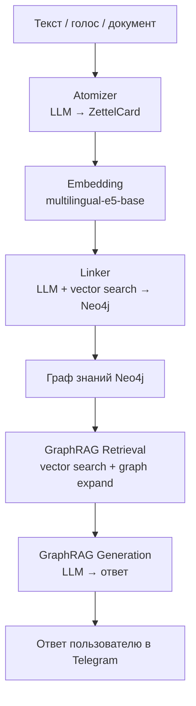
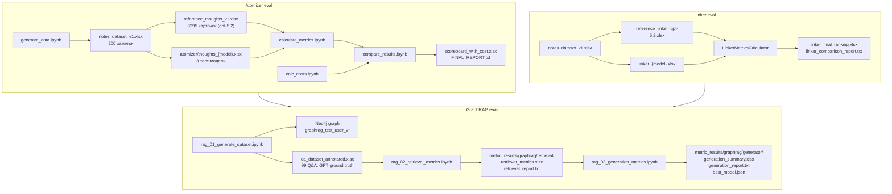
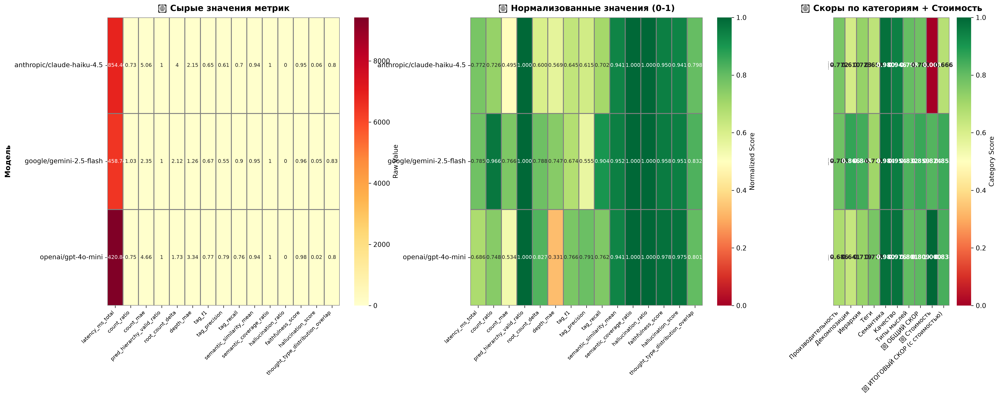
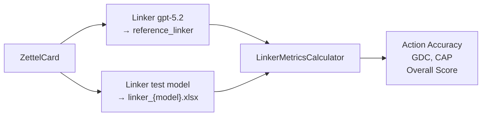
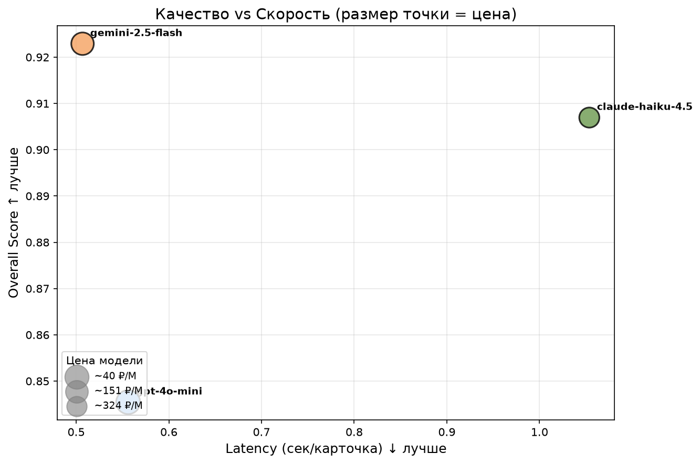
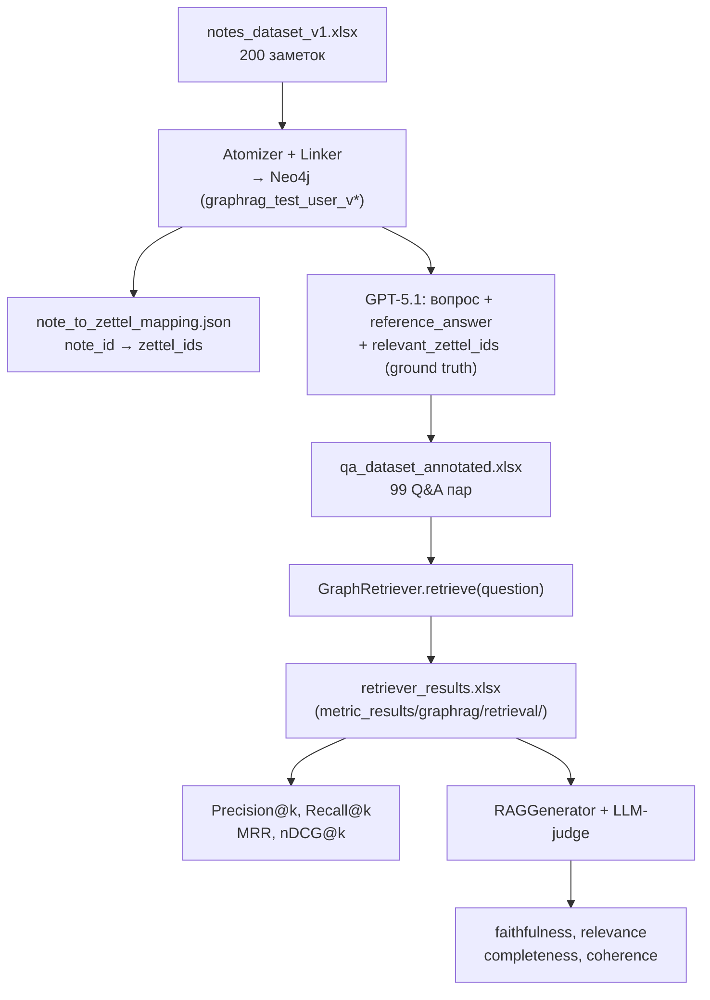
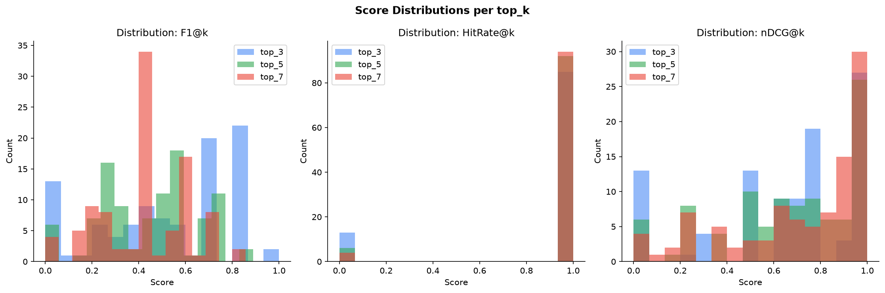
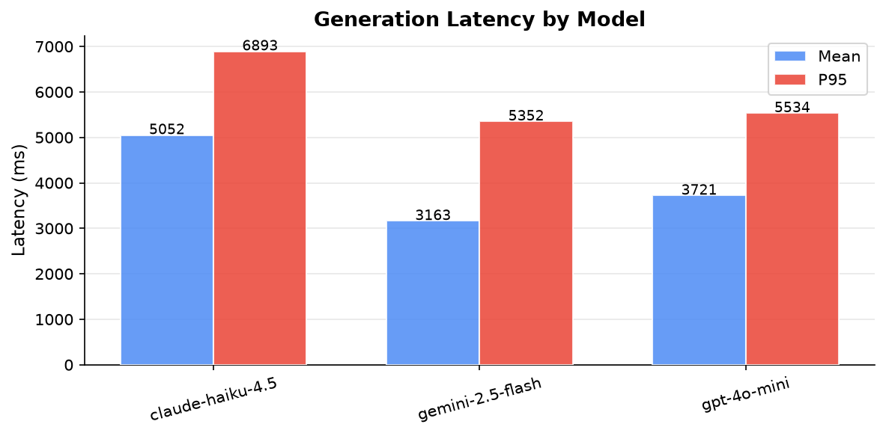

# Оценка качества системы Executive Exocortex

> **Формат документа:** методологическое описание эксперимента в стиле исследовательской работы.  
> Охватывает все этапы: постановку задачи, генерацию данных, формирование эталона, расчёт метрик, результаты и выводы.

**Последнее обновление:** 30.06.2026 — синхронизировано с текущим состоянием репозитория.

---

## Аннотация

Данная работа описывает систему оценки качества компонентов **Executive Exocortex** — персонального экзокортекса на основе графа знаний. Система состоит из трёх семантически связанных этапов: **Atomizer** (разбиение текста на атомарные мысли), **Linker** (встраивание мыслей в граф знаний) и **GraphRAG** (поиск и генерация ответов по графу). Ошибка на каждом шаге каскадно влияет на последующие, поэтому оценка каждого этапа в отдельности критична.

Ключевая задача — построить **воспроизводимую, количественную** систему выбора моделей и конфигураций промптов по комплексному критерию **качество + стоимость + задержка**.

Вместо ручной разметки применяется подход **smart model as oracle**: сильная закрытая модель генерирует синтетический датасет и формирует эталон, по которому затем оцениваются тест-модели. Подход масштабируется, не требует ручного труда и воспроизводим при обновлении корпуса.

---

## Содержание

1. [Введение: что и почему оценивается](#1-введение-что-и-почему-оценивается)
2. [Архитектура eval-контура](#2-архитектура-eval-контура)
3. [Экспериментальный дизайн](#3-экспериментальный-дизайн)
4. [Генерация синтетического датасета (Atomizer)](#4-генерация-синтетического-датасета-atomizer)
5. [Формирование эталона через smart model](#5-формирование-эталона-через-smart-model)
6. [Выбор моделей для тестирования](#6-выбор-моделей-для-тестирования)
7. [Оценка Atomizer: метрики и формулы](#7-оценка-atomizer-метрики-и-формулы)
8. [Нормализация, категориальные скоры, финальный рейтинг](#8-нормализация-категориальные-скоры-финальный-рейтинг)
9. [Результаты Atomizer](#9-результаты-atomizer)
10. [Оценка Linker](#10-оценка-linker)
11. [Оценка GraphRAG](#11-оценка-graphrag)
12. [Итоговая конфигурация моделей в продакшне](#12-итоговая-конфигурация-моделей-в-продакшне)
13. [Стоимость и latency: экономический слой](#13-стоимость-и-latency-экономический-слой)
14. [Ограничения и риски валидности](#14-ограничения-и-риски-валидности)
15. [Воспроизведение эксперимента](#15-воспроизведение-эксперимента)
16. [Заключение](#16-заключение)

---

## 1. Введение: что и почему оценивается

### 1.1 Пайплайн системы

Executive Exocortex превращает неструктурированные управленческие заметки в граф знаний и отвечает на вопросы по нему. Пайплайн состоит из трёх последовательных компонентов:



### 1.2 Почему важно оценивать каждый этап

Ошибки в пайплайне **каскадируются**:

- Если Atomizer плохо дробит текст (пропускает мысли, объединяет несвязанные), Linker получает «грязные» карточки и встраивает их неверно.
- Если Linker неправильно выбирает действие (`new_root` вместо `child_of`), граф растёт хаотично, семантические связи рвутся.
- Если граф искажён, GraphRAG получает неверный контекст при retrieval и генерирует ответ, не соответствующий реальной базе знаний пользователя.

Из этого следует принцип оценки: **отдельная метрика для каждого этапа + понимание сквозного влияния**.

### 1.3 Исследовательские вопросы

1. Какая из бюджетных моделей лучше всего выполняет атомизацию по совокупности метрик качества?
2. Как меняется рейтинг при учёте стоимости вызова?
3. Какие метрики наиболее чувствительны к смене модели и промпта?
4. Какая модель оптимальна для Linker и GraphRAG при разных компромиссах качество/скорость/цена?
5. Какой `top_k` retrieval даёт лучший баланс Precision/Recall для GraphRAG?

---

## 2. Архитектура eval-контура

### 2.1 Состав файлов

| Файл / директория | Назначение |
| --- | --- |
| `generate_data.ipynb` | Генерация синтетических заметок, эталона Atomizer/Linker, прогоны тест-моделей |
| `calculate_metrics.ipynb` | Формальные метрики Atomizer + LLM-as-a-judge |
| `compare_results.ipynb` | Нормализация, категориальные скоры, итоговый рейтинг, визуализации |
| `calc_costs.ipynb` | Анализ стоимости и скорости по прайс-листу и реальным логам |
| `rag_01_generate_dataset.ipynb` | Построение графа для GraphRAG eval, генерация Q&A с ground truth |
| `rag_02_retrieval_metrics.ipynb` | Метрики retrieval (top_k = 3, 5, 7) |
| `rag_03_generation_metrics.ipynb` | Метрики generation через LLM-as-judge |
| `metric_results/atomizer/` | Итоговые таблицы и отчёты по Atomizer |
| `metric_results/linker/` | Итоговые таблицы и отчёты по Linker |
| `metric_results/graphrag/` | **Актуальные** результаты GraphRAG (retrieval + generation) |
| `metric_results/rag/` | Legacy-результаты старого GraphRAG-пайплайна (см. §11.7) |
| `synthetic_datasets/atomizer/` | Эталон и предсказания моделей Atomizer |
| `synthetic_datasets/linker/` | Прогоны Linker и эталон |
| `synthetic_datasets/graphrag/` | Q&A-датасет, маппинг note→zettel |
| `synthetic_datasets/notes_dataset_v1.xlsx` | 200 синтетических заметок (корень synthetic_datasets/) |
| `synthetic_datasets/Old/` | Архив предыдущих версий датасетов |
| `price_data/` | Прайс-лист LLM и логи реальных вызовов |

### 2.2 Полная схема пайплайна оценки



### 2.3 Структура директорий результатов

```
eval/
├── generate_data.ipynb
├── calculate_metrics.ipynb
├── compare_results.ipynb
├── calc_costs.ipynb
├── rag_01_generate_dataset.ipynb
├── rag_02_retrieval_metrics.ipynb
├── rag_03_generation_metrics.ipynb
├── metric_results/
│   ├── atomizer/          # 16 метрик, heatmap, radar, scoreboard
│   ├── linker/            # action accuracy, GDC, CAP, radar
│   └── graphrag/          # ← актуальный GraphRAG eval
│       ├── retrieval/
│       │   ├── retriever_metrics.xlsx
│       │   ├── retriever_results.xlsx
│       │   ├── retrieval_report.txt
│       │   └── figures/
│       └── generator/
│           ├── generation_summary.xlsx
│           ├── generation_raw.xlsx
│           ├── generation_report.txt
│           ├── best_model.json
│           └── figures/
└── synthetic_datasets/
    ├── atomizer/
    ├── linker/
    ├── graphrag/
    └── Old/               # архив legacy-датасетов
```

---

## 3. Экспериментальный дизайн

### 3.1 Принцип «smart model как эталон»

Традиционный подход к оценке NLP-систем предполагает ручную разметку экспертами. Для корпуса из 200 заметок × ~16 карточек = ~3200 карточек это нереалистично по времени и стоимости.

Вместо этого применяется **smart model as oracle**:

1. **Smart model A** (`openai/gpt-5.1`) генерирует реалистичные синтетические заметки.
2. **Smart model B** (`openai/gpt-5.2`) прогоняется через реальный `NoteAtomizer` / `GraphLinker` и формирует эталон.
3. **Тест-модели** (бюджетные LLM) прогоняются на тех же входных данных.
4. Их выход сравнивается с эталоном по формальным и семантическим метрикам.
5. **LLM-judge** (`openai/gpt-5.1`) дополнительно оценивает faithfulness, hallucination, relevance и др.

**Ограничение:** эталон наследует характерный для smart model способ структурирования. При изменении промпта эталон нужно перегенерировать.

### 3.2 Уровни оценки

| Уровень | Что оценивается | Метод |
| --- | --- | --- |
| Декомпозиция | Правильное число атомарных мыслей | count_ratio, count_mae |
| Иерархия | Корректность Luhmann-ID | hierarchy_valid_ratio, depth_mae |
| Теги | Точность и полнота extracted тегов | Precision / Recall / F1 |
| Семантика | Смысловая близость мыслей к эталону | Cosine similarity (e5-base) |
| Linker | Классификация действий + структура графа | Action Accuracy, GDC, CAP |
| Retrieval | Поиск релевантных zettel по вопросу | Precision@k, Recall@k, MRR, nDCG@k |
| Generation | Качество ответа по контексту | LLM-as-a-judge (G-Eval) |
| Экономика | Стоимость и скорость | Прайс-лист + реальные логи |

---

## 4. Генерация синтетического датасета (Atomizer)

### 4.1 Параметры генерации

```python
count_syntetic_data = 200
generate_llm_model  = 'openai/gpt-5.1'
temperature         = 0.95
num_sentences       = random.randint(3, 10)
domain              = random.choice(BUSINESS_DOMAINS)   # 17 доменов
style               = random.choice(NOTE_STYLES)      # 7 стилей
```

**Домены:** продуктовая разработка, продажи, HR, финансы, операционка, стратегия, аналитика, реструктуризация, ИИ-зация и др.

**Стили:** расшифровка встречи, голосовая заметка, рабочие мысли, записи после звонка, планёрка, анализ ситуации, список задач.

Промпт явно требует **использовать местоимения и контекстные ссылки** — это усложняет задачу атомизации и приближает её к реальным условиям.

### 4.2 Итоговый датасет

| Параметр | Значение |
| --- | --- |
| Файл | `synthetic_datasets/notes_dataset_v1.xlsx` |
| Количество заметок | 200 |
| Эталонных карточек | 3 295 |
| Среднее карточек на заметку | ~16.5 |
| Минимум / максимум | 5 / ~45 |

---

## 5. Формирование эталона через smart model

Все 200 заметок прогоняются через **реальный** `NoteAtomizer` с моделью `openai/gpt-5.2` — тот же код и промпт, что в продакшне (`config/settings.py`).

Эталон Atomizer: `synthetic_datasets/atomizer/reference_thoughts_v1.xlsx`.

Эталон Linker: `synthetic_datasets/linker/reference_linker_gpt-5.2.xlsx` (484 карточки для оценки).

Эталон загружается в Langfuse как датасет `atomizer-benchmark-v1` для воспроизводимых прогонов.

---

## 6. Выбор моделей для тестирования

### 6.1 Smart model (генерация / эталон / судья)

| Роль | Модель | Назначение |
| --- | --- | --- |
| Генерация заметок | `openai/gpt-5.1` | Синтетический корпус |
| Эталон Atomizer / Linker | `openai/gpt-5.2` | Ground truth |
| LLM-судья (G-Eval) | `openai/gpt-5.1` | Atomizer + GraphRAG generation |
| Аннотация Q&A (GraphRAG) | `openai/gpt-5.1` | Вопросы + relevant_zettel_ids |

### 6.2 Тест-модели

```python
llm_models = [
    "openai/gpt-4o-mini",
    "google/gemini-2.5-flash",
    "anthropic/claude-haiku-4.5",
]
```

| Модель | Прайс вх. (₽/М) | Профиль |
| --- | --- | --- |
| `gpt-4o-mini` | 16.20 | Бюджетный baseline |
| `gemini-2.5-flash` | 32.40 | Баланс качество/скорость |
| `claude-haiku-4.5` | 108.00 | Альтернативный вендор, высокая цена |

---

## 7. Оценка Atomizer: метрики и формулы

Все метрики считаются на уровне отдельной заметки (`note_id`), затем агрегируются по модели. Реализовано в `calculate_metrics.ipynb`.

**Обозначения:** $R$ — эталон, $P$ — предсказание, $N_{ref} = |R|$, $N_{pred} = |P|$, $sim(x,y)$ — cosine similarity (`intfloat/multilingual-e5-base`), $\tau = 0.75$ — порог покрытия.

### 7.1 Декомпозиция

$$\text{count\_ratio} = \frac{N_{pred}}{N_{ref}} \qquad \text{count\_mae} = |N_{pred} - N_{ref}|$$

### 7.2 Иерархия

$$\text{hierarchy\_valid\_ratio} = \frac{|\{i : \text{luhmann\_id}_i \text{ валиден}\}|}{N_{pred}}$$

$$\text{parent\_consistency} = \frac{|\{i : \text{parent}(i) \in \text{ID\_set}\}|}{|\{i : \text{depth}(i) > 1\}|}$$

$$\text{root\_count\_delta} = |\text{root}_{pred} - \text{root}_{ref}| \qquad \text{depth\_mae} = |\text{depth}^{max}_{pred} - \text{depth}^{max}_{ref}|$$

### 7.3 Теги

$$\text{tag\_precision} = \frac{|tags(P) \cap tags(R)|}{|tags(P)|} \qquad \text{tag\_recall} = \frac{|tags(P) \cap tags(R)|}{|tags(R)|}$$

$$\text{tag\_f1} = \frac{2 \cdot P \cdot R}{P + R}$$

### 7.4 Семантика

$$\text{sem\_sim\_mean} = \frac{1}{N_{ref}} \sum_{i=1}^{N_{ref}} \max_j sim(r_i, p_j)$$

$$\text{coverage\_ratio} = \frac{1}{N_{ref}} \sum_{i=1}^{N_{ref}} \mathbf{1}\left[\max_j sim(r_i, p_j) \geq \tau\right]$$

$$\text{hallucination\_ratio} = \frac{1}{N_{pred}} \sum_{j=1}^{N_{pred}} \mathbf{1}\left[\max_i sim(p_j, r_i) < \tau\right]$$

### 7.5 Типы мыслей и LLM-judge

$$\text{type\_overlap} = \sum_{t \in \mathcal{T}} \min(P_{ref}(t), P_{pred}(t))$$

LLM-судья (`openai/gpt-5.1`) оценивает `faithfulness_score` и `hallucination_score` на подвыборке из 50 заметок.

### 7.6 Сводная таблица (16 метрик)

| Группа | Метрика | Идеальное значение |
| --- | --- | --- |
| Декомпозиция | count_ratio | 1.0 |
| Декомпозиция | count_mae | 0 |
| Иерархия | hierarchy_valid_ratio | 1.0 |
| Иерархия | parent_consistency | 1.0 |
| Иерархия | root_count_delta | 0 |
| Иерархия | depth_mae | 0 |
| Теги | tag_precision / recall / f1 | 1.0 |
| Семантика | semantic_similarity_mean | 1.0 |
| Семантика | coverage_ratio | 1.0 |
| Семантика | hallucination_ratio | 0.0 |
| Типы | type_overlap | 1.0 |
| Судья | faithfulness_score | 1.0 |
| Судья | hallucination_score | 0.0 |
| Скорость | latency_ms_total | — |

---

## 8. Нормализация, категориальные скоры, финальный рейтинг

Для метрик «больше лучше»: $\text{norm}(m) = (m - m_{min}) / (m_{max} - m_{min})$.

Для метрик «меньше лучше»: $\text{norm}(m) = 1 - (m - m_{min}) / (m_{max} - m_{min})$.

Для count_ratio: $\text{norm} = 1 - |\text{count\_ratio} - 1.0|$.

$$\text{quality\_score} = \frac{1}{|M|} \sum_{m \in M} \text{norm}(m)$$

$$\text{final\_score} = \text{quality\_score} \cdot 0.85 + \text{cost\_score} \cdot 0.15 \qquad (w_{cost} = 0.15)$$

---

## 9. Результаты Atomizer

### 9.1 Итоговый рейтинг

| Место | Модель | Цена (₽/М) | Quality | Final |
| --- | --- | --- | --- | --- |
| 🥇 1 | `google/gemini-2.5-flash` | 32.40 | 0.859 | **0.853** |
| 🥈 2 | `openai/gpt-4o-mini` | 16.20 | 0.809 | **0.838** |
| 🥉 3 | `anthropic/claude-haiku-4.5` | 108.00 | 0.783 | **0.666** |

### 9.2 Категориальные скоры

| Модель | Произв. | Декомп. | Иерархия | Теги | Семантика | Качество | Типы |
| --- | --- | --- | --- | --- | --- | --- | --- |
| gemini-2.5-flash | 0.785 | 0.866 | 0.845 | 0.711 | 0.984 | 0.955 | 0.832 |
| gpt-4o-mini | 0.686 | 0.641 | 0.719 | 0.773 | 0.980 | 0.977 | 0.801 |
| claude-haiku-4.5 | 0.772 | 0.610 | 0.723 | 0.654 | 0.980 | 0.946 | 0.798 |

### 9.3 Сырые значения ключевых метрик

| Модель | count_ratio | count_mae | depth_mae | tag_f1 | sem_sim | coverage | halluc. | faithful. |
| --- | --- | --- | --- | --- | --- | --- | --- | --- |
| gemini-2.5-flash | **1.034** | **2.35** | **1.27** | 0.674 | **0.952** | 1.000 | 0.000 | 0.958 |
| gpt-4o-mini | 0.748 | 4.67 | 3.35 | **0.766** | 0.941 | 1.000 | 0.000 | **0.978** |
| claude-haiku-4.5 | 0.726 | 5.06 | 2.16 | 0.645 | 0.941 | 1.000 | 0.000 | 0.950 |

### 9.4 Визуализации




**Вывод:** `gemini-2.5-flash` лидирует по декомпозиции (count_ratio ≈ 1.0). Все модели показывают нулевой hallucination_ratio и 100% coverage. Главное различие — точность дробления, критичная для Linker и GraphRAG.

---

## 10. Оценка Linker

### 10.1 Задача

Linker для каждой `ZettelCard` принимает решение: `new_root`, `child_of` или `update_of` (+ целевой узел). Это **многоклассовая классификация + retrieval**.

Эталон: `openai/gpt-5.2` через реальный `GraphLinker`. Тест: 484 карточки, 3 модели.

### 10.2 Метрики

| Метрика | Описание |
| --- | --- |
| **Action Accuracy** | Доля верных действий (new_root / child_of / update_of) |
| **Graph Depth Consistency (GDC)** | Согласованность глубины решений с эталоном |
| **Child Attachment Precision (CAP)** | Точность присоединения к правильному родителю |
| **Graph Structure Similarity** | Совпадение рёбер итогового графа |
| **Action KL-Divergence** | KL-расхождение распределений действий (→ 0 лучше) |
| **Root Rate Delta** | Ошибка в доле корневых узлов |
| **Overall Score** | Агрегированный скор качества |

$$\text{Action Accuracy} = \frac{|\{i : action_{pred}^{(i)} = action_{ref}^{(i)}\}|}{N}$$

$$\text{Overall Score} = \text{mean}(\text{action\_accuracy}, \text{GDC}, \text{CAP}, \text{graph\_structure\_similarity}, 1 - \text{KL})$$

### 10.3 Схема оценки



### 10.4 Результаты (484 карточки)

| Метрика | gemini-2.5-flash | claude-haiku-4.5 | gpt-4o-mini |
| --- | --- | --- | --- |
| **Overall Score** | **0.923** | 0.907 | 0.846 |
| Action Accuracy | **0.946** | 0.936 | 0.901 |
| Graph Depth Consistency | **0.967** | 0.961 | 0.952 |
| Child Attachment Precision | **0.765** | 0.714 | 0.610 |
| Graph Structure Similarity | 0.986 | **0.991** | 0.987 |
| Action KL-Divergence | **0.003** | 0.004 | 0.030 |
| Root Rate Delta | 0.014 | **0.008** | 0.010 |
| Latency (с/карточка) | **0.507** | 1.054 | 0.556 |
| Cost Efficiency | 0.254 | 0.117 | **0.901** |

### 10.5 Визуализации




**Вывод:** `gemini-2.5-flash` — лучшее качество (Overall 0.923, Action Accuracy 94.6%) и минимальная латентность. `gpt-4o-mini` проигрывает по CAP (0.610 vs 0.765) — чаще присоединяет дочерние карточки к неверным родителям, искажая структуру графа.

---

## 11. Оценка GraphRAG

GraphRAG оценивается в **два независимых слоя**: retrieval (поиск узлов) и generation (ответ LLM). Это актуальный пайплайн v2, результаты в `metric_results/graphrag/`.

### 11.1 Новый пайплайн генерации Q&A (v2)

В отличие от legacy-подхода (§11.7), ground truth для retrieval формируется **на этапе аннотации**, а не post-hoc через cosine similarity.



**Шаги (`rag_01_generate_dataset.ipynb`):**

1. Для каждой заметки: Atomizer → Linker → Neo4j. Сохраняется `note_id → [zettel_id]`.
2. GPT-5.1 видит `note_text` + список `{zettel_id, content}` и генерирует:
   - `question`, `reference_answer`, `question_type`, `key_concepts`
   - `relevant_zettel_ids` — **ground truth для retrieval**
3. GraphRetriever прогоняется на каждом вопросе → `metric_results/graphrag/retrieval/retriever_results.xlsx`.
4. Метрики считаются в `rag_02_retrieval_metrics.ipynb`.
5. Generation оценивается в `rag_03_generation_metrics.ipynb` через LLM-judge.

**Параметры eval-графа:**

| Параметр | Значение |
| --- | --- |
| User ID (retrieval) | `graphrag_test_user_v1` |
| User ID (generation) | `graphrag_test_user_v10` |
| Заметок в графе | 100 |
| Q&A пар (annotated) | 99 |
| Evaluated questions | 98 |
| Similarity threshold | 0.5 |
| context_hops | 1 (как в продакшне) |

### 11.2 Retrieval-метрики

Пусть $Rel_k$ — top-$k$ retrieved узлов, $Rel^*$ — эталонный набор (`relevant_zettel_ids` от GPT-5.1).

$$\text{Precision@}k = \frac{|Rel_k \cap Rel^*|}{k}$$

$$\text{Recall@}k = \frac{|Rel_k \cap Rel^*|}{|Rel^*|}$$

$$\text{F1@}k = \frac{2 \cdot P@k \cdot R@k}{P@k + R@k}$$

$$\text{MRR} = \frac{1}{|Q|} \sum_{q \in Q} \frac{1}{\text{rank}_q}$$

$$\text{nDCG@}k = \frac{\text{DCG@}k}{\text{IDCG@}k}, \quad \text{DCG@}k = \sum_{i=1}^{k} \frac{2^{rel_i} - 1}{\log_2(i + 1)}$$

### 11.3 Результаты Retrieval

| top_k | Precision | Recall | F1 | HitRate | MRR | nDCG |
| --- | --- | --- | --- | --- | --- | --- |
| **3** | **0.517** | 0.549 | **0.503** | 0.867 | **0.832** | 0.652 |
| 5 | 0.371 | 0.649 | 0.447 | 0.939 | 0.832 | 0.668 |
| 7 | 0.324 | **0.758** | 0.431 | **0.959** | 0.832 | **0.715** |

**Best top_k = 3** (максимальный F1 = 0.503). При top_k=7 растёт Recall (0.758) и HitRate (0.959), но падает Precision.

Retrieval по типам вопросов (F1@3):

| question_type | F1@3 | HitRate@3 |
| --- | --- | --- |
| summary | 0.498 | 1.000 |
| factual | 0.612 | 0.914 |
| decision | 0.430 | 0.806 |
| action_items | 0.313 | 0.667 |
| risk | 0.543 | 0.857 |

### 11.4 Визуализации Retrieval




### 11.5 Generation-метрики (LLM-as-judge)

Судья: `openai/gpt-5.1`. Оцениваются: faithfulness, relevance, completeness, coherence, accuracy, hallucinations.

| Модель | Faithfulness | Relevance | Completeness | Coherence | Accuracy | Halluc. ↓ | Overall | Latency (мс) |
| --- | --- | --- | --- | --- | --- | --- | --- | --- |
| **gemini-2.5-flash** 🥇 | **0.950** | 0.941 | 0.787 | 0.981 | **0.851** | **0.050** | **0.909** | **3163** |
| claude-haiku-4.5 | 0.925 | **0.961** | **0.799** | **0.982** | 0.848 | 0.076 | 0.906 | 5052 |
| gpt-4o-mini | 0.897 | 0.928 | 0.752 | 0.977 | 0.815 | 0.103 | 0.877 | 3721 |

Generation eval: 98 вопросов × 3 модели, `best_k=5` (из retrieval eval).

### 11.6 Визуализации Generation




### 11.7 Legacy-пайплайн GraphRAG (deprecated)

Ранняя версия eval использовала:

- Датасет: `synthetic_datasets/Old/rag_qa_dataset.xlsx` (или `rag_qa_dataset.xlsx`)
- User ID: `linker_eval_gpt-5.2`
- Ground truth: cosine similarity zettel↔note (без GPT-аннотации)
- Similarity threshold: 0.20
- Результаты: `metric_results/rag/` (F1@7 ≈ 0.073 — значительно ниже v2)

Legacy-пайплайн **не рекомендуется** для новых экспериментов. Актуальный — §11.1–11.6.

---

## 12. Итоговая конфигурация моделей в продакшне

Eval-победитель и текущий `config/settings.py` **полностью совпадают**:

| Компонент | Модель | Ключевая метрика eval |
| --- | --- | --- |
| **Atomizer** | `google/gemini-2.5-flash` | Final Score 0.853 |
| **Linker** | `google/gemini-2.5-flash` | Overall 0.923, Action Accuracy 0.946 |
| **GraphRAG Generator** | `google/gemini-2.5-flash` | Overall 0.909, faithfulness 0.95 |
| **Embedding** | `intfloat/multilingual-e5-base` | — |

**Параметры GraphRAG (продакшн, `settings.py`):**

| Параметр | Значение | Eval-значение |
| --- | --- | --- |
| search_limit | 5 | best_k=5 (generation eval) |
| context_hops | 1 | 1 |
| similarity_threshold | 0.3 | 0.5 (retrieval eval) |
| linker_similarity_threshold | 0.5 | 0.5 |
| temperature | 0.3 | — |

> **Примечание:** GraphRAG eval v2 показал лидерство `gemini-2.5-flash` (Overall 0.909), а не `claude-haiku-4.5` — в отличие от legacy-eval (`metric_results/rag/`, F1 retrieval ≈ 0.07). Новый пайплайн с GPT-аннотированным ground truth даёт F1@3 = 0.503.

---

## 13. Стоимость и latency: экономический слой

`calc_costs.ipynb` анализирует:

1. **Прайс-лист** (`price_data/llm_prices.xlsx`)
2. **Реальные логи** (`price_data/llm-logs_2026-05-28_2026-06-28.csv`)

| Модель | Input (₽/М) | Output (₽/М) | Latency mean (мс) | Относ. стоимость |
| --- | --- | --- | --- | --- |
| gpt-4o-mini | 16.20 | 64.80 | 9 421 | 1× |
| gemini-2.5-flash | 32.40 | 129.60 | 6 459 | ~2× |
| claude-haiku-4.5 | 108.00 | 432.00 | 6 854 | ~6.7× |

$$\text{cost}_{1000} = \frac{\bar{T}_{in} \cdot p_{in} + \bar{T}_{out} \cdot p_{out}}{10^6} \cdot 1000$$

`claude-haiku-4.5` в 6.7× дороже `gpt-4o-mini`, что объясняет его последнее место в Atomizer eval при сопоставимом качестве.

---

## 14. Ограничения и риски валидности

| Ограничение | Влияние | Митigation |
| --- | --- | --- |
| Эталон создан smart model, не людьми | Bias эталона | Human-audit подвыборка (50–100 заметок) |
| LLM-судья на 50 заметках (Atomizer) | Стохастическая погрешность | Bootstrap CI, повторные прогоны |
| Синтетика ≠ продакшн | Domain shift | Корпус реальных заметок (без PII) |
| Порог τ = 0.75 эмпирический | Меняет coverage/hallucination | Sensitivity analysis τ ∈ [0.6, 0.9] |
| GraphRAG GT от GPT-5.1 | Bias relevant_zettel_ids | Cross-validation с human audit |
| Eval user_id ≠ prod user_id | Размер/структура графа отличается | End-to-end eval на реальных данных |
| Оценка prompt-версии | Смена промпта аннулирует сравнение | Фиксировать хэш промпта в метаданных |

---

## 15. Воспроизведение эксперимента

### Atomizer + Linker

```bash
# 1. Генерация данных и прогоны моделей
jupyter notebook eval/generate_data.ipynb
# → synthetic_datasets/notes_dataset_v1.xlsx
# → synthetic_datasets/atomizer/reference_thoughts_v1.xlsx
# → synthetic_datasets/linker/linker_{model}.xlsx

# 2. Метрики Atomizer
jupyter notebook eval/calculate_metrics.ipynb
# → metric_results/atomizer/all_models_atomizer_metrics.xlsx

# 3. Рейтинг + визуализации
jupyter notebook eval/compare_results.ipynb
# → metric_results/atomizer/scoreboard_with_cost.xlsx
# → metric_results/atomizer/FINAL_REPORT.txt

# 4. Экономический анализ
jupyter notebook eval/calc_costs.ipynb
```

### GraphRAG (v2)

```bash
# 1. Построение графа + Q&A датасет
jupyter notebook eval/rag_01_generate_dataset.ipynb
# → synthetic_datasets/graphrag/qa_dataset_annotated.xlsx
# → synthetic_datasets/graphrag/note_to_zettel_mapping.json
# → metric_results/graphrag/retrieval/retriever_results.xlsx

# 2. Retrieval метрики
jupyter notebook eval/rag_02_retrieval_metrics.ipynb
# → metric_results/graphrag/retrieval/retriever_metrics.xlsx
# → metric_results/graphrag/retrieval/retrieval_report.txt

# 3. Generation метрики
jupyter notebook eval/rag_03_generation_metrics.ipynb
# → metric_results/graphrag/generator/generation_summary.xlsx
# → metric_results/graphrag/generator/best_model.json
# → metric_results/graphrag/generator/generation_report.txt
```

### Требования

```
sentence-transformers >= 2.7
langchain-openai >= 0.1
neo4j >= 5.0
langfuse >= 2.0
pydantic >= 2.0
pandas, numpy, scikit-learn, matplotlib, seaborn, openpyxl
```

Переменные окружения (`.env`):

```
LLM_API_KEY=...
LLM_BASE_URL=...
NEO4J_URI=bolt://localhost:7687
NEO4J_PASSWORD=...
LANGFUSE_PUBLIC_KEY=...
LANGFUSE_SECRET_KEY=...
```

---

## 16. Заключение

### Что достигнуто

1. **Atomizer** — полный eval-контур: 16 метрик, LLM-judge, финальный рейтинг. Победитель: `gemini-2.5-flash` (Final 0.853).
2. **Linker** — полный eval-контур: 484 карточки, 6 метрик. Победитель: `gemini-2.5-flash` (Overall 0.923, Action Accuracy 94.6%).
3. **GraphRAG Retrieval** — v2-пайплайн с GPT-аннотированным ground truth. 98 вопросов, best top_k=3 (F1=0.503, HitRate=0.867).
4. **GraphRAG Generation** — LLM-judge на 98 вопросах × 3 модели. Победитель: `gemini-2.5-flash` (Overall 0.909).
5. **Инфраструктура** — Langfuse, воспроизводимые ноутбуки, отчёты и визуализации для всех модулей.

### Ключевые выводы

- **`google/gemini-2.5-flash`** — единственная модель, лидирующая во всех трёх компонентах пайплайна при ~2× стоимости относительно gpt-4o-mini.
- **`gpt-4o-mini`** — оптимален при жёстком бюджете (Cost Efficiency Linker = 0.901), но проигрывает по CAP и декомпозиции.
- **GraphRAG v2** показал F1 retrieval **0.503** (vs 0.073 в legacy) благодаря GPT-аннотированному ground truth и end-to-end построению графа.
- **Completeness generation** (0.75–0.80) существенно выше, чем в legacy-eval (~0.25), что подтверждает важность качества retrieval для generation.

### Следующие шаги

| Приоритет | Задача |
| --- | --- |
| Высокий | Human-audit подвыборка для валидации GPT-эталона (Atomizer + GraphRAG GT) |
| Высокий | End-to-end eval: Atomizer → Linker → GraphRAG как единый контур |
| Средний | Sensitivity analysis по τ и similarity_threshold |
| Средний | Гибридный retrieval (vector + BM25) + reranking |
| Низкий | Автоматизация eval в CI/CD при смене промптов |

Текущий eval-контур обеспечивает **полную прозрачность** при выборе моделей для всех компонентов системы и формально обосновывает конфигурацию продакшна через метрики, стоимость и задержку.
